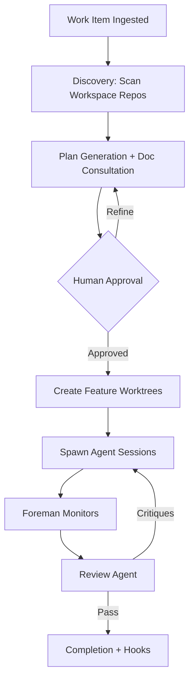

<div align="center">

# Substrate

**A modern ADE - Agentic Development Environment**

*AI-powered work item orchestration for single or multi-repo development*

[](https://go.dev/)
[](LICENSE)
[](https://www.sqlite.org/)

</div>

---

## What is Substrate?

Substrate automates the lifecycle of a development task — from ticket ingestion through cross-repo planning, agent-driven implementation, review, and completion. It replaces the manual choreography of multi-repo development with a deterministic, human-supervised pipeline where AI agents execute sub-plans under structured oversight.

### The Problem

Multi-repo development tasks require significant coordination overhead:
- Understanding cross-cutting concerns across repositories
- Maintaining context across repo boundaries
- Verifying changes holistically
- Coordinating branches, worktrees, and merge requests

### The Solution

Substrate orchestrates this complexity through a structured pipeline:



---

## Features

| Feature | Description |
|---------|-------------|
| **Cross-Repo Planning** | Generate orchestration plans that span multiple repositories, with per-repo sub-plans and parallel execution groups |
| **Human-in-the-Loop** | Plans require explicit approval. Foreman escalates unanswerable questions. Intervene at any point via TUI |
| **Agent Harness Integration** | Spawn isolated agent sessions per sub-plan. Fault isolation — agent crash cannot take down substrate |
| **Review Cycles** | Automated review with critique-driven reimplementation loops until quality threshold met |
| **Event-Driven Hooks** | System mutations emit events. Adapters subscribe to act on them — move tickets, create MRs, notify channels |
| **Workspace-Based** | Multiple work items coexist in one workspace, each with isolated branches and worktrees |
| **Adapter Pattern** | Every external system sits behind a Go interface. Swap Linear for Jira, GitLab for GitHub, or oh-my-pi for another agent |

---

## Installation

### Homebrew (Recommended)

Install from the beeemT tap:

```bash
brew tap beeemT/tap
brew install substrate
```

This install path ships compiled bridge executables (oh-my-pi and Claude Agent SDK) with Substrate, so both the default harness and Claude Code integration work out of the box without `bun_path` or `bridge_path` configuration.

To upgrade:

```bash
brew upgrade substrate
```

### go install

Install the latest version directly:

```bash
go install github.com/beeemT/substrate/cmd/substrate@latest
```

Install a specific version:

```bash
go install github.com/beeemT/substrate/cmd/substrate@v1.0.0
```

Note: `go install` only installs the Go binary. If you want harness bridges to work out of the box, prefer the Homebrew package or build from a source checkout that includes the `bridge/` assets.

### Build from Source

```bash
git clone https://github.com/beeemT/substrate.git
cd substrate
bun install --cwd bridge
go build -o substrate ./cmd/substrate
```

---

## Optional Dependencies

These tools are not required to run Substrate. When absent, the relevant feature is disabled or skipped rather than crashing.

- **gh** — [GitHub CLI](https://cli.github.com). Used for GitHub auth fallback and harness-driven GitHub login actions. Without it, those auth flows are unavailable; the GitHub adapter still works via a configured token.
- **glab** — [GitLab CLI](https://gitlab.com/gitlab-org/cli). Used for GitLab MR creation. Without it, MR lifecycle automation is skipped.
- **Sentry** — No CLI required; configured via API token in `~/.substrate/config.yaml`. See the Sentry adapter fields under `adapters.sentry` (`token_ref`, `organization`, `projects`).


---

## Agent Harnesses

Substrate delegates agent work to an external harness. Set the harness in `~/.substrate/config.yaml`:

```yaml
harness:
  default: ohmypi   # ohmypi (default) | claude-code | codex | opencode
```

The harness selection is also surfaced in the TUI under **Settings → Harness Routing** and can be changed at runtime.

### Oh My Pi (default: `ohmypi`)

The default harness. The bridge that Substrate uses to talk to Oh My Pi is **bundled with Substrate** — nothing extra to install.

- **Homebrew install**: a compiled bridge executable ships inside the package. Bun is not required.
- **Source build / `go install`**: the bridge runs as a TypeScript script via Bun. Bun must be on your PATH and `bun install --cwd bridge` must have been run in the repository checkout.

Optional config:

```yaml
adapters:
  ohmypi:
    thinking_level: xhigh   # off | minimal | low | medium | high | xhigh
    model: ""               # empty = Oh My Pi's own default
    # bun_path: /opt/homebrew/bin/bun   # only if bun is not on PATH
    # bridge_path: /path/to/omp-bridge  # only for non-standard layouts
```

### Claude Code (`claude-code`)

Uses Anthropic's Claude Agent SDK. The Substrate bridge is **bundled with Substrate** (same story as Oh My Pi above). However, the `claude` CLI itself is **not bundled** — you must install and authenticate it separately before this harness works:

1. Install: follow the [Claude Code install guide](https://docs.anthropic.com/en/docs/claude-code)
2. Authenticate: run `claude` once and complete the interactive login

```yaml
harness:
  default: claude-code

adapters:
  claude_code:
    model: ""      # empty = Claude's own default
    thinking: ""   # adaptive | enabled | disabled
    effort: ""     # low | medium | high | max
    # bun_path: /opt/homebrew/bin/bun
    # bridge_path: /path/to/claude-agent-bridge
```

### Codex (`codex`)

Uses OpenAI's Codex CLI. **Must be installed manually** — Substrate invokes `codex` directly as a subprocess; there is no bridge and nothing is bundled.

1. Install: `npm install -g @openai/codex` (see the [Codex CLI README](https://github.com/openai/codex))
2. Authenticate: set `OPENAI_API_KEY` in your environment, or run `codex` once to go through its interactive setup

```yaml
harness:
  default: codex

adapters:
  codex:
    model: ""              # e.g. o4-mini, o3
    reasoning_effort: ""   # none | minimal | low | medium | high | xhigh
    # binary_path: /usr/local/bin/codex  # only if codex is not on PATH
```

### OpenCode (`opencode`)

Uses the OpenCode server. **Must be installed manually** — Substrate launches `opencode serve` as a subprocess; nothing is bundled.

1. Install: follow the [OpenCode install guide](https://opencode.ai)
2. Authenticate: configure your provider credentials as OpenCode requires (typically via `opencode` interactive setup or environment variables)

```yaml
harness:
  default: opencode

adapters:
  opencode:
    model: ""     # e.g. anthropic/claude-sonnet-4-20250514
    agent: build  # build (full-access) | plan (read-only)
    variant: ""   # model reasoning variant; empty = model default
    # binary_path: /usr/local/bin/opencode
    # port: 0     # 0 = auto-assign a free port
```
---

## Quick Start

### 1. Create a Workspace

Create a directory for your project. You can start with existing git repos or an empty folder — Substrate will handle initializing the workspace and migrating repos to git-work:

```bash
mkdir ~/myproject && cd ~/myproject
```

If you have existing repos, simply place them in this directory. When you run Substrate, it will:

- Create the `.substrate-workspace` identity file
- Migrate any regular git repos to git-work (creating `.bare/` and `main/` worktree)
- Register the workspace in the global DB (`~/.substrate/state.db`)
### 2. Configure

Substrate uses a global config file at `~/.substrate/config.yaml`. This file is auto-generated with helpful comments on first run.

To customize settings, edit the config file:

```bash
# View/edit the config
$EDITOR ~/.substrate/config.yaml
```

Example configuration:

```yaml
harness:
  default: ohmypi              # ohmypi | claude-code | codex | opencode

commit:
  strategy: semi-regular        # granular | semi-regular | single
  message_format: ai-generated  # ai-generated | conventional | custom

plan:
  max_parse_retries: 2

review:
  pass_threshold: minor_ok      # nit_only | minor_ok | no_critiques
  max_cycles: 3

adapters:
  ohmypi:
    thinking_level: xhigh
    # bun_path: /opt/homebrew/bin/bun
    # bridge_path: /custom/path/to/omp-bridge

foreman:
  question_timeout: "0"         # "0" = wait indefinitely
```
### 3. Run the TUI

```bash
substrate
```

The TUI lets you:
- Browse and select work items from Linear (or create manually)
- Review and approve generated plans
- Monitor agent session progress
- Answer escalated questions
- View review critiques

---

## How to Develop

For local development you are usually running the source bridges (`bridge/omp-bridge.ts`, `bridge/claude-agent-bridge.ts`), not the compiled bridges shipped in the Homebrew package. That means Bun and the bridges' Bun dependencies must be present locally.

### Run from a source checkout

```bash
git clone https://github.com/beeemT/substrate.git
cd substrate
bun install --cwd bridge
go build -o ./substrate ./cmd/substrate
./substrate
```

Building the binary into the repo root lets Substrate auto-discover `./bridge/omp-bridge.ts` and `./bridge/claude-agent-bridge.ts`.

### If you use `go run` or place the binary somewhere else

`go run ./cmd/substrate` builds the executable in a temporary directory, so bridge auto-discovery cannot find the repository's `bridge/` folder. In that case, set an absolute bridge path in `~/.substrate/config.yaml`:

```yaml
adapters:
  ohmypi:
    bridge_path: /absolute/path/to/substrate/bridge/omp-bridge.ts
    # bun_path: /opt/homebrew/bin/bun
```

Set `bun_path` only when `bun` is not already on your `PATH`.

### Fixing `bridge dependencies missing`

That message means Substrate found a TypeScript bridge script, but the Bun packages next to it have not been installed. From the repository root, run:

```bash
bun install --cwd bridge
```

Then restart Substrate. Re-run that command after pulling changes to `bridge/package.json` or `bridge/bun.lock`.

---

## Architecture

### Layered Design

```
┌─────────────────────────────────────────────────────────┐
│                    TUI (bubbletea)                      │
├─────────────────────────────────────────────────────────┤
│              Business Logic Layer                       │
│   Orchestrator │ PlanningPipeline │ ReviewPipeline      │
├─────────────────────────────────────────────────────────┤
│              Service Layer (owns domain models)         │
│   WorkItemService │ PlanService │ SessionService        │
├─────────────────────────────────────────────────────────┤
│              Repository Layer (interfaces)              │
│   WorkItemRepo │ PlanRepo │ SessionRepo                 │
├─────────────────────────────────────────────────────────┤
│              Storage (SQLite + go-atomic)               │
│               ~/.substrate/state.db                     │
└─────────────────────────────────────────────────────────┘
```

### Workspace Layout

```
~/myproject/
├── .substrate-workspace          # workspace identity (ULID)
├── backend-api/
│   ├── .bare/                    # git-work bare repo
│   ├── main/                     # default branch (READ-ONLY for planning)
│   └── sub-LIN-FOO-123-auth/     # feature worktree
├── frontend-app/
│   ├── .bare/
│   ├── main/
│   └── sub-LIN-FOO-123-auth/     # same branch, different repo
└── engineering-docs/
    ├── .bare/
    └── main/
```

Configuration is stored globally at `~/.substrate/config.yaml`. See `SUBSTRATE_HOME` environment variable to customize the location.

---

## Documentation

| Document | Description |
|----------|-------------|
| [00-overview.md](docs/00-overview.md) | Mission, workflow, technology decisions |
| [01-domain-model.md](docs/01-domain-model.md) | Core entities, state machines, workspace layout |
| [02-layered-architecture.md](docs/02-layered-architecture.md) | Repository / Service / Business Logic layers |
| [03-event-system.md](docs/03-event-system.md) | Event bus, adapter interfaces, hook dispatch |
| [04-adapters.md](docs/04-adapters.md) | Linear, Manual, glab, agent harness |
| [05-orchestration.md](docs/05-orchestration.md) | Planning pipeline, foreman, review cycle |
| [06-tui-design.md](docs/06-tui-design.md) | bubbletea views, interaction model |
| [07-implementation-plan.md](docs/07-implementation-plan.md) | Phased build-out, quality gates |

---

## Technology Stack

| Component | Technology | Rationale |
|-----------|------------|-----------|
| **Language** | Go | First-class concurrency, single-binary distribution, clean interfaces |
| **TUI** | bubbletea + lipgloss | Elm Architecture for predictable state management |
| **Database** | SQLite + sqlx + go-atomic | Local-only, no server, Unit of Work pattern |
| **Git** | git-work + CLI | Machine-readable stdout, subprocess isolation |
| **Agent Harness** | Bun bridge (subprocess) | Fault isolation, language independence |
| **Config** | YAML | Human-readable, hierarchical |

---

## State Machines

### Work Item Lifecycle

```
Ingested → Planning → PlanReview → Approved → Implementing → Reviewing → Completed
                ↖__________↗                              ↖__________↗
```

### Agent Session Lifecycle

```
Pending → Running → Completed → ReviewPhase
            ↓           ↓
        Waiting     Interrupted
            ↓           ↓
        Running      Failed
```

---

## Contributing

Contributions are welcome! Please read the documentation in `docs/` to understand the architecture before submitting PRs.

---

## License

[MIT License](LICENSE) — Copyright (c) 2026 Benedikt

---

<div align="center">

*Substrate: because someone has to coordinate the chaos*

</div>
