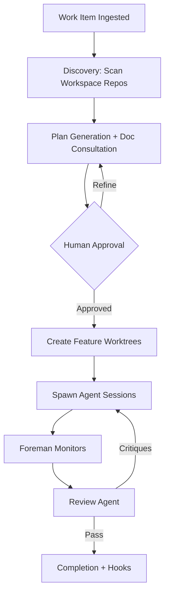

# Substrate: Project Overview

*the filling between all the gaps*

## Mission Statement

Substrate is an AI-powered work item orchestration tool built in Go. It automates the lifecycle of a development task — from ticket ingestion through cross-repo planning, agent-driven implementation, review, and completion. The problem it solves: multi-repo development tasks require significant coordination overhead — understanding cross-cutting concerns, maintaining context across repo boundaries, and verifying changes holistically. Substrate replaces that manual choreography with a deterministic, human-supervised pipeline where AI agents execute sub-plans under structured oversight.

## Core Workflow

1. **Ingest** — Pull a work item from a tracker (Linear or adapter) when assignment or status conditions are met, OR create one manually.
2. **Discovery** — Operates within a pre-existing workspace folder where repos are already cloned via git-work. Scans workspace repos (`main/` worktrees), gathers documentation from architecture docs, API specs, and conventions.
3. **Plan Generation** — Reads from `main/` worktrees across all repos. Produces a cross-repo orchestration plan and per-repo sub-plans.
4. **Human Approval** — Presents the plan in the TUI. The human reviews, requests changes, or approves. Back-and-forth refinement until accepted.
5. **Worktree Creation** — Runs `git-work checkout -b <branch>` in each repo that needs changes, creating isolated feature worktrees within the shared workspace.
6. **Agent Execution** — Spawns one agent harness session per sub-plan/repo in its feature worktree. Agents implement changes, commit per the configured strategy, and push.
7. **Foreman Monitoring** — A Foreman agent watches sub-agent sessions, answers questions from the cross-repo plan context, and escalates unanswerable questions to the human.
8. **Review** — A review agent compares each feature worktree against `main/`, produces critique reports.
9. **Re-implementation** — If critiques exist, the relevant agent session is respawned with critique context. Steps 6-8 repeat until review passes.
10. **Completion** — Event hooks fire (e.g., create merge requests via `glab`, move ticket to "Done"). Workspace remains for reference.

## Technology Decisions

| Technology | Choice | Rationale |
|---|---|---|
| Language | Go | First-class concurrency (goroutines for parallel agent sessions), single-binary distribution, interfaces enable clean adapter pattern without generics overhead |
| TUI | bubbletea + lipgloss + bubbles | Elm Architecture (model-update-view) gives predictable state management for a complex reactive UI; lipgloss for styling; bubbles for common widgets |
| Database | SQLite via sqlx + go-atomic | Local-only persistence, no server dependency, single-file global DB at `~/.substrate/state.db`. `jmoiron/sqlx` for struct scanning with `db` tags; `modernc.org/sqlite` as pure-Go driver (no CGO). go-atomic provides Unit of Work pattern for transactional consistency. |
| Git integration | git-work + git CLI (subprocess) | git-work manages worktree lifecycle with machine-readable stdout. Subprocess calls avoid fragile library bindings. |
| Agent harness | Subprocess (Bun bridge script) | Fault isolation — agent crash cannot take down substrate. Language independence — harness interface is JSON-over-stdio. oh-my-pi SDK is TypeScript/Bun; bridge script is thin. |
| Work item tracker | Linear GraphQL API | First adapter. Personal API key or OAuth. Adapter interface allows future backends. |
| Repo lifecycle | glab CLI (subprocess) | Merge request creation, pipeline status. Subprocess keeps GitLab coupling at the boundary. |
| Config | TOML (pelletier/go-toml) | Human-readable, well-suited for hierarchical config (`substrate.toml`), strong Go library support. |
| DB concurrency | go-atomic (Unit of Work) | Transactional consistency across repos, automatic retry on SQLITE_BUSY, no manual locking |
| Commit strategy | substrate.toml [commit] | Configurable: granular/semi-regular/single; AI-generated messages by default |
## Key Design Principles

**Adapter pattern everywhere.** Every external system — work item trackers, repository hosts, agent harnesses — sits behind a Go interface. Swapping Linear for Jira, GitLab for GitHub, or oh-my-pi for another agent means implementing one interface. No core logic changes. See `02-layered-architecture.md`.

**Event-driven hooks.** System mutations (plan approved, worktree created, review passed) emit events. Adapters subscribe to act on them — move a ticket to "In Progress," create a merge request, notify a channel. Decouples workflow progression from side effects. See `03-event-system.md`.

**Human-in-the-loop.** Plans require explicit approval. The Foreman escalates unanswerable questions. Humans can intervene at any point via the TUI. Automation handles volume; humans handle judgment. See `06-tui-design.md`.

**Workspace as shared context.** A workspace is a pre-existing folder where repos are already cloned via git-work. Multiple work items coexist in one workspace — each gets its own branches and worktrees within the shared repos. Workspace identity is tracked via a `.substrate-workspace` file (contains a ULID), and all state lives in a global DB at `~/.substrate/state.db` scoped by workspace ID. Moving the folder doesn't break session access. See `01-domain-model.md`.

**Repository, Service, Business Logic layering.** Repository layer handles data access and converts domain models to storage format. Service layer owns domain models and encapsulates domain logic. Business Logic Services compose multiple services into workflows (e.g., "ingest work item, setup workspace, generate plan"). See `02-layered-architecture.md`.

**Domain models owned by services.** Services define the canonical types. Repositories translate to/from SQLite rows. The TUI translates to/from view models. No layer leaks its representation into another.

## Document Map

| Doc | Title | Description |
|---|---|---|
| `00-overview.md` | Project Overview | Mission, workflow, technology decisions, design principles |
| `01-domain-model.md` | Domain Model | Core entities, enums, state machines, workspace layout |
| `02-layered-architecture.md` | Layered Architecture | Repository / Service / Business Logic layers, SQLite schema |
| `03-event-system.md` | Event System & Hooks | Event bus, adapter interfaces, hook dispatch |
| `04-adapters.md` | Adapter Implementations | Linear, Manual, glab, agent harness |
| `05-orchestration.md` | Orchestration | Planning pipeline, implementation, foreman, review cycle |
| `06-tui-design.md` | TUI Design | bubbletea views, interaction model, async patterns |
| `07-implementation-plan.md` | Implementation Plan | Phased build-out, quality gates, risk register |
