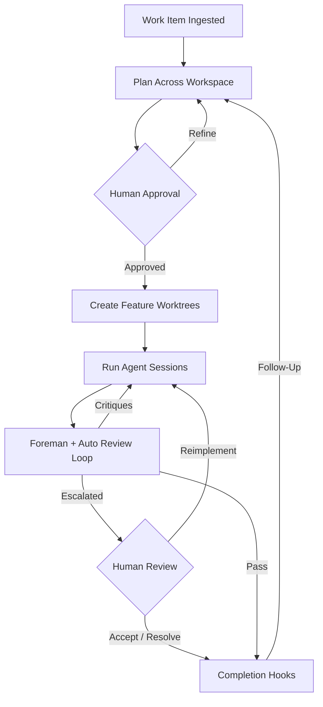

# 00 - Project Overview
<!-- docs:last-integrated-commit 10e50295fb75f72c67233e191ae34fb8fc091f1e -->

## Mission Statement

Substrate is an AI-powered work-item orchestration tool that automates the lifecycle of a development task — from ticket ingestion through cross-repo planning, agent-driven implementation, review, and completion. Operators work at the work-item level: planning, implementation, and session-history surfaces aggregate each work item while exposing the latest child agent run, reviews, questions, and resume state when deeper inspection is needed. Substrate replaces manual multi-repo choreography with a deterministic, human-supervised pipeline where AI agents execute sub-plans under structured oversight.

## Core Workflow

1. **Ingest** — Create or ingest a work item from a configured provider.
2. **Plan** — Explore workspace branches, gather repo guidance, and generate a cross-repo plan plus per-repo sub-plans.
3. **Review Plan** — Human reviews, revises, approves, or rejects the plan in the TUI.
4. **Implement** — Create feature branches, run agent sessions per sub-plan, and execute waves in dependency order. An automated review loop per repo runs within implementation: implement → review → reimpl → re-review → pass/escalate/fail.
5. **Oversee** — A Foreman session mediates unresolved questions. Operators can steer running agents mid-stream or follow up on completed/failed repo sessions with additional feedback.
6. **Complete** — When all sub-plans pass review, event hooks update external trackers and repo hosts, then the workspace is retained for reference.
7. **Follow Up** — Completed work items can re-enter planning with differential feedback. Only repos whose sub-plans change are re-implemented; unchanged repos are skipped.

## System Boundaries

Substrate is organized around six stable seams:

- **Domain and persistence** — work items, plans, sessions, reviews, review artifacts, and PR/MR persistence; **Events and hooks** — workflow progression is published as system events; external effects subscribe
- **Adapters and harnesses** — providers, repo hosts, coding harnesses, and error-tracking adapters sit behind explicit interfaces; **Runtime orchestration** — planning, execution waves, Foreman handling, review loops, and recovery
- **Operator interface** — work-item overviews, runs and tasks, session search, planning, implementation, settings, repo browsing, and recovery flows; **Delivery plan** — phased rollout, quality gates, validation strategy, and risk tracking

## Design Principles

**Strong boundaries over clever abstractions.** Provider logic, repo host automation, harness integration, orchestration, and TUI concerns each have a primary home. **Event-driven side effects.** Workflow state changes are internal; tracker updates, MR/PR creation, and external actions hang off events rather than being embedded in core transitions.
**Human judgment at control points.** Plan approval, uncertain question handling, escalation, and interrupted-session recovery always have an operator path. **Workspace-first execution.** Planning reads the main branch; implementation writes feature branches; workspace identity survives path moves.

## Technology Choices

Go, Bubble Tea, SQLite, git-work, OMP bridge.
