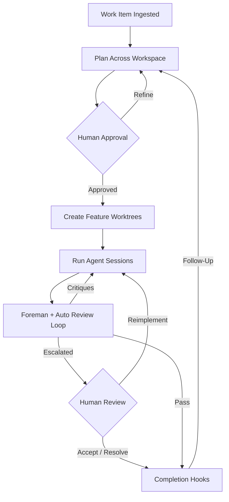

# 00 - Project Overview
<!-- docs:last-integrated-commit a38128010038776df783ec0bdf305b2637b5603e -->
## Mission Statement

Substrate is an AI-powered work-item orchestration tool built in Go. It automates the lifecycle of a development task — from ticket ingestion through cross-repo planning, agent-driven implementation, review, and completion. Operators work at the work-item level: planning, implementation, and session-history surfaces aggregate each work item while still exposing the latest child agent run, reviews, questions, and resume state when deeper inspection is needed. Substrate replaces manual multi-repo choreography with a deterministic, human-supervised pipeline where AI agents execute sub-plans under structured oversight.

## Core Workflow

1. **Ingest** — Create or ingest a work item from a configured provider.
2. **Plan** — Explore the workspace's `main/` worktrees, gather repo guidance, and generate a cross-repo plan plus per-repo sub-plans.
3. **Review Plan** — Human reviews, revises, approves, or rejects the plan in the TUI.
4. **Implement** — Create feature worktrees, run agent sessions per sub-plan, and execute waves in dependency order. The orchestrator runs an automated review loop per repo within implementation: implement → review → reimpl → re-review → pass/escalate/fail.
5. **Oversee** — A Foreman session mediates unresolved questions. Operators can steer running agents mid-stream or follow up on completed/failed repo sessions with additional feedback.
6. **Complete** — When all sub-plans pass review, event hooks update external trackers and repo hosts, then the workspace is retained for reference.
7. **Follow Up** — Completed work items can re-enter planning with differential feedback. Only repos whose sub-plans change are re-implemented; unchanged repos are skipped.

## System Boundaries

Substrate is organized around a few stable seams:

- **Domain and persistence** — work items, plans, sessions, reviews, review artifacts, PR/MR persistence, and workspace identity (`01-domain-model.md`, `02-layered-architecture.md`)
- **Events and hooks** — workflow progression is published as system events; external effects subscribe to those events (`03-event-system.md`)
- **Adapters and harnesses** — providers, repo hosts, coding harnesses, and Sentry source-adapter behavior sit behind explicit interfaces (`04-adapters.md`)
- **Runtime orchestration** — planning, execution waves, Foreman handling, review loops, and recovery are runtime workflows (`05-orchestration.md`)
- **Operator interface** — the TUI exposes work-item overviews, per-work-item runs/tasks, session-history search, planning, implementation, settings, repository browsing and cloning, and recovery flows (`06-tui-design.md`)
- **Delivery plan** — phased rollout, quality gates, validation strategy, and risk tracking live in one place (`07-implementation-plan.md`)

## Technology Decisions

| Technology | Choice | Rationale |
|---|---|---|
| Language | Go | First-class concurrency for parallel sessions, single-binary distribution, and interface-oriented architecture |
| TUI | bubbletea + lipgloss + bubbles | Predictable reactive terminal UI with a semantic design system split across `styles/`, reusable `components/`, and composed `views/` |
| Database | SQLite via sqlx + go-atomic | Local persistence, transactional consistency via `atomic.Transacter[repository.Resources]`, and zero service dependency |
| Git integration | git-work + git CLI | Worktree lifecycle stays explicit and machine-readable |
| Agent harness | Multi-harness subprocess adapters | oh-my-pi via Bun bridge is the default verified interactive harness; Claude Code and Codex are selectable but not yet parity-proven for all interactive flows |
| Work item trackers | Linear GraphQL + GitHub/GitLab REST adapters | Common work item contract with provider-specific capabilities behind the boundary |
| Repo lifecycle | glab CLI + GitHub REST API | GitLab MR automation stays in `glab`; GitHub PR automation uses REST; startup remote detection selects the right lifecycle path |
| Config | YAML | Human-editable structured configuration with stable defaults |

## Design Principles

**Strong boundaries over clever abstractions.** Provider logic, repo host automation, harness integration, orchestration, and TUI concerns each have a primary home. Cross-file references should point to the owning document instead of duplicating detail.

**Event-driven side effects.** Workflow state changes are internal; tracker updates, MR/PR creation, and other external actions hang off events rather than being embedded in core state transitions. See `03-event-system.md`.

**Human judgment at control points.** Plan approval, uncertain question handling, escalation, and interrupted-session recovery always have an operator path. See `05-orchestration.md` and `06-tui-design.md`.

**Workspace-first execution.** Planning reads `main/` worktrees, implementation writes feature worktrees, and workspace identity survives path moves through `.substrate-workspace`. See `01-domain-model.md`.

**One source of truth per topic.**
- Domain/state/schema: `01` / `02`
- Events/hook semantics: `03`
- Provider, lifecycle, harness, and Sentry source-adapter contracts: `04`
- Runtime control flow: `05`
- TUI behavior: `06`
- Phasing/tests/risks: `07`
- TUI design-system contract and verification guidance: `08`
- Deferred follow-ups: `future-work.md`

## Document Map

| Doc | Owns | Does not own |
|---|---|---|
| `00-overview.md` | Product summary, boundaries, doc map | Detailed runtime logic, adapter specifics, schema |
| `01-domain-model.md` | Entities, enums, state machines, workspace layout, review artifacts, source summaries, PR/MR types | Service wiring, adapter behavior |
| `02-layered-architecture.md` | Layer boundaries, dependency injection, go-atomic transacter pattern, persistence/schema | Runtime workflow details |
| `03-event-system.md` | Event catalog (including `review.artifact_recorded`, `adapter.error`), bus behavior, hook semantics | Concrete provider behavior |
| `04-adapters.md` | Work item adapters, repo lifecycle adapters, harnesses, remote detection, and Sentry-specific auth/config, browse, settings, and verification details | End-to-end workflow sequencing, DB schema, or shared TUI interaction design |
| `05-orchestration.md` | Planning/execution/review/Foreman handling/recovery runtime flow | Provider internals, schema, full UI design |
| `06-tui-design.md` | Views, overlays, settings UX, operator interactions | Adapter implementations, DB schema |
| `07-implementation-plan.md` | Phases, quality gates, test strategy, risks | Canonical runtime behavior |
| `08-tui-design-system.md` | Design-system ownership boundaries, shared chrome semantics, layout guardrails, verification guidance | Broader TUI workflow behavior |
| `future-work.md` | Deferred follow-up items with scope/interim/requirements | Implementation timelines, current behavior details |
