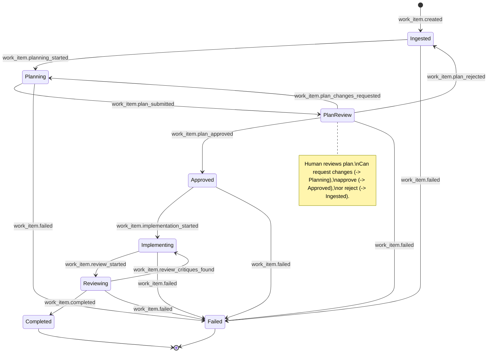
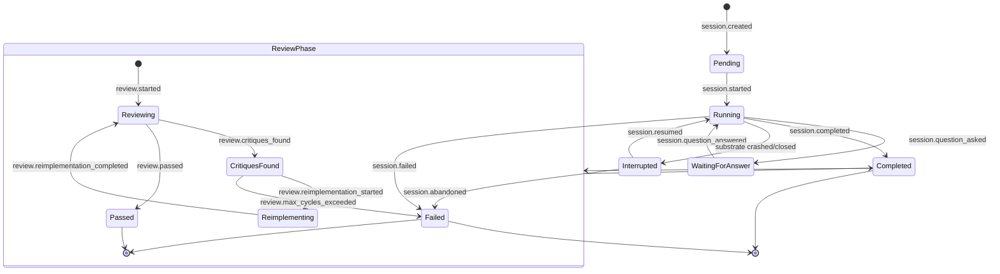
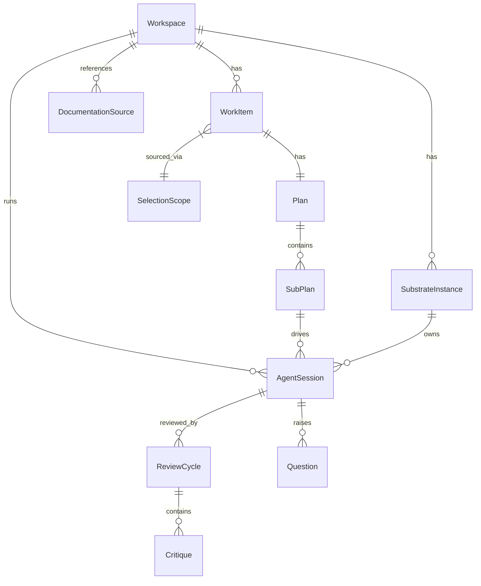

# Domain Model

Core domain types, state machines, and workspace layout for Substrate — the filling between all the gaps.
See `02-layered-architecture.md` for how these types flow through the system layers.

---

## Core Domain Types

### WorkItem
The root aggregate. Represents an external ticket pulled from a work item source (Linear, etc.).
```go
type WorkItem struct {
	ID            string            `json:"id"`
	WorkspaceID   string            `json:"workspace_id"`   // FK to Workspace
	ExternalID    string            `json:"external_id"`    // format: LIN-{TEAM}-{NUMBER} (e.g. LIN-FOO-123) for adapter-sourced; MAN-{n} (e.g. MAN-1, MAN-42) for manual
	Source        string            `json:"source"`          // adapter name, e.g. "linear"
	Title         string            `json:"title"`
	Description   string            `json:"description"`
	Labels        []string          `json:"labels"`
	AssigneeID    string            `json:"assignee_id"`
	State         WorkItemState     `json:"state"`
	Metadata      map[string]any    `json:"metadata"`        // adapter-specific fields
	SourceScope   SelectionScope    `json:"source_scope"`    // granularity selected: issues/projects/initiatives/manual
	SourceItemIDs []string          `json:"source_item_ids"` // external IDs selected to create this work item
	CreatedAt     time.Time         `json:"created_at"`
	UpdatedAt     time.Time         `json:"updated_at"`
}

type WorkItemState string
const (
	WorkItemIngested     WorkItemState = "ingested"
	WorkItemPlanning     WorkItemState = "planning"
	WorkItemPlanReview   WorkItemState = "plan_review"
	WorkItemApproved     WorkItemState = "approved"
	WorkItemImplementing WorkItemState = "implementing"
	WorkItemReviewing    WorkItemState = "reviewing"
	WorkItemCompleted    WorkItemState = "completed"
	WorkItemFailed       WorkItemState = "failed"
)
```

### Selection Model
Types for adapter-driven work item selection in the TUI. See `04-adapters.md` for the `WorkItemAdapter` interface.
```go
type SelectionScope string
const (
	ScopeIssues      SelectionScope = "issues"
	ScopeProjects    SelectionScope = "projects"
	ScopeInitiatives SelectionScope = "initiatives"
	ScopeManual      SelectionScope = "manual"      // manual adapter, no external items
)

type SelectableItem struct {
	ID          string            `json:"id"`
	Scope       SelectionScope    `json:"scope"`
	Title       string            `json:"title"`
	Description string            `json:"description"`
	State       string            `json:"state"`
	Labels      []string          `json:"labels"`
	Children    int               `json:"children"`  // issues in project, projects in initiative
	Metadata    map[string]any    `json:"metadata"`
}

type Selection struct {
	Scope       SelectionScope       `json:"scope"`
	ItemIDs     []string             `json:"item_ids"`
	ManualInput *ManualWorkItemInput `json:"manual_input,omitempty"`
}

type ManualWorkItemInput struct {
	Title        string          `json:"title"`
	Description  string          `json:"description"`
}

// WorkItemEvent is emitted on the channel returned by WorkItemAdapter.Watch.
type WatchEventType string
const (
	WorkItemDiscovered WatchEventType = "discovered" // newly seen issue matching filter
	WorkItemUpdated    WatchEventType = "updated"    // previously seen issue changed state
	WatchError         WatchEventType = "error"      // poll error; Err field is set
)

type WorkItemEvent struct {
	Type WatchEventType `json:"type"`
	Item WorkItem       `json:"item,omitempty"`
	Err  error          `json:"-"`              // non-nil only when Type == WatchError
}
type AdapterCapabilities struct {
	CanWatch     bool             `json:"can_watch"`
	CanBrowse    bool             `json:"can_browse"`
	CanMutate    bool             `json:"can_mutate"`
	BrowseScopes []SelectionScope `json:"browse_scopes"`
}

type ListOpts struct {
	Scope  SelectionScope `json:"scope"`
	TeamID string         `json:"team_id"`
	Query  string         `json:"query"`
	Cursor string         `json:"cursor"`
	Limit  int            `json:"limit"`
}

type ListResult struct {
	Items      []SelectableItem `json:"items"`
	NextCursor string           `json:"next_cursor"`
	HasMore    bool             `json:"has_more"`
}
```

### Plan
The orchestration plan for a work item. Contains one top-level plan (markdown) and N sub-plans, one per repository requiring changes. Planning always reads from the `main/` worktree of each repo.
```go
type Plan struct {
	ID               string     `json:"id"`
	WorkItemID       string     `json:"work_item_id"`
	Status           PlanStatus `json:"status"`
	OrchestratorPlan string     `json:"orchestrator_plan"` // cross-repo markdown plan
	SubPlans         []SubPlan  `json:"sub_plans"`
	Version          int        `json:"version"`           // increments on each revision
	CreatedAt        time.Time  `json:"created_at"`
	UpdatedAt        time.Time  `json:"updated_at"`
}

type PlanStatus string
const (
	PlanDraft         PlanStatus = "draft"
	PlanPendingReview PlanStatus = "pending_review"
	PlanApproved      PlanStatus = "approved"
	PlanRejected      PlanStatus = "rejected"
)
```

### SubPlan
A single repository's portion of the plan. `Order` is the execution group index from the `substrate-plan` YAML block in the plan output: repos in `execution_groups[0]` get `Order=0`, repos in `execution_groups[1]` get `Order=1`, etc. Sub-plans with equal `Order` run in parallel; lower values run first. See `03-event-system.md` for events.
```go
type SubPlan struct {
	ID             string        `json:"id"`
	PlanID         string        `json:"plan_id"`
	RepositoryName string        `json:"repository_name"` // matches repo directory name in workspace
	Content        string        `json:"content"`         // markdown sub-plan
	Order          int           `json:"order"` // execution group index; equal values run in parallel
	Status         SubPlanStatus `json:"status"`
}

type SubPlanStatus string
const (
	SubPlanPending      SubPlanStatus = "pending"
	SubPlanInProgress   SubPlanStatus = "in_progress"
	SubPlanCompleted    SubPlanStatus = "completed"
	SubPlanFailed       SubPlanStatus = "failed"
)
```

### Workspace
A pre-existing folder where the user has cloned repos via `gw clone`. Initialized with `substrate init`, which creates a `.substrate-workspace` identity file. A workspace contains one or more work items, each producing feature worktrees in the relevant repos.
```go
type Workspace struct {
	ID        string          `json:"id"`         // ULID from .substrate-workspace
	Name      string          `json:"name"`       // user-given name
	RootPath  string          `json:"root_path"`  // current filesystem path (updated on startup)
	Status    WorkspaceStatus `json:"status"`
	CreatedAt time.Time       `json:"created_at"`
}

type WorkspaceStatus string
const (
	WorkspaceCreating WorkspaceStatus = "creating"
	WorkspaceReady    WorkspaceStatus = "ready"
	WorkspaceArchived WorkspaceStatus = "archived"
	WorkspaceError    WorkspaceStatus = "error"
)
```

### AgentSession
A single agent harness invocation against one sub-plan in one repository's feature worktree.
```go
type AgentSession struct {
	ID             string             `json:"id"`
	WorkspaceID    string             `json:"workspace_id"`
	SubPlanID      string             `json:"sub_plan_id"`
	RepositoryName string             `json:"repository_name"`
	WorktreePath   string             `json:"worktree_path"`   // absolute path to feature worktree
	HarnessName    string             `json:"harness_name"`    // e.g. "oh-my-pi"
	Status         AgentSessionStatus `json:"status"`
	PID            *int               `json:"pid"`             // OS process ID for liveness checks
	StartedAt      *time.Time         `json:"started_at"`
	CompletedAt    *time.Time         `json:"completed_at"`
	ShutdownAt     *time.Time         `json:"shutdown_at"`  // set on clean shutdown; nil if process crashed
	ExitCode       *int               `json:"exit_code"`
	OwnerInstanceID *string            `json:"owner_instance_id"` // nil until session starts; set to spawning instance's ID
}

type AgentSessionStatus string
const (
	AgentSessionPending          AgentSessionStatus = "pending"
	AgentSessionRunning          AgentSessionStatus = "running"
	AgentSessionWaitingForAnswer AgentSessionStatus = "waiting_for_answer"
	AgentSessionCompleted        AgentSessionStatus = "completed"
	AgentSessionInterrupted      AgentSessionStatus = "interrupted"
	AgentSessionFailed           AgentSessionStatus = "failed"
)
```

### SubstrateInstance
A running Substrate process registered for a workspace. Used for multi-instance coordination: session ownership, answer/resume gating, and PID-independent liveness detection.
```go
type SubstrateInstance struct {
	ID            string    `json:"id"`             // ULID generated at startup
	WorkspaceID   string    `json:"workspace_id"`
	PID           int       `json:"pid"`
	Hostname      string    `json:"hostname"`
	LastHeartbeat time.Time `json:"last_heartbeat"` // updated every 5s; stale after 15s = dead
	StartedAt     time.Time `json:"started_at"`
}
```
An instance is considered live if `LastHeartbeat` is within 15 seconds of the current time. An instance is considered dead if its row is missing or the heartbeat is stale.
### SessionSummary
```go
// SessionSummary is a TUI projection type for the session sidebar. It aggregates
// WorkItem and active AgentSession state into a single value for rendering.
type SessionSummary struct {
	WorkItemID    string             `json:"work_item_id"`
	ExternalID    string             `json:"external_id"`   // e.g. "LIN-FOO-123"
	Title         string             `json:"title"`
	State         WorkItemState      `json:"state"`
	ActiveSession *ActiveSessionInfo `json:"active_session,omitempty"`
	ReposDone     int                `json:"repos_done"`
	ReposTotal    int                `json:"repos_total"`
	CompletedAt   *time.Time         `json:"completed_at,omitempty"`
}

type ActiveSessionInfo struct {
	ID     string             `json:"id"`
	Status AgentSessionStatus `json:"status"`
	Repo   string             `json:"repo"`  // repository being processed
}
```

### ReviewCycle
One review pass over an agent session's output. A session may go through multiple review cycles (implement -> review -> critique -> reimplement -> review -> pass).
```go
type ReviewCycle struct {
	ID              string            `json:"id"`
	CycleNumber     int               `json:"cycle_number"`
	AgentSessionID  string            `json:"agent_session_id"`
	ReimplementationSessionID *string  `json:"reimplementation_session_id"` // nil until reimplementation starts
	ReviewerHarness string            `json:"reviewer_harness"` // harness used for review
	Summary         string            `json:"summary"`
	Status          ReviewCycleStatus `json:"status"`
	Critiques       []Critique        `json:"critiques"`
	StartedAt       time.Time         `json:"started_at"`
	CompletedAt     *time.Time        `json:"completed_at"`
}

type ReviewCycleStatus string
const (
	ReviewCycleReviewing      ReviewCycleStatus = "reviewing"
	ReviewCycleCritiquesFound ReviewCycleStatus = "critiques_found"
	ReviewCycleReimplementing ReviewCycleStatus = "reimplementing"
	ReviewCyclePassed         ReviewCycleStatus = "passed"
	ReviewCycleFailed         ReviewCycleStatus = "failed"
)
```

### Critique
A single review finding within a review cycle.
```go
type Critique struct {
	ID            string          `json:"id"`
	ReviewCycleID string          `json:"review_cycle_id"`
	FilePath      string          `json:"file_path"`
	LineNumber   *int            `json:"line_number"`  // nil for file-level critiques
	Description   string          `json:"description"`
	Suggestion   string          `json:"suggestion"`   // optional improvement suggestion from review agent
	Severity      CritiqueSeverity `json:"severity"`
	Status        CritiqueStatus  `json:"status"`
}

type CritiqueSeverity string
const (
	CritiqueSeverityCritical CritiqueSeverity = "critical" // blocking; must fix before merge
	CritiqueSeverityMajor    CritiqueSeverity = "major"    // significant issue; triggers re-implementation
	CritiqueSeverityMinor    CritiqueSeverity = "minor"    // style or quality; logged, does not block
	CritiqueSeverityNit      CritiqueSeverity = "nit"      // trivial preference; always logged, never blocks
)

type CritiqueStatus string
const (
	CritiqueOpen     CritiqueStatus = "open"
	CritiqueResolved CritiqueStatus = "resolved"
)
```

### DocumentationSource
An abstracted reference to documentation consumed during planning and flagged for update during implementation. See `04-adapters.md` for the interface definition.
```go
type DocumentationSource struct {
	ID           string                  `json:"id"`
	WorkspaceID  string                  `json:"workspace_id"`
	RepositoryName string                  `json:"repository_name"` // for repo_embedded: name of the containing workspace repo; empty for dedicated_repo
	Type         DocumentationSourceType `json:"type"`
	Path         string                  `json:"path"`           // relative path within repo, e.g. "docs/"
	RepoURL      string                  `json:"repo_url"`       // clone URL (empty for repo_embedded)
	Branch       string                  `json:"branch"`
	LastSyncedAt *time.Time              `json:"last_synced_at"`
}

type DocumentationSourceType string
const (
	DocSourceRepoEmbedded  DocumentationSourceType = "repo_embedded"  // lives in project repo
	DocSourceDedicatedRepo DocumentationSourceType = "dedicated_repo" // separate docs repo
)
```
`RepoURL` is empty for `repo_embedded`; use `RepositoryName` to identify the containing workspace repo instead.


### Question
A question surfaced by a sub-agent, routed through the foreman. If the cross-repo plan contains the answer, the foreman responds directly. Otherwise it escalates to the human.
```go
type Question struct {
	ID             string     `json:"id"`
	AgentSessionID string     `json:"agent_session_id"`
	Content        string     `json:"content"`            // the question text
	Context        string     `json:"context"`            // surrounding context from agent
	Answer         string     `json:"answer"`
	AskedAt        time.Time  `json:"asked_at"`
	AnsweredAt     *time.Time `json:"answered_at"`
	AnsweredBy     string     `json:"answered_by"`        // "foreman" or "human"
	Status     QuestionStatus `json:"status"`
}

type QuestionStatus string
const (
	QuestionPending   QuestionStatus = "pending"
	QuestionAnswered  QuestionStatus = "answered"
	QuestionEscalated QuestionStatus = "escalated"
)
```

---
## Work Item State Machine


### Transition Events
| From | To | Event | Trigger |
|---|---|---|---|
| `*` | Ingested | `work_item.created` | Adapter ingests ticket |
| Ingested | Planning | `work_item.planning_started` | Planner invoked, reads repos from `main/` worktrees |
| Planning | PlanReview | `work_item.plan_submitted` | Plan generation complete |
| PlanReview | Approved | `work_item.plan_approved` | Human approves via TUI |
| PlanReview | Planning | `work_item.plan_changes_requested` | Human requests changes — new planning session started |
| PlanReview | Ingested | `work_item.plan_rejected` | Human rejects plan outright |
| Approved | Implementing | `work_item.implementation_started` | Worktrees created, agents spawned |
| Implementing | Reviewing | `work_item.review_started` | All agent sessions completed |
| Reviewing | Implementing | `work_item.review_critiques_found` | Open critiques require reimplementation |
| Reviewing | Completed | `work_item.completed` | All reviews passed |
| any active | Failed | `work_item.failed` | Unrecoverable error |

---
## Agent Session State Machine


### Session Lifecycle
1. **Pending** - Sub-plan assigned, worktree created, waiting for harness spawn.
2. **Running** - Agent harness process active. PID tracked for liveness checks. Emits streaming events via bridge.
3. **WaitingForAnswer** - Agent surfaced a question. Foreman attempts auto-answer from cross-repo plan; if unable, escalates to human via TUI.
4. **Completed** - Harness exited with code 0. Triggers review phase.
5. **Interrupted** - Was running, but Substrate crashed or was closed and the process is gone (detected via PID liveness check on startup). TUI offers `[R]esume` or `[A]bandon`.
6. **Failed** - Harness exited non-zero, timed out, or session was abandoned after interruption.

### Review Sub-lifecycle
1. **Reviewing** - Review agent compares feature worktree against `main/`, evaluates against sub-plan.
2. **CritiquesFound** - Review produced open critiques. Agent must address them.
3. **Reimplementing** - New agent session spawned to fix critiques. Loops back to Reviewing.
4. **Passed** - No open critiques. Sub-plan marked completed.
5. **Failed** — Max review cycles exceeded without passing. Work item is paused and escalated to the human with full critique history.
---

## Workspace Layout
```
~/myproject/                                # pre-existing workspace folder
├── .substrate-workspace                    # workspace identity file (YAML: id, name, created_at)
├── backend-api/                            # git-work managed repo (cloned via `gw clone`)
│   ├── .bare/                              #   bare git repo (git-work internals)
│   ├── main/                               #   default branch worktree (READ-ONLY for planning)
│   ├── sub-LIN-FOO-123-fix-auth-flow/          #   work item 1's feature worktree
│   └── sub-LIN-FOO-456-rate-limit/             #   work item 2's feature worktree
├── frontend-app/                           # git-work managed repo
│   ├── .bare/                              #   bare git repo
│   ├── main/                               #   default branch worktree (READ-ONLY for planning)
│   └── sub-LIN-FOO-123-fix-auth-flow/          #   work item 1 (same branch, different repo)
└── engineering-docs/                       # optional: dedicated docs repo
    ├── .bare/
    └── main/
```

**.substrate-workspace file:**
```yaml
id: "01HXYZ..."        # ULID, stable workspace identity
name: "myproject"       # user-given name
created_at: "2024-..."
```

**Key invariants:**
- The workspace folder and its repos are pre-existing — the user clones repos with `gw clone` and runs `substrate init` to register the workspace.
- **All repos in the workspace must be git-work initialized** (`.bare/` present). `substrate init` verifies this at setup time. The pre-flight check (planning pipeline step a) re-verifies before each plan and surfaces any plain git clones as workspace health warnings.
- Substrate scans for git-work repos (directories with a `.bare/` subdirectory) on startup. Plain git clones are visible as warnings but excluded from planning.
- The `main/` worktree is never modified by agents. It serves as the read-only reference for planning and diffing.
- Feature worktrees are created via `git-work checkout -b <branch>` only after plan approval.
- Multiple work items coexist in the same workspace, each with its own branch/worktree per repo.
- All domain state lives in the global database at `~/.substrate/state.db`, scoped by workspace ID. Plan drafts live in `<workspace-root>/.substrate/sessions/<session-id>/plan-draft.md`. Session logs live in `~/.substrate/sessions/<session-id>.log`.
- Sessions are scoped to workspace by the ULID in `.substrate-workspace`, not by filesystem path. Moving the folder doesn't break session access.
---
## Entity Relationships

Each `Workspace` contains one or more `WorkItem`s. Each `WorkItem` drives exactly one `Plan`; the plan record is updated in-place on revision, never replaced. The `Plan` decomposes into `SubPlan`s, each mapped to a repository in the workspace. An `AgentSession` executes a `SubPlan` within a feature worktree. After execution, one or more `ReviewCycle`s evaluate the output, producing `Critique`s that may trigger reimplementation.

---
## Commit Strategy Types

```go
type CommitStrategy string
const (
	CommitStrategyGranular    CommitStrategy = "granular"     // commit after every logical change
	CommitStrategySemiRegular CommitStrategy = "semi-regular" // commit when a unit of work is complete (default)
	CommitStrategySingle      CommitStrategy = "single"       // one commit at end of session
)

type CommitMessageFormat string
const (
	CommitMessageAIGenerated  CommitMessageFormat = "ai-generated"  // default
	CommitMessageConventional CommitMessageFormat = "conventional"  // conventional commits
	CommitMessageCustom       CommitMessageFormat = "custom"        // user template
)
```

Configured per workspace in `substrate.toml` under the `[commit]` block. `CommitStrategySemiRegular` is the default: commit when a logical unit of work is complete (e.g. after implementing a complete function or adding all files for a feature). AI-generated commit messages are the default; instructions are passed to the agent harness as part of session context.
