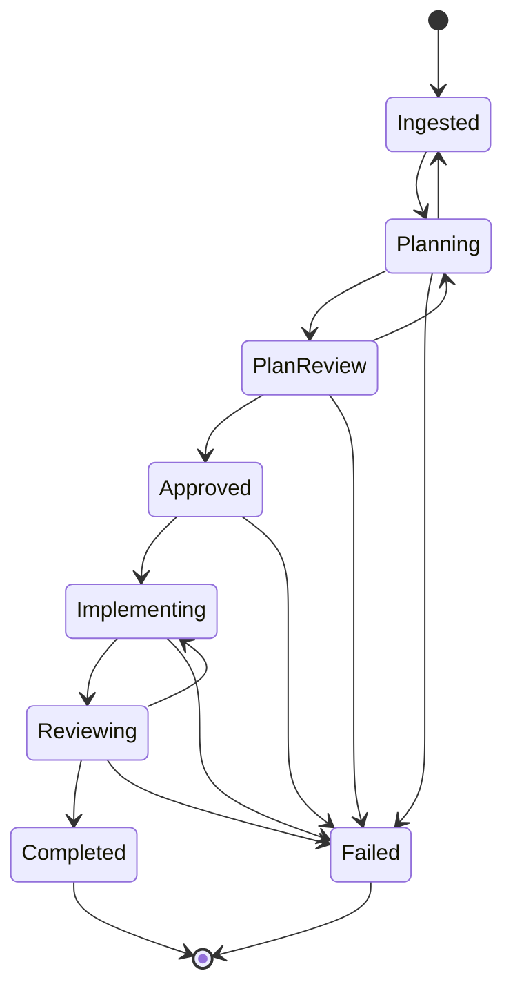
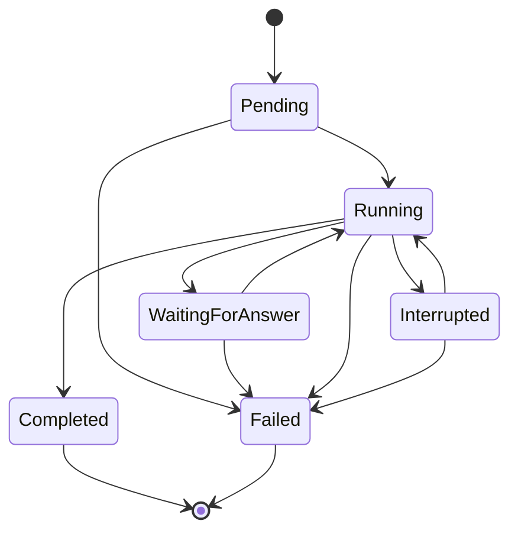
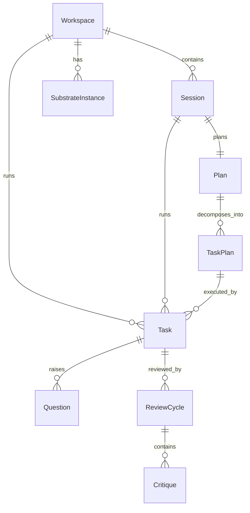

# 01 - Domain Model
<!-- docs:last-integrated-commit f6b8e6e5f8374bd4c2f467852266f01cc2f323a2 -->

Current domain types, state machines, and relationship rules for Substrate.
This document describes repository HEAD, not earlier naming.

User-facing copy still says “work item” and “session history” in places. Internally, the persisted root aggregate is `domain.Session`, and a repo-scoped agent run is `domain.Task`.

---

## Core Domain Types

### Session

`Session` is the root aggregate for a unit of tracked work. It represents the external issue / project / initiative / manual request that Substrate is moving through planning, implementation, and review.

```go
type Session struct {
	ID            string
	WorkspaceID   string
	ExternalID    string
	Source        string
	Title         string
	Description   string
	Labels        []string
	AssigneeID    string
	State         SessionState
	Metadata      map[string]any
	SourceScope   SelectionScope
	SourceItemIDs []string
	CreatedAt     time.Time
	UpdatedAt     time.Time
}

type SessionState string

const (
	SessionIngested     SessionState = "ingested"
	SessionPlanning     SessionState = "planning"
	SessionPlanReview   SessionState = "plan_review"
	SessionApproved     SessionState = "approved"
	SessionImplementing SessionState = "implementing"
	SessionReviewing    SessionState = "reviewing"
	SessionCompleted    SessionState = "completed"
	SessionFailed       SessionState = "failed"
)
```

Important invariants owned by `SessionService`:

- `WorkspaceID` is required.
- Initial state must be `ingested`.
- `external_id` uniqueness is enforced per workspace when applicable.
- `SourceItemIDs` are used to prevent duplicate ingestion of the same scoped tracker item set.

### Selection Model

Selection scope records how a root `Session` was created from an adapter.

```go
type SelectionScope string

const (
	ScopeIssues      SelectionScope = "issues"
	ScopeProjects    SelectionScope = "projects"
	ScopeInitiatives SelectionScope = "initiatives"
	ScopeManual      SelectionScope = "manual"
)
```

### Plan and TaskPlan

A `Plan` is the cross-repo orchestration record for one root `Session`. `TaskPlan` is the per-repository slice of that plan.

```go
type Plan struct {
	ID               string
	WorkItemID       string
	Status           PlanStatus
	OrchestratorPlan string
	Version          int
	FAQ              []FAQEntry
	CreatedAt        time.Time
	UpdatedAt        time.Time
}

type FAQEntry struct {
	ID             string
	PlanID         string
	AgentSessionID string
	RepoName       string
	Question       string
	Answer         string
	AnsweredBy     string
	CreatedAt      time.Time
}

type PlanStatus string

const (
	PlanDraft         PlanStatus = "draft"
	PlanPendingReview PlanStatus = "pending_review"
	PlanApproved      PlanStatus = "approved"
	PlanRejected      PlanStatus = "rejected"
)

type TaskPlan struct {
	ID             string
	PlanID         string
	RepositoryName string
	Content        string
	Order          int
	Status         TaskPlanStatus
	CreatedAt      time.Time
	UpdatedAt      time.Time
}

type TaskPlanStatus string

const (
	SubPlanPending     TaskPlanStatus = "pending"
	SubPlanInProgress  TaskPlanStatus = "in_progress"
	SubPlanCompleted   TaskPlanStatus = "completed"
	SubPlanFailed      TaskPlanStatus = "failed"
	SubPlanInterrupted TaskPlanStatus = "interrupted"
)
```

Notes:

- `Plan.WorkItemID` is the foreign key back to the root `Session`; storage still uses the legacy column name `work_item_id`.
- `FAQ` is persisted on the `plans` row as JSON and is appended by the Foreman flow.
- `TaskPlan.Order` is the execution-group index parsed from the planning YAML block.
- The domain enum includes `SubPlanInterrupted`, but the current service transition table actively uses `pending -> in_progress -> completed/failed`, with `failed -> pending` for retry. The current SQLite migration also constrains `sub_plans.status` to `pending|in_progress|completed|failed`.

### TaskPhase

`TaskPhase` discriminates the kind of child agent session.

```go
type TaskPhase string

const (
	TaskPhasePlanning       TaskPhase = "planning"
	TaskPhaseImplementation TaskPhase = "implementation"
	TaskPhaseReview         TaskPhase = "review"
)
```

### Task

`Task` replaces the old "agent session" model in the domain narrative. It is one harness invocation against one `TaskPlan` in one repository worktree.

```go
type Task struct {
	ID              string
	WorkItemID      string
	WorkspaceID     string
	Phase           TaskPhase
	SubPlanID       string
	RepositoryName  string
	WorktreePath    string
	HarnessName     string
	Status          TaskStatus
	PID             *int
	StartedAt       *time.Time
	CompletedAt     *time.Time
	ShutdownAt      *time.Time
	ExitCode        *int
	OwnerInstanceID *string
	CreatedAt       time.Time
	UpdatedAt       time.Time
	OmpSessionFile  string
	OmpSessionID    string
}

type TaskStatus string

const (
	AgentSessionPending          TaskStatus = "pending"
	AgentSessionRunning          TaskStatus = "running"
	AgentSessionWaitingForAnswer TaskStatus = "waiting_for_answer"
	AgentSessionCompleted        TaskStatus = "completed"
	AgentSessionInterrupted      TaskStatus = "interrupted"
	AgentSessionFailed           TaskStatus = "failed"
)
```

Nuance: the constants still use the historical `AgentSession...` prefix. That is legacy naming on the status enum, not evidence that the persisted aggregate is still named `AgentSession`.

`WorkItemID` is the foreign key to the root `Session`. `SubPlanID` is nullable; planning sessions have no associated sub-plan. `Phase` discriminates the session kind: `planning`, `implementation`, or `review`.

`OmpSessionFile` and `OmpSessionID` are populated when the harness is oh-my-pi and track the external session identity for resume/steering.

### Question

Questions are attached to a `Task` through the historical `AgentSessionID` field name.

```go
type Question struct {
	ID             string
	AgentSessionID string
	Content        string
	Context        string
	Answer         string
	ProposedAnswer string
	AnsweredBy     string
	Status         QuestionStatus
	CreatedAt      time.Time
	AnsweredAt     *time.Time
}

type QuestionStatus string

const (
	QuestionPending   QuestionStatus = "pending"
	QuestionAnswered  QuestionStatus = "answered"
	QuestionEscalated QuestionStatus = "escalated"
)
```

Current behavior:

- Foreman can answer directly (`answered`).
- Foreman can escalate with a `ProposedAnswer` for human review (`escalated`).
- Humans resolve escalated questions by transitioning them to `answered`.

### ReviewCycle and Critique

Review is modeled separately from implementation runs. A `ReviewCycle` points back to the reviewed `Task` through `AgentSessionID`.

```go
type ReviewCycle struct {
	ID              string
	CycleNumber     int
	AgentSessionID  string
	ReviewerHarness string
	Summary         string
	Status          ReviewCycleStatus
	CreatedAt       time.Time
	UpdatedAt       time.Time
}

type ReviewCycleStatus string

const (
	ReviewCycleReviewing      ReviewCycleStatus = "reviewing"
	ReviewCycleCritiquesFound ReviewCycleStatus = "critiques_found"
	ReviewCycleReimplementing ReviewCycleStatus = "reimplementing"
	ReviewCyclePassed         ReviewCycleStatus = "passed"
	ReviewCycleFailed         ReviewCycleStatus = "failed"
)

type Critique struct {
	ID            string
	ReviewCycleID string
	FilePath      string
	LineNumber    *int
	Description   string
	Suggestion    string
	Severity      CritiqueSeverity
	Status        CritiqueStatus
	CreatedAt     time.Time
}

type CritiqueSeverity string

const (
	CritiqueCritical CritiqueSeverity = "critical"
	CritiqueMajor    CritiqueSeverity = "major"
	CritiqueMinor    CritiqueSeverity = "minor"
	CritiqueNit      CritiqueSeverity = "nit"
)

type CritiqueStatus string

const (
	CritiqueOpen     CritiqueStatus = "open"
	CritiqueResolved CritiqueStatus = "resolved"
)
```

### Workspace

A `Workspace` is a substrate-managed root directory containing git-work repositories.

```go
type Workspace struct {
	ID        string
	Name      string
	RootPath  string
	Status    WorkspaceStatus
	CreatedAt time.Time
	UpdatedAt time.Time
}

type WorkspaceStatus string

const (
	WorkspaceCreating WorkspaceStatus = "creating"
	WorkspaceReady    WorkspaceStatus = "ready"
	WorkspaceArchived WorkspaceStatus = "archived"
	WorkspaceError    WorkspaceStatus = "error"
)
```

### SubstrateInstance

A `SubstrateInstance` is a running process registered against a workspace for liveness and ownership.

```go
type SubstrateInstance struct {
	ID            string
	WorkspaceID   string
	PID           int
	Hostname      string
	LastHeartbeat time.Time
	StartedAt     time.Time
}
```

The current runtime treats an instance as stale when `LastHeartbeat` is older than 15 seconds.

### SessionHistoryEntry

Session history is a projection, not a root entity. It keeps the root `Session` identity visible while also surfacing the latest contributing `Task` metadata.

```go
type SessionHistoryEntry struct {
	SessionID          string
	WorkspaceID        string
	WorkspaceName      string
	WorkItemID         string
	WorkItemExternalID string
	WorkItemTitle      string
	WorkItemState      SessionState
	RepositoryName     string
	HarnessName        string
	Status             TaskStatus
	AgentSessionCount  int
	HasOpenQuestion    bool
	HasInterrupted     bool
	CreatedAt          time.Time
	UpdatedAt          time.Time
	CompletedAt        *time.Time
}
```

---

## State Machines

### Session lifecycle

This is the authoritative service-layer state machine for the root aggregate.



Meaning of the main edges:

- `Ingested -> Planning`: planner starts.
- `Planning -> PlanReview`: parseable plan persisted.
- `PlanReview -> Approved`: human approves the plan.
- `PlanReview -> Planning`: changes requested / re-plan.
- `Approved -> Implementing`: implementation begins.
- `Implementing -> Reviewing`: implementation wave set completes and the work item enters review.
- `Reviewing -> Implementing`: review found blocking critiques.
- `Reviewing -> Completed`: human accepts the reviewed result.

### Task lifecycle



Current interpretation:

- `Pending` means the DB row exists before the harness is launched.
- `Running` means the durable row has been transitioned before the external harness session is started.
- `WaitingForAnswer` is used while the Foreman / human question path is unresolved.
- `Interrupted` is used by instance reconciliation and graceful shutdown flows.
- `Resume` creates a new `Task`; the interrupted task remains interrupted for audit purposes.

### Review, question, and critique sub-lifecycles

`ReviewService` transition rules:

- `reviewing -> critiques_found | passed | failed`
- `critiques_found -> reimplementing | failed`
- `reimplementing -> reviewing | failed`

`QuestionService` transition rules:

- `pending -> answered | escalated`
- `escalated -> answered`

`Critique` transition rules:

- `open -> resolved`

---

## Relationship Narrative



Relationship rules that matter in practice:

- One root `Session` drives at most one persisted `Plan` row (`plans.work_item_id` is unique).
- One `Plan` fan-outs into one or more repository-scoped `TaskPlan` records.
- A `TaskPlan` can accumulate multiple `Task` attempts over time because review-driven reimplementation and resume create additional runs.
- `Question` and `ReviewCycle` remain attached to the specific `Task` that produced them, not to the root `Session`.
- `SessionHistoryEntry` is a read model that joins root-session identity with latest-task signals.

---

## Workspace Layout

```text
<workspace>/
├── .substrate-workspace
├── .substrate/
│   └── sessions/
│       └── <planning-session-id>/
│           └── plan-draft.md
├── repo-a/
│   ├── .bare/
│   ├── main/
│   └── sub-.../
└── repo-b/
    ├── .bare/
    ├── main/
    └── sub-.../
```

Global state lives under `config.GlobalDir()` (default `~/.substrate`):

- `state.db` stores all persisted domain state.
- `sessions/<task-id>.log` stores harness output logs used by review and resume flows.

Key invariants:

- Planning reads repository `main/` worktrees and writes draft output to `<workspace>/.substrate/sessions/<planning-session-id>/plan-draft.md`.
- Implementation and review run against feature worktrees.
- The workspace marker file (`.substrate-workspace`) is the stable identity anchor; path changes are recoverable.
