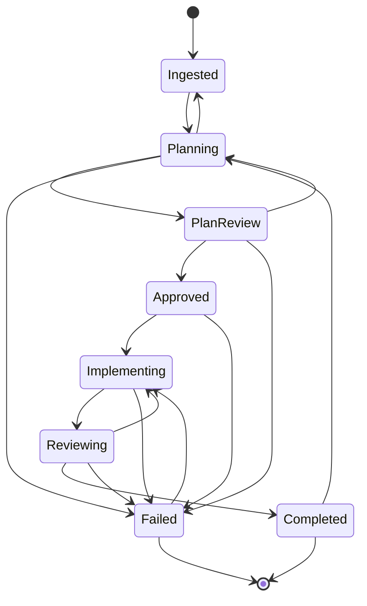
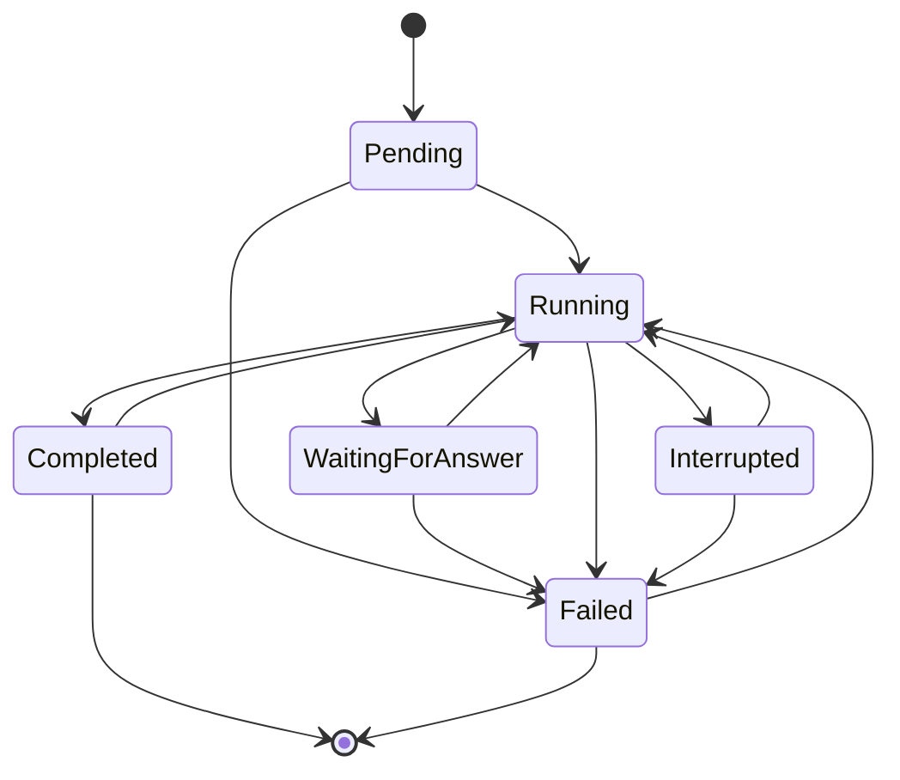
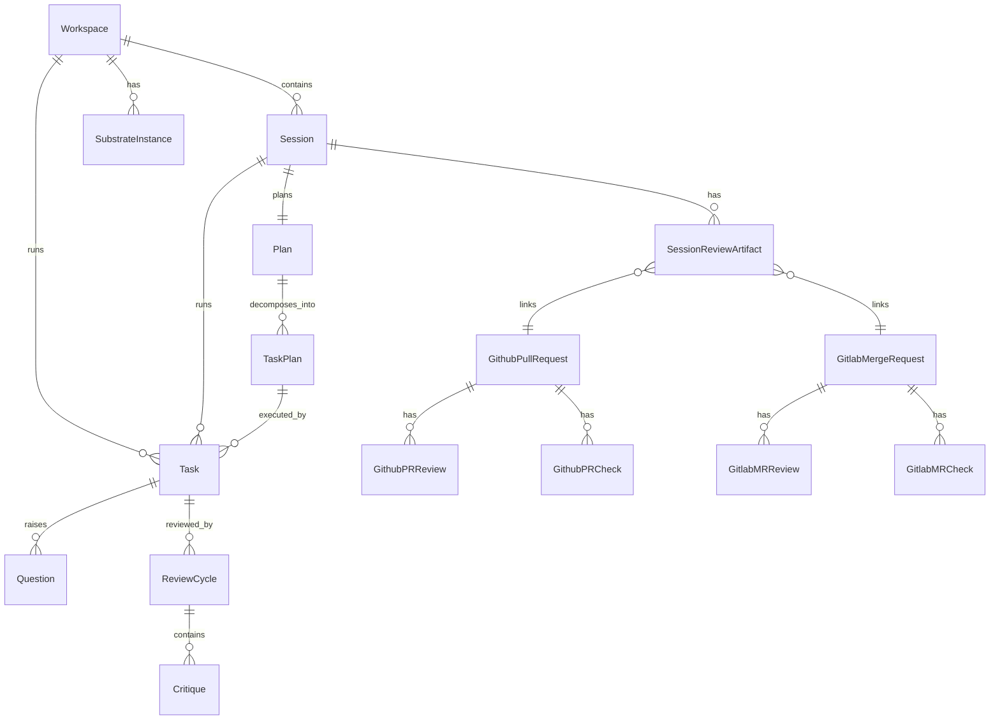

# 01 - Domain Model

<!-- docs:last-integrated-commit 5cbffc696e10a65fb98b6957c93e3c5f68e837d8 -->
Current domain types, state machines, and relationship rules for Substrate.
This document describes repository HEAD, not earlier naming.

User-facing copy still says "work item" and "session history" in places. Internally, the persisted root aggregate is `domain.Session`, and a repo-scoped agent run is `domain.AgentSession`.

---

## Core Domain Types

### Session

`Session` is the root aggregate for a unit of tracked work. It represents the external issue / project / initiative / manual request that Substrate is moving through planning, implementation, and review.

**State enum:**

| Value | Meaning |
|---|---|
| `ingested` | Received from an adapter; not yet started |
| `planning` | Planner is running |
| `plan_review` | Plan is ready for human approval |
| `approved` | Plan approved; waiting to begin |
| `implementing` | Implementation runs are active |
| `reviewing` | Human attention required — at least one repo escalated after automated review |
| `completed` | Work accepted; no further automated action |
| `merged` | All linked PRs/MRs are merged (terminal success) |
| `failed` | Work item encountered a terminal failure |
| `archived` | Removed from active views |

Important invariants owned by `SessionService`:

- `WorkspaceID` is required.
- Initial state must be `ingested`.
- External ID uniqueness is enforced per workspace when applicable.
- `SourceItemIDs` are used to prevent duplicate ingestion of the same scoped tracker item set.
- `merged` is a terminal success state distinct from `completed`. The transition `completed → merged` is driven by the GitHub/GitLab refresh loop once every linked PR/MR reaches the merged state. Follow-up re-planning is hidden for merged sessions; inspection remains available.

### Selection Model

Selection scope records how a root `Session` was created from an adapter.

| Value | Meaning |
|---|---|
| `issues` | Created from one or more tracker issues |
| `projects` | Created from a project board |
| `initiatives` | Created from an initiative/epic |
| `manual` | Created directly by the operator |

### Plan and TaskPlan

A `Plan` is the cross-repository orchestration record for one root `Session`. `TaskPlan` is the per-repository slice of that plan.

**Plan status:**

| Value | Meaning |
|---|---|
| `draft` | Being drafted by the planner |
| `pending_review` | Awaiting human approval |
| `approved` | Approved and ready to execute |
| `rejected` | Rejected; planner should revise |
| `superseded` | Replaced by a newer plan; retained for audit |

**TaskPlan status:**

| Value | Meaning |
|---|---|
| `pending` | Queued for execution |
| `in_progress` | Execution started |
| `completed` | Execution finished |
| `failed` | Execution failed |

Notes:

- `Plan.Version` is a monotonically increasing generation counter. It starts at 1 and increments each time a new plan supersedes the current active plan.
- Plan uniqueness is enforced so that historical plan rows are retained when superseded; only one non-superseded plan is active per session at any time.
- `TaskPlan.Order` is the execution-group index parsed from the planning YAML block.
- `FAQ` entries are appended by the Foreman flow and record human clarifications captured during planning.

### TaskPhase

`TaskPhase` discriminates the kind of child agent session.

| Value | Meaning |
|---|---|
| `planning` | Session produces or revises a plan |
| `implementation` | Session applies changes to a repository |
| `review` | Session runs automated code review |
| `manual` | Operator-driven session with no sub-plan, auto-commit, or Foreman involvement |

### ReviewArtifact and Provider Types

Review artifacts track PR/MR state across GitHub and GitLab. They are recorded as system events and projected into provider-normalized rows.

**Key concepts:**

- `ReviewArtifact` is the canonical normalized shape for a PR or MR, used in event payloads.
- `GithubPullRequest` and `GitlabMergeRequest` are the provider-specific records projected from those events.
- `SessionReviewArtifact` is the link table connecting a work item to its PR/MR records.

**GitHub behavior:**

- Review states are normalized to lowercase on storage; pending reviews are dropped.
- When the same reviewer submits multiple reviews, only the latest non-pending entry is retained.
- Check rows are uniqued by PR ID and check name so re-runs replace prior state.
- When a PR transitions to a terminal state, stale check rows are cleaned up.

**GitLab behavior:**

- GitLab has no native `changes_requested` signal. When the discussions endpoint reports any unresolved thread, a synthetic review entry with `reviewer_login = "__unresolved_threads__"` and `state = "changes_requested"` is derived.
- Per-user approval state is sourced from the approval-state endpoint.
- Check rows are uniqued by MR ID and check name; terminal MR transitions trigger cleanup.

Review-comment bodies are not stored. They are fetched live at follow-up time only (see `04-adapters.md` and `06-tui-design.md`).

### SourceSummary

`SourceSummary` is a durable per-source-item snapshot for sessions sourced from issue trackers. It captures the title, description excerpt, labels, state, and metadata fields of the source item at ingestion time, giving planning and review contexts a stable reference even if the source item changes.

### Task

`Task` is one harness invocation against one `TaskPlan` in one repository worktree. It replaces the historical "agent session" model.

**Status:**

| Value | Meaning |
|---|---|
| `pending` | Row exists before harness launch |
| `running` | Harness is executing |
| `waiting_for_answer` | Foreman or human question path is unresolved |
| `completed` | Harness finished normally |
| `interrupted` | Stopped by instance reconciliation or graceful shutdown |
| `failed` | Harness exited with a non-zero status |

Notes:

- `Task.ResumeInfo` carries harness-specific resume metadata as a generic string map instead of dedicated harness file/id fields.
- `Phase` discriminates the session kind: `planning`, `implementation`, `review`, or `manual`.
- A `PlanID` links planning sessions to the plan they produced, enabling plan inspection from the task sidebar.
- Follow-up restarts (manual retry or review-driven reimplementation) create new `Task` rows; the prior row is retained for audit.
- `ParentAgentSessionID` links a task to its predecessor in the agent-session graph (parent → child direction). It is populated for retries, resumes, reviews of implementations, reimplementations after critique, and follow-ups. It is empty for the first task in a chain. A **leaf** is any task with no children (no other task points to it as its parent). See "Agent-Session Graph" below.

### Agent-Session Graph

Tasks form a directed graph via `ParentAgentSessionID`. The child row stores its parent's ID.

The graph captures all lifecycle edges within a sub-plan:

| Scenario | Parent |
|---|---|
| Initial implementation | empty |
| Review created for implementation | implementation task ID |
| Reimplementation from review critique | review task ID |
| Review created for reimplementation | reimplementation task ID |
| Retry failed implementation/review | failed task ID |
| Resume interrupted implementation/review | interrupted task ID |
| Follow-up of failed/completed task | original task ID |

A **leaf** is any task that has no children. Work-item status labels (`HasInterrupted`, `HasOpenQuestion`, etc.) are derived from leaf tasks only — a historical interrupted task that has a running child is not surfaced to the user. Manual tasks (`phase = manual`) are excluded from the graph; they are user-driven side conversations that must not influence work-item-level status.

**Legacy fallback:** tasks with no graph edges (pre-migration rows) fall back to the newest-by-created-at heuristic per `(kind, sub_plan_id, repository_name)` group. As soon as any task in a group participates in a graph edge, the graph becomes authoritative and all leaves in the group are kept verbatim.

### Question

Questions are raised by a `Task` during execution and are answered by the Foreman or escalated to a human.

**Status:**

| Value | Meaning |
|---|---|
| `pending` | Awaiting an answer |
| `answered` | Answer provided |
| `escalated` | Escalated to human for review |

Notes:

- `Stage` records which phase the question was raised in (`planning`, `implementation`, `review`).
- `Source` identifies the harness mechanism that produced the question (`ask_foreman`, `claude_ask`, `omp_ask`, `opencode_question`, `future_harness_question`).
- `Structured` carries the native ask-question payload when the harness uses a structured question format.
- Foreman can answer directly (`answered`) or escalate with a `ProposedAnswer` for human review (`escalated`).
- Humans resolve escalated questions by transitioning them to `answered`.

### ReviewCycle and Critique

Review is modeled separately from implementation runs.

**ReviewCycle status:**

| Value | Meaning |
|---|---|
| `reviewing` | Automated review is running |
| `critiques_found` | Automated review found issues requiring attention |
| `reimplementing` | Implementation is being revised based on critiques |
| `passed` | Automated review passed |
| `failed` | Automated review itself failed |

**Critique severity:**

| Value | Meaning |
|---|---|
| `critical` | Must fix before approval |
| `major` | Should fix |
| `minor` | Nice to have |
| `nit` | Style or convention |

**Critique status:**

| Value | Meaning |
|---|---|
| `open` | Not yet addressed |
| `resolved` | Addressed or accepted |

### Workspace

A `Workspace` is a substrate-managed root directory containing git-work repositories.

**Status:**

| Value | Meaning |
|---|---|
| `creating` | Being provisioned |
| `ready` | Active and usable |
| `archived` | Retired |
| `error` | Provisioning failed |

### SubstrateInstance

A `SubstrateInstance` is a running process registered against a workspace for liveness and ownership. The current runtime treats an instance as stale when its last heartbeat is older than 15 seconds.

---

## State Machines

### Session lifecycle



Meaning of the main edges:

- `Ingested -> Planning`: planner starts.
- `Planning -> PlanReview`: parseable plan persisted.
- `PlanReview -> Approved`: human approves the plan.
- `PlanReview -> Planning`: changes requested / re-plan.
- `Approved -> Implementing`: implementation begins.
- `Implementing -> Reviewing`: at least one repo escalated during auto-review; needs human decision.
- `Reviewing -> Implementing`: review found blocking critiques.
- `Reviewing -> Completed`: human accepts or all escalations resolved.
- `Completed -> Planning`: follow-up re-planning with differential sub-plans. The operator provides feedback; only changed repos are re-implemented.
- `Failed -> Implementing`: user-initiated retry of a failed work item.

Note: `reviewing` means human attention is needed (at least one repo escalated after automated review cycles). Automated review runs within `implementing` and does not trigger the `implementing → reviewing` transition unless escalation occurs.

### Task lifecycle



Current interpretation:

- `Pending` means the row exists before the harness is launched.
- `Running` means the row has been transitioned before the external harness session starts.
- `WaitingForAnswer` is used while the Foreman / human question path is unresolved.
- `Interrupted` is used by instance reconciliation and graceful shutdown flows.
- `Resume` creates a new `Task`; the interrupted task remains interrupted for audit purposes.
- `Completed -> Running`: follow-up restart for a completed task — creates a new `Task` row; the completed task remains for audit.
- `Failed -> Running`: follow-up on a failed task — same pattern, creates a new `Task` row; the failed task remains for audit.

### Review, question, and critique sub-lifecycles

`ReviewService` transition rules:

- `reviewing -> critiques_found | passed | failed`
- `critiques_found -> reimplementing | failed`
- `reimplementing -> reviewing | failed`

`QuestionService` transition rules:

- `pending -> answered | escalated`
- `escalated -> answered`

`Critique` transition rules:

- `open -> resolved`

### AgentSessionContinuation

An `AgentSessionContinuation` is the durable state for the orchestrator work that must happen after an agent session reaches a terminal harness state — review, sub-plan transition, aggregate work-item state, and finalization. It is not the same as the agent session itself: the agent session is the harness run; the continuation is what the orchestrator must do after the harness finishes. The continuation table is the source of truth for whether a completed implementation session has been advanced.

**Status:**

| Value | Meaning |
|---|---|
| `pending` | Created in the same transaction as the agent-session terminal transition; work has not yet started |
| `running` | Orchestrator is performing the continuation work |
| `completed` | Sub-plan, work-item, and (when applicable) finalization writes have committed |
| `failed` | Continuation returned an error; the error chain is preserved in `LastError`. Not terminal — operator can retry |
| `skipped` | Continuation was intentionally not run, with a reason recorded |
| `superseded` | A new graph child was created before the continuation could run |

`completed`, `skipped`, and `superseded` are terminal. `failed` is not — it surfaces the durable failure to the UI and to recovery.

**Transition rules:**

- `pending -> running | skipped | superseded`
- `running -> completed | failed | skipped | superseded`
- `failed -> running | superseded` (operator-triggered recovery or new graph child)

The `pending` row is created in the same transaction that marks the agent session terminal. The transition to `running` happens before any review, sub-plan, or finalization work. The transition to `completed` happens only after the durable sub-plan, work-item, and finalization writes have committed. The state machine, race recovery, and routing are described in the agent-session graph continuation document.

### Resume, retry, and follow-up routing

Replaceable agent sessions are append-only children of their predecessor, identified by `ParentAgentSessionID`. Each user-triggered resume, retry, or follow-up may only target a graph leaf — a session with no children. Historical non-leaf failed or interrupted sessions cannot drive new child creation.

Resume and retry candidates are selected by domain helpers (`LeafAgentSessions`, `RetryableAgentSessionLeaves`, `ResumableAgentSessionLeaves`); the TUI and orchestrator do not reconstruct eligibility. Kind-specific routing, the supervisor that owns harness lifecycle, and the bulk work-item entry point are described in the agent-session graph continuation document.

---

## Relationship Narrative



Relationship rules that matter in practice:

- One root `Session` has at most one active plan at any time. Historical plans are retained with `superseded` status.
- One `Plan` fan-outs into one or more repository-scoped `TaskPlan` records.
- A `TaskPlan` can accumulate multiple `Task` attempts over time because review-driven reimplementation and resume create additional runs.
- `Question` and `ReviewCycle` remain attached to the specific `Task` that produced them, not to the root `Session`.
- `SessionReviewArtifact` links a `Session` to provider-specific PR/MR records.

---

## Workspace Layout

```text
<workspace>/
├── .substrate-workspace
├── .substrate/
│   └── sessions/
│       └── <planning-session-id>/
│           └── plan-draft.md
├── repo-a/
│   ├── .bare/
│   ├── main/
│   └── sub-.../
└── repo-b/
    ├── .bare/
    ├── main/
    └── sub-.../
```

Global state lives under `config.GlobalDir()` (default `~/.substrate`):

- `state.db` stores all persisted domain state.
- `sessions/<task-id>.log` stores harness output logs used by review and resume flows.

Key invariants:

- Planning reads repository `main/` worktrees and writes draft output to `<workspace>/.substrate/sessions/<planning-session-id>/plan-draft.md`.
- Implementation and review run against feature worktrees.
- The workspace marker file (`.substrate-workspace`) is the stable identity anchor; path changes are recoverable.
