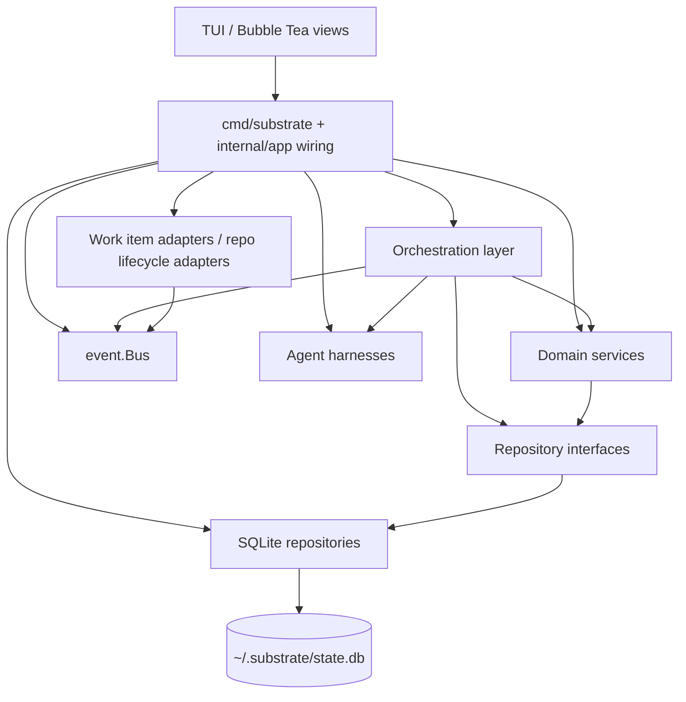

# 02 - Layered Architecture
<!-- docs:last-integrated-commit 2826f9fd2e658941eb96072a0c30df9766b92d94 -->

This document describes the layered structure of the application and the patterns that connect layers.

The daemon/TUI split moves this composition boundary behind the daemon process: `substrate daemon` owns repositories, services, orchestrators, harnesses, adapters, and the in-process event bus, while visualization clients use product-shaped daemon APIs and read models. Transitional in-process wiring can still exist during cutover, but new UI paths should prefer the daemon boundary.

## 1. Layer Diagram



**Top-level split:**

- `cmd/substrate/` boots the app: loads config, runs migrations, wires everything together.
- `internal/app/` assembles adapters and harnesses from config.
- `internal/orchestrator/` owns multi-service workflows (planning, implementation, review, foreman).
- `internal/service/` owns state transitions, validation, and event emission.
- `internal/repository/interfaces.go` defines the repository abstraction boundary.
- `internal/repository/sqlite/` provides the concrete implementations backed by SQLite.
- `internal/event/bus.go` is an in-process pub/sub bus backed by event persistence.

## 2. Repository Layer

The repository layer is the persistence abstraction. Services depend only on interfaces; they never import the sqlite package directly.

### What repositories own

Each repository is responsible for one domain aggregate:

- **Session repository** — root work-item lifecycle and state transitions.
- **Plan repository** — plan drafts, review outcomes, and FAQ append.
- **Task plan repository** — per-repository plan slices and their execution status.
- **Task repository** — agent session lifecycle (pending, running, interrupted, completed) and history projection.
- **Review repository** — review cycles and individual critiques.
- **Question repository** — question/answer/escalation/proposal workflows tied to agent sessions.
- **Workspace repository** — workspace lifecycle, including archive and recovery.
- **Event repository** — system event persistence, used by the event bus.
- **Instance repository** — running substrate process heartbeat and stale detection.
- **PR/MR repositories** — pull request and merge request state, CI checks, and per-reviewer triage state.
- **Session review artifact repository** — links between sessions and external review artifacts.
- **Agent session continuation repository** — durable continuation state for post-agent orchestration work; enables crash recovery and operator-triggered replay.

All repositories accept a shared database handle. Transaction-bound handles are derived from that same handle so that changes within a transaction are isolated from concurrent readers.

## 3. Service Layer

The service layer is where domain rules, state machines, and validation live. Services own all state transitions and emit events on every change.

### The transactional pattern

Every service holds a transacter — a handle that can open a transaction around repository operations. All repository access is gated through a `Transact` callback:

```go
// Pseudo-signature; actual type lives in the repository package.
Transact(ctx, func(res Resources) error)
```

This pattern exists for two reasons:

1. **SQLite consistency.** SQLite transactions are required for any write that must survive a crash or be visible to the next read in the same process. Without a transaction, concurrent reads can observe partial writes.

2. **Read-after-write correctness.** Planning and review workflows read what they just wrote before returning to the caller. Without a transaction, those reads can miss the uncommitted row.

Single-read operations also go through `Transact` to keep the pattern uniform and to allow future writes without refactoring callers.

### Design rules

- Services MUST NOT hold bare repository interfaces as struct fields. All access goes through the transacter.
- Services MUST NOT import or depend on other services. Cross-service coordination belongs in the orchestration layer.
- Services return domain-oriented errors (`ErrNotFound`, `ErrInvalidTransition`, `ErrInvalidInput`).
- Services emit events **after** the transaction commits, never before persisting state. The bus is passed as a pointer; services that don't emit events receive nil.

### Event emission

A shared helper publishes events asynchronously with a timeout. If the bus is nil (in tests), it no-ops gracefully.

Services that emit events:

| Service | Events |
|---|---|
| Session service | work-item state transitions |
| AgentSession service | `agent_session.started`, `agent_session.completed`, `agent_session.failed`, `agent_session.interrupted` |
| Plan service | `plan.submitted`, `plan.approved`, `plan.rejected`, `plan.revised`, `plan.superseded`, `subplan.started`, `subplan.completed`, `subplan.failed` |

## 4. Orchestration Layer

The orchestration layer owns multi-step workflows that coordinate across services. It is not a single monolith — focused structs own each workflow.

| Orchestrator | Responsibility |
|---|---|
| `Discoverer` | workspace preflight, git-work discovery, repo metadata extraction |
| `PlanningService` | planning session startup, correction loop, plan persistence, planning-session graph routing |
| `ImplementationService` | worktree preparation, wave execution, harness startup, event forwarding, implementation graph entry points, graph continuation |
| `ReviewPipeline` | review session startup, critique parsing, review outcome transitions, review graph entry points |
| `AgentRunSupervisor` | owns harness lifecycle: single event-channel consumer, wait-for-completion, durable complete/fail/interrupt transitions, resume-info persistence, completion callbacks. Used by both implementation and review runs. |
| `Foreman` | persistent question-answering session, FAQ append, escalation handling. Not graph-supervised. |
| `SessionRegistry` | maps live agent session IDs to adapter handles for steering |

**Wiring.** A service manager creates the shared event bus, constructs all services and orchestrators, and wires adapters to the bus. In daemon mode that service manager lives daemon-side; the TUI should not construct or retain repositories, orchestrators, harnesses, adapters, or an event bus except for transitional compatibility during the split. Adapters react to events; services do not depend on adapters. Orchestrators receive service pointers and the shared bus.
