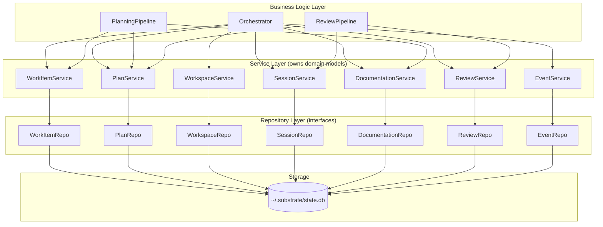

# 02 - Layered Architecture

## 1. Layer Diagram



Dependencies flow downward only. The TUI (see `06-tui-design.md`) sits above business logic; it calls in but is never called by it.

## 2. Repository Layer

**Rules:** (1) Repos are plain structs that accept `generic.SQLXRemote` -- an interface from go-atomic satisfied by both `*sqlx.DB` and `*sqlx.Tx`. This enables Unit of Work: multiple repo operations compose into a single transaction. (2) Internal row structs use `db:"column"` tags for sqlx automatic scanning (works through `SQLXRemote`); nullable columns use pointer types (`*string`, `*time.Time`). (3) Accept/return domain models only -- never expose DB row structs. (4) Repos own domain ↔ row conversion. (5) Zero business logic. (6) Repos are instantiated via a factory function (`ResourcesFactory`) that receives the transaction, so every repo in a `Transact` call shares the same `*sqlx.Tx`.

```go
// --- Interface (package repository) ---

type WorkItemRepository interface {
    Get(ctx context.Context, id string) (domain.WorkItem, error)
    List(ctx context.Context, filter WorkItemFilter) ([]domain.WorkItem, error)
    Create(ctx context.Context, item domain.WorkItem) error
    Update(ctx context.Context, item domain.WorkItem) error
    Delete(ctx context.Context, id string) error
}

type WorkItemFilter struct {
    State    *domain.WorkItemState
    Source   *string
    Labels   []string
    Limit, Offset int
}
```

```go
// --- SQLite implementation (package sqlite) ---

// workItemRow is unexported. Never leaves this package.
// Fields use db tags for sqlx automatic scanning.
type workItemRow struct {
	ID          string  `db:"id"`
	ExternalID  *string `db:"external_id"`
	Source      string  `db:"source"`
	SourceScope *string `db:"source_scope"`
	Title       string  `db:"title"`
	Description *string `db:"description"`
	AssigneeID  *string `db:"assignee_id"`
	State       string  `db:"state"`
	Labels      *string `db:"labels"`          // JSON array
	Repositories *string `db:"repositories"`   // JSON array of RepositoryRef
	SourceItemIDs *string `db:"source_item_ids"` // JSON array
	Metadata    *string `db:"metadata"`        // JSON object
	CreatedAt   string  `db:"created_at"`
	UpdatedAt   string  `db:"updated_at"`
}

func (r *workItemRow) toDomain() domain.WorkItem {
	item := domain.WorkItem{
		ID: r.ID, Source: r.Source, Title: r.Title,
		State: domain.WorkItemState(r.State),
		CreatedAt: mustParseTime(r.CreatedAt), UpdatedAt: mustParseTime(r.UpdatedAt),
	}
	if r.ExternalID != nil { item.ExternalID = *r.ExternalID }
	if r.SourceScope != nil { item.SourceScope = domain.SelectionScope(*r.SourceScope) }
	if r.Description != nil { item.Description = *r.Description }
	if r.AssigneeID != nil { item.AssigneeID = *r.AssigneeID }
	if r.Labels != nil { json.Unmarshal([]byte(*r.Labels), &item.Labels) }
	if r.Repositories != nil { json.Unmarshal([]byte(*r.Repositories), &item.Repositories) }
	if r.SourceItemIDs != nil { json.Unmarshal([]byte(*r.SourceItemIDs), &item.SourceItemIDs) }
	if r.Metadata != nil { json.Unmarshal([]byte(*r.Metadata), &item.Metadata) }
	return item
}

// WorkItemRepo accepts generic.SQLXRemote -- works with both *sqlx.DB and *sqlx.Tx.
type WorkItemRepo struct{ remote generic.SQLXRemote }

func NewWorkItemRepo(remote generic.SQLXRemote) WorkItemRepo { return WorkItemRepo{remote: remote} }

func (r WorkItemRepo) Get(ctx context.Context, id string) (domain.WorkItem, error) {
	var row workItemRow
	err := r.remote.GetContext(ctx, &row, `SELECT * FROM work_items WHERE id = ?`, id)
	if err != nil { return domain.WorkItem{}, fmt.Errorf("get work item %s: %w", id, err) }
	return row.toDomain(), nil
}

func (r WorkItemRepo) List(ctx context.Context, filter WorkItemFilter) ([]domain.WorkItem, error) {
	query := `SELECT * FROM work_items WHERE 1=1`
	args := map[string]any{}
	if filter.State != nil {
		query += ` AND state = :state`
		args["state"] = string(*filter.State)
	}
	if filter.Source != nil {
		query += ` AND source = :source`
		args["source"] = *filter.Source
	}
	query += ` ORDER BY created_at DESC`
	if filter.Limit > 0 {
		query += fmt.Sprintf(` LIMIT %d OFFSET %d`, filter.Limit, filter.Offset)
	}
	rows, err := r.remote.NamedQueryContext(ctx, query, args)
	if err != nil {
		return nil, fmt.Errorf("list work items: %w", err)
	}
	defer rows.Close()
	var items []domain.WorkItem
	for rows.Next() {
		var row workItemRow
		if err := rows.StructScan(&row); err != nil {
			return nil, fmt.Errorf("scan work item: %w", err)
		}
		items = append(items, row.toDomain())
	}
	return items, nil
}

func (r WorkItemRepo) Create(ctx context.Context, item domain.WorkItem) error {
	row := rowFromWorkItem(item)
	_, err := r.remote.NamedExecContext(ctx,
		`INSERT INTO work_items
		 (id, external_id, source, source_scope, title, description, assignee_id,
		  state, labels, repositories, source_item_ids, metadata, created_at, updated_at)
		 VALUES
		 (:id, :external_id, :source, :source_scope, :title, :description, :assignee_id,
		  :state, :labels, :repositories, :source_item_ids, :metadata, :created_at, :updated_at)`, row)
	if err != nil {
		return fmt.Errorf("create work item %s: %w", item.ID, err)
	}
	return nil
}

// Update, Delete follow the same pattern: NamedExecContext with db-tagged row struct.
```

### Resources Registry

All repos are grouped into a `Resources` struct, instantiated together via `ResourcesFactory`. When business logic calls `transacter.Transact`, the factory creates every repo bound to the same `*sqlx.Tx`.

```go
type Resources struct {
	WorkItems  WorkItemRepo
	Plans      PlanRepo
	SubPlans   SubPlanRepo
	Workspaces WorkspaceRepo
	Sessions   SessionRepo
	Reviews    ReviewRepo
	Docs       DocumentationRepo
	Events     EventRepo
}

func ResourcesFactory(
	ctx context.Context,
	_ *generic.Transacter[generic.SQLXRemote, Resources],
	tx generic.SQLXRemote,
) (Resources, error) {
	return Resources{
		WorkItems:  NewWorkItemRepo(tx),
		Plans:      NewPlanRepo(tx),
		SubPlans:   NewSubPlanRepo(tx),
		Workspaces: NewWorkspaceRepo(tx),
		Sessions:   NewSessionRepo(tx),
		Reviews:    NewReviewRepo(tx),
		Docs:       NewDocumentationRepo(tx),
		Events:     NewEventRepo(tx),
	}, nil
}
```

## 3. Service Layer

**Rules:** (1) Services **own** domain model types (`domain.WorkItem`, `domain.Plan`, etc.). (2) Contain domain logic: validation, state transitions, derived queries. (3) Depend on repository **interfaces** (injected). (4) Never call other services -- cross-service coordination belongs in business logic. (5) Return domain errors, not SQL errors.

```go
package service

var (
    ErrPlanNotFound      = errors.New("plan not found")
    ErrInvalidTransition = errors.New("invalid plan status transition")
)

type PlanService struct {
    plans    repository.PlanRepository
    subPlans repository.SubPlanRepository
}

func NewPlanService(plans repository.PlanRepository, subPlans repository.SubPlanRepository) *PlanService {
    return &PlanService{plans: plans, subPlans: subPlans}
}

func (s *PlanService) CreateDraft(ctx context.Context, workItemID, content string) (domain.Plan, error) {
    plan := domain.Plan{
        ID: domain.NewID(), WorkItemID: workItemID, Content: content,
        Status: domain.PlanStatusDraft, Version: 1,
        CreatedAt: domain.Now(), UpdatedAt: domain.Now(),
    }
    if err := plan.Validate(); err != nil {
        return domain.Plan{}, fmt.Errorf("validate plan: %w", err)
    }
    return plan, s.plans.Create(ctx, plan)
}

func (s *PlanService) SubmitForReview(ctx context.Context, planID string) (domain.Plan, error) {
    plan, err := s.plans.Get(ctx, planID)
    if err != nil {
        return domain.Plan{}, ErrPlanNotFound
    }
    if plan.Status != domain.PlanStatusDraft && plan.Status != domain.PlanStatusRejected {
        return domain.Plan{}, fmt.Errorf("%w: cannot submit %s", ErrInvalidTransition, plan.Status)
    }
    plan.Status = domain.PlanStatusPendingReview
    plan.UpdatedAt = domain.Now()
    return plan, s.plans.Update(ctx, plan)
}

// Approve: guards pending_review -> approved. Same fetch-guard-transition-persist pattern.
// Reject:  guards pending_review -> revision. Sets feedback, bumps version.
// AttachSubPlan: sets PlanID + timestamps, delegates to subPlans.Create().
```

State transitions are explicit and guarded. The service delegates persistence to the repository interface.

## 4. Business Logic Layer

**Rules:** (1) Composes multiple services into workflows. (2) Orchestrates sequencing, error handling, rollback. (3) Emits system events via `EventService` (see `03-event-system.md`). (4) Invokes adapter hooks (Linear status, GitLab MR). (5) Owns cross-cutting concerns like "on plan approval → create worktrees → spawn agents."

The Orchestrator receives a `generic.Transacter` and uses `Transact` to wrap multi-repo mutations in a single atomic transaction. Events are emitted **after** the transaction commits to avoid publishing side effects from rolled-back writes.

```go
package orchestrator

type Orchestrator struct {
	transacter generic.Transacter[generic.SQLXRemote, Resources]
	eventBus   event.EventBus
	harness    adapter.AgentHarness
	// adapters...
}

// OnPlanApproved: approve → emit event → create worktrees → spawn agents.
func (o *Orchestrator) OnPlanApproved(ctx context.Context, planID string) error {
	return o.transacter.Transact(ctx, func(ctx context.Context, repos Resources) error {
		plan, err := repos.Plans.Get(ctx, planID)
		if err != nil { return fmt.Errorf("get plan: %w", err) }
		plan.Status = domain.PlanApproved
		plan.UpdatedAt = domain.Now()
		if err := repos.Plans.Update(ctx, plan); err != nil { return err }
		// event emission happens AFTER transaction commits (outside Transact)
		return nil
	})
	// After successful transaction, emit event:
	// o.eventBus.Publish(ctx, PlanApprovedEvent{...})
}
```

`PlanningPipeline` and `ReviewPipeline` follow the same pattern. See `01-domain-model.md` for the full state machine.

## 5. SQLite Schema

All timestamps ISO 8601 UTC. IDs are ULIDs. JSON columns (`metadata`, `payload`) avoid schema coupling for adapter-specific data. Single global database at `~/.substrate/state.db`; all tables scoped by `workspace_id`.

```sql
CREATE TABLE IF NOT EXISTS schema_migrations (
    version    INTEGER PRIMARY KEY,
    applied_at TEXT NOT NULL DEFAULT (strftime('%Y-%m-%dT%H:%M:%fZ', 'now'))
);

CREATE TABLE IF NOT EXISTS workspaces (
    id           TEXT PRIMARY KEY,
    name         TEXT NOT NULL,
    root_dir     TEXT NOT NULL,
    status       TEXT NOT NULL CHECK (status IN ('creating','ready','archived','error')),
    created_at   TEXT NOT NULL DEFAULT (strftime('%Y-%m-%dT%H:%M:%fZ', 'now')),
    updated_at   TEXT NOT NULL DEFAULT (strftime('%Y-%m-%dT%H:%M:%fZ', 'now'))
);

CREATE TABLE IF NOT EXISTS work_items (
    id              TEXT PRIMARY KEY,
    workspace_id    TEXT NOT NULL REFERENCES workspaces(id),
    external_id     TEXT UNIQUE,
    source          TEXT NOT NULL,
    source_scope    TEXT,
    title           TEXT NOT NULL,
    description     TEXT,
    assignee_id     TEXT,
    state           TEXT NOT NULL CHECK (state IN (
                        'ingested','planning','plan_review','approved',
                        'implementing','reviewing','completed','failed')),
    labels          TEXT,  -- JSON array
    repositories    TEXT,  -- JSON array
    source_item_ids TEXT,  -- JSON array
    metadata        TEXT,  -- JSON object
    created_at      TEXT NOT NULL DEFAULT (strftime('%Y-%m-%dT%H:%M:%fZ', 'now')),
    updated_at      TEXT NOT NULL DEFAULT (strftime('%Y-%m-%dT%H:%M:%fZ', 'now'))
);
CREATE INDEX idx_work_items_state ON work_items(state);
CREATE INDEX idx_work_items_source ON work_items(source);
CREATE INDEX idx_work_items_workspace ON work_items(workspace_id);

CREATE TABLE IF NOT EXISTS plans (
    id                TEXT PRIMARY KEY,
    work_item_id      TEXT NOT NULL REFERENCES work_items(id),
    content           TEXT NOT NULL,
    orchestrator_plan TEXT,
    status            TEXT NOT NULL CHECK (status IN (
                          'draft','pending_review','approved','rejected')),
    version           INTEGER NOT NULL DEFAULT 1,
    created_at        TEXT NOT NULL DEFAULT (strftime('%Y-%m-%dT%H:%M:%fZ', 'now')),
    updated_at        TEXT NOT NULL DEFAULT (strftime('%Y-%m-%dT%H:%M:%fZ', 'now'))
);
CREATE INDEX idx_plans_work_item ON plans(work_item_id);

CREATE TABLE IF NOT EXISTS sub_plans (
    id          TEXT PRIMARY KEY,
    plan_id     TEXT NOT NULL REFERENCES plans(id) ON DELETE CASCADE,
    repo_name   TEXT NOT NULL,
    content     TEXT NOT NULL,
    exec_order  INTEGER NOT NULL DEFAULT 0,
    status      TEXT NOT NULL CHECK (status IN ('pending','in_progress','completed','failed')),
    created_at  TEXT NOT NULL DEFAULT (strftime('%Y-%m-%dT%H:%M:%fZ', 'now')),
    updated_at  TEXT NOT NULL DEFAULT (strftime('%Y-%m-%dT%H:%M:%fZ', 'now')),
    UNIQUE(plan_id, repo_name)
);
CREATE INDEX idx_sub_plans_plan ON sub_plans(plan_id);

CREATE TABLE IF NOT EXISTS agent_sessions (
    id              TEXT PRIMARY KEY,
    sub_plan_id     TEXT NOT NULL REFERENCES sub_plans(id),
    workspace_id    TEXT NOT NULL REFERENCES workspaces(id),
    repository_name TEXT NOT NULL,
    harness_name    TEXT NOT NULL,
    worktree_dir    TEXT NOT NULL,
    pid             INTEGER,
    status          TEXT NOT NULL CHECK (status IN (
                        'pending','running','waiting_for_answer','completed','failed','interrupted')),
    exit_code       INTEGER,
    started_at      TEXT,
    finished_at     TEXT,
    created_at      TEXT NOT NULL DEFAULT (strftime('%Y-%m-%dT%H:%M:%fZ', 'now')),
    updated_at      TEXT NOT NULL DEFAULT (strftime('%Y-%m-%dT%H:%M:%fZ', 'now'))
);
CREATE INDEX idx_sessions_sub_plan ON agent_sessions(sub_plan_id);
CREATE INDEX idx_sessions_status ON agent_sessions(status);

CREATE TABLE IF NOT EXISTS review_cycles (
    id               TEXT PRIMARY KEY,
    agent_session_id TEXT NOT NULL REFERENCES agent_sessions(id),
    cycle_number     INTEGER NOT NULL DEFAULT 1,
    reviewer_harness TEXT NOT NULL,
    status           TEXT NOT NULL CHECK (status IN (
                         'reviewing','critiques_found','reimplementing','passed','failed')),
    summary          TEXT,
    created_at       TEXT NOT NULL DEFAULT (strftime('%Y-%m-%dT%H:%M:%fZ', 'now')),
    updated_at       TEXT NOT NULL DEFAULT (strftime('%Y-%m-%dT%H:%M:%fZ', 'now')),
    UNIQUE(agent_session_id, cycle_number)
);
CREATE INDEX idx_reviews_session ON review_cycles(agent_session_id);

CREATE TABLE IF NOT EXISTS critiques (
    id              TEXT PRIMARY KEY,
    review_cycle_id TEXT NOT NULL REFERENCES review_cycles(id) ON DELETE CASCADE,
    file_path       TEXT,
    line_number     INTEGER,
    severity        TEXT NOT NULL CHECK (severity IN ('error','warning','info')),
    message         TEXT NOT NULL,
    status          TEXT NOT NULL CHECK (status IN ('open','resolved')) DEFAULT 'open',
    created_at      TEXT NOT NULL DEFAULT (strftime('%Y-%m-%dT%H:%M:%fZ', 'now'))
);
CREATE INDEX idx_critiques_review ON critiques(review_cycle_id);

CREATE TABLE IF NOT EXISTS questions (
    id               TEXT PRIMARY KEY,
    agent_session_id TEXT NOT NULL REFERENCES agent_sessions(id),
    content          TEXT NOT NULL,
    context          TEXT,
    answer           TEXT,
    answered_by      TEXT,
    source           TEXT CHECK (source IN ('foreman','human')),
    status           TEXT NOT NULL CHECK (status IN ('pending','answered','escalated')),
    created_at       TEXT NOT NULL DEFAULT (strftime('%Y-%m-%dT%H:%M:%fZ', 'now')),
    answered_at      TEXT
);
CREATE INDEX idx_questions_session ON questions(agent_session_id);
CREATE INDEX idx_questions_status ON questions(status);

CREATE TABLE IF NOT EXISTS documentation_sources (
    id           TEXT PRIMARY KEY,
    workspace_id TEXT NOT NULL REFERENCES workspaces(id),
    source_type  TEXT NOT NULL CHECK (source_type IN ('repo_embedded','dedicated_repo')),
    path         TEXT,
    repo_url     TEXT,
    branch       TEXT,
    description  TEXT,
    last_synced  TEXT,
    created_at   TEXT NOT NULL DEFAULT (strftime('%Y-%m-%dT%H:%M:%fZ', 'now'))
);
CREATE INDEX idx_docs_workspace ON documentation_sources(workspace_id);

CREATE TABLE IF NOT EXISTS system_events (
    id           TEXT PRIMARY KEY,
    event_type   TEXT NOT NULL,
    payload      TEXT NOT NULL,
    work_item_id TEXT REFERENCES work_items(id),
    created_at   TEXT NOT NULL DEFAULT (strftime('%Y-%m-%dT%H:%M:%fZ', 'now'))
);
CREATE INDEX idx_events_type ON system_events(event_type);
CREATE INDEX idx_events_work_item ON system_events(work_item_id);
CREATE INDEX idx_events_created ON system_events(created_at);
```

## 6. Dependency Injection

Plain constructor injection via go-atomic. No framework, no container.

**`substrate.toml` configuration:**
```toml
[commit]
strategy        = "semi-regular"   # "granular" | "semi-regular" | "single"
message_format  = "ai-generated"   # "ai-generated" | "conventional" | "custom"
message_template = ""              # used when message_format = "custom"

[adapters.ohmypi]
bun_path        = "bun"
bridge_path     = "scripts/omp-bridge.ts"
reasoning_level = "xhigh"          # oh-my-pi reasoning level for all sessions

[foreman]
enabled          = true
question_timeout = "0"             # duration string; "0" = wait indefinitely
```

```go
func main() {
	cfg, _ := config.Load("substrate.toml")

	db, _ := sqlx.Open("sqlite", cfg.GlobalDBPath()) // ~/.substrate/state.db
	defer db.Close()
	db.MustExec("PRAGMA journal_mode=WAL; PRAGMA foreign_keys=ON; PRAGMA busy_timeout=5000;")

	executor := sqlxexec.NewExecuter(db)
	transacter := generic.NewTransacter[generic.SQLXRemote, Resources](executor, ResourcesFactory)

	// Services receive transacter (not individual repos)
	// Business logic uses transacter.Transact for atomic operations

	// Adapters
	linearAdapter := linear.NewAdapter(cfg.Linear)
	glabAdapter   := glab.NewAdapter(cfg.GitLab)
	agentHarness  := ohmypi.NewBridge(cfg.Agent)

	// Business logic
	orch := orchestrator.New(transacter, linearAdapter, glabAdapter, agentHarness)

	// Event bus
	bus := event.NewEventBus()
	linearAdapter.RegisterHooks(bus)
	glabAdapter.RegisterHooks(bus)
	bus.SubscribeType(domain.EventAgentSessionCompleted, orch.OnSessionCompleted)

	// TUI
	app := tui.New(orch, bus)
	app.Run()
}
```

**Wiring flow:** `sqlx.Open` → `sqlxexec.NewExecuter(db)` → `generic.NewTransacter(executor, ResourcesFactory)` → `adapter.New*(cfg)` → `orchestrator.New(transacter, adapters)` → `bus.SubscribeType(hooks)` → `tui.New(orch, bus).Run()`

No global state. Every dependency is explicit in the constructor signature. Tests swap any layer by injecting a mock that satisfies the interface. See `04-adapters.md` for adapter contracts, `06-tui-design.md` for TUI consumption of the orchestrator.
