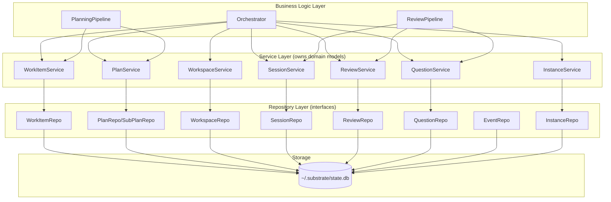

# 02 - Layered Architecture
<!-- docs:last-integrated-commit 21fe37a831a565fe596ba9f2b6444475f238b474 -->

## 1. Layer Diagram



Dependencies flow downward only. The TUI (see `06-tui-design.md`) sits above business logic; it calls in but is never called by it.

## 2. Repository Layer

**Rules:** (1) Repos are plain structs that accept `generic.SQLXRemote` -- an interface from go-atomic satisfied by both `*sqlx.DB` and `*sqlx.Tx`. This enables Unit of Work: multiple repo operations compose into a single transaction. (2) Internal row structs use `db:"column"` tags for sqlx automatic scanning (works through `SQLXRemote`); nullable columns use pointer types (`*string`, `*time.Time`). (3) Accept/return domain models only -- never expose DB row structs. (4) Repos own domain ↔ row conversion. (5) Zero business logic. (6) Repos are instantiated via a factory function (`ResourcesFactory`) that receives the transaction, so every repo in a `Transact` call shares the same `*sqlx.Tx`.

```go
// --- Interface (package repository) ---

type WorkItemRepository interface {
    Get(ctx context.Context, id string) (domain.WorkItem, error)
    List(ctx context.Context, filter WorkItemFilter) ([]domain.WorkItem, error)
    Create(ctx context.Context, item domain.WorkItem) error
    Update(ctx context.Context, item domain.WorkItem) error
    Delete(ctx context.Context, id string) error
}

type WorkItemFilter struct {
    WorkspaceID *string
    State       *domain.WorkItemState
    Source      *string
    Labels      []string
    Limit, Offset int
}
```

The session repository also owns the searchable history projection used by the TUI's work-item session surfaces and history overlay:
```go
type SessionRepository interface {
    SearchHistory(ctx context.Context, filter domain.SessionHistoryFilter) ([]domain.SessionHistoryEntry, error)
}
```
`SearchHistory` returns work-item-centric history entries and can be scoped to a single workspace or the global session corpus via `SessionHistoryFilter`.


```go
// --- SQLite implementation (package sqlite) ---

// workItemRow is unexported. Never leaves this package.
// Fields use db tags for sqlx automatic scanning.
type workItemRow struct {
	WorkspaceID string  `db:"workspace_id"`
	ID          string  `db:"id"`
	ExternalID  *string `db:"external_id"`
	Source      string  `db:"source"`
	SourceScope *string `db:"source_scope"`
	Title       string  `db:"title"`
	Description *string `db:"description"`
	AssigneeID  *string `db:"assignee_id"`
	State       string  `db:"state"`
	Labels      *string `db:"labels"`          // JSON array
	SourceItemIDs *string `db:"source_item_ids"` // JSON array
	Metadata    *string `db:"metadata"`        // JSON object
	CreatedAt   string  `db:"created_at"`
	UpdatedAt   string  `db:"updated_at"`
}

func (r *workItemRow) toDomain() (domain.WorkItem, error) {
	item := domain.WorkItem{
		ID: r.ID, WorkspaceID: r.WorkspaceID, Source: r.Source, Title: r.Title,
		State: domain.WorkItemState(r.State),
		CreatedAt: mustParseTime(r.CreatedAt), UpdatedAt: mustParseTime(r.UpdatedAt),
	}
	if r.ExternalID != nil  { item.ExternalID = *r.ExternalID }
	if r.SourceScope != nil { item.SourceScope = domain.SelectionScope(*r.SourceScope) }
	if r.Description != nil { item.Description = *r.Description }
	if r.AssigneeID != nil  { item.AssigneeID = *r.AssigneeID }
	if r.Labels != nil {
		if err := json.Unmarshal([]byte(*r.Labels), &item.Labels); err != nil {
			return domain.WorkItem{}, fmt.Errorf("unmarshal labels: %w", err)
		}
	}
	if r.SourceItemIDs != nil {
		if err := json.Unmarshal([]byte(*r.SourceItemIDs), &item.SourceItemIDs); err != nil {
			return domain.WorkItem{}, fmt.Errorf("unmarshal source_item_ids: %w", err)
		}
	}
	if r.Metadata != nil {
		if err := json.Unmarshal([]byte(*r.Metadata), &item.Metadata); err != nil {
			return domain.WorkItem{}, fmt.Errorf("unmarshal metadata: %w", err)
		}
	}
	return item, nil
}

// WorkItemRepo accepts generic.SQLXRemote -- works with both *sqlx.DB and *sqlx.Tx.
type WorkItemRepo struct{ remote generic.SQLXRemote }

func NewWorkItemRepo(remote generic.SQLXRemote) WorkItemRepo { return WorkItemRepo{remote: remote} }

func (r WorkItemRepo) Get(ctx context.Context, id string) (domain.WorkItem, error) {
	var row workItemRow
	err := r.remote.GetContext(ctx, &row, `SELECT * FROM work_items WHERE id = ?`, id)
	if err != nil { return domain.WorkItem{}, fmt.Errorf("get work item %s: %w", id, err) }
	item, err := row.toDomain(); if err != nil { return domain.WorkItem{}, err }; return item, nil
}

func (r WorkItemRepo) List(ctx context.Context, filter WorkItemFilter) ([]domain.WorkItem, error) {
	query := `SELECT * FROM work_items WHERE 1=1`
	args := map[string]any{}
	if filter.WorkspaceID != nil {
		query += ` AND workspace_id = :workspace_id`
		args["workspace_id"] = *filter.WorkspaceID
	}
	if filter.State != nil {
		query += ` AND state = :state`
		args["state"] = string(*filter.State)
	}
	if filter.Source != nil {
		query += ` AND source = :source`
		args["source"] = *filter.Source
	}
	query += ` ORDER BY created_at DESC`
	if filter.Limit > 0 {
		query += fmt.Sprintf(` LIMIT %d OFFSET %d`, filter.Limit, filter.Offset)
	}
	rows, err := r.remote.NamedQueryContext(ctx, query, args)
	if err != nil {
		return nil, fmt.Errorf("list work items: %w", err)
	}
	defer rows.Close()
	var items []domain.WorkItem
	for rows.Next() {
		var row workItemRow
		if err := rows.StructScan(&row); err != nil {
			return nil, fmt.Errorf("scan work item: %w", err)
		}
		item, err := row.toDomain(); if err != nil { return nil, fmt.Errorf("convert work item: %w", err) }; items = append(items, item)
	}
	return items, nil
}

func (r WorkItemRepo) Create(ctx context.Context, item domain.WorkItem) error {
	row := rowFromWorkItem(item)
	_, err := r.remote.NamedExecContext(ctx,
		`INSERT INTO work_items
		 (id, workspace_id, external_id, source, source_scope, title, description, assignee_id,
		  state, labels, source_item_ids, metadata, created_at, updated_at)
		 VALUES
		 (:id, :workspace_id, :external_id, :source, :source_scope, :title, :description, :assignee_id,
		  :state, :labels, :source_item_ids, :metadata, :created_at, :updated_at)`, row)
	if err != nil {
		return fmt.Errorf("create work item %s: %w", item.ID, err)
	}
	return nil
}

// Update, Delete follow the same pattern: NamedExecContext with db-tagged row struct.
```

### Resources Registry

All transaction-bound repositories are grouped into `sqlite.Resources`, instantiated together via `ResourcesFactory`. When business logic opens a transaction through `generic.Transacter`, the factory binds every repository to the same `*sqlx.Tx`. Services are constructed separately from repository interfaces; `Resources` is a repository bundle, not a service container.

```go
type Resources struct {
    WorkItems  WorkItemRepo
    Plans      PlanRepo
    SubPlans   SubPlanRepo
    Workspaces WorkspaceRepo
    Sessions   SessionRepo
    Reviews    ReviewRepo
    Questions  QuestionRepo
    Events     EventRepo
    Instances  InstanceRepo
}

func ResourcesFactory(
    _ context.Context,
    _ *generic.Transacter[generic.SQLXRemote, Resources],
    tx generic.SQLXRemote,
 ) (Resources, error) {
    return Resources{
        WorkItems:  NewWorkItemRepo(tx),
        Plans:      NewPlanRepo(tx),
        SubPlans:   NewSubPlanRepo(tx),
        Workspaces: NewWorkspaceRepo(tx),
        Sessions:   NewSessionRepo(tx),
        Reviews:    NewReviewRepo(tx),
        Questions:  NewQuestionRepo(tx),
        Events:     NewEventRepo(tx),
        Instances:  NewInstanceRepo(tx),
    }, nil
}
```

## 3. Service Layer

**Rules:** (1) Services **own** domain model types (`domain.WorkItem`, `domain.Plan`, etc.). (2) They contain domain logic: validation, state transitions, and derived queries. (3) They depend on repository **interfaces** supplied at construction time. (4) They do not call each other; cross-service coordination belongs in business logic. (5) They return domain errors, not SQL errors.

Current domain services are `WorkItemService`, `PlanService`, `SessionService`, `ReviewService`, `QuestionService`, `WorkspaceService`, and `InstanceService`. Event persistence belongs to `EventRepository`, while publication is handled by the event bus documented in `03-event-system.md`.

```go
type SessionService struct {
    repo repository.SessionRepository
}

func NewSessionService(repo repository.SessionRepository) *SessionService {
    return &SessionService{repo: repo}
}

func (s *SessionService) SearchHistory(ctx context.Context, filter domain.SessionHistoryFilter) ([]domain.SessionHistoryEntry, error) {
    return s.repo.SearchHistory(ctx, filter)
}
```

Other services follow the same constructor-injected pattern: validate transitions, expose targeted queries such as question or instance lookups, and delegate persistence to repository interfaces.

## 4. Business Logic Layer

**Rules:** (1) Composes multiple services into workflows. (2) Orchestrates sequencing, error handling, rollback. (3) Publishes system events through the event bus backed by `EventRepository` (see `03-event-system.md`). (4) Invokes adapter hooks for external trackers and repository hosts — e.g. Linear/GitLab/GitHub tracker mutation plus GitLab MR or GitHub PR lifecycle. (5) Owns cross-cutting concerns like "on plan approval -> create worktrees -> spawn agents."

The Orchestrator receives a `generic.Transacter` and uses `Transact` to wrap multi-repo mutations in a single atomic transaction. `ResourcesFactory` supplies repository handles bound to that transaction; services remain constructor-injected collaborators around repository interfaces, and events are published only after commit.

```go
package orchestrator

type Orchestrator struct {
	transacter generic.Transacter[generic.SQLXRemote, Resources]
	eventBus   event.EventBus
	harnesses  HarnessRouter
	// work item adapters, repo lifecycle adapters, and other dependencies...
}

// OnPlanApproved wraps transaction-bound repositories in a PlanService so the
// state-machine guard and the DB write are atomic. Event emission is after commit.
func (o *Orchestrator) OnPlanApproved(ctx context.Context, planID string) error {
	var approvedPlan domain.Plan
	if err := o.transacter.Transact(ctx, func(ctx context.Context, res Resources) error {
		planSvc := service.NewPlanService(res.Plans, res.SubPlans)
		plan, err := planSvc.Approve(ctx, planID)
		if err != nil { return err }
		approvedPlan = plan
		return nil
	}); err != nil {
		return err
	}

	return o.eventBus.Publish(ctx, PlanApprovedEvent{
		BaseEvent: newBaseEvent(EventPlanApproved),
		Plan:      approvedPlan,
	})
}
```
`PlanningPipeline` and `ReviewPipeline` follow the same pattern. See `01-domain-model.md` for the full state machine.

## 5. SQLite Schema

All timestamps ISO 8601 UTC. IDs are ULIDs. JSON columns (`metadata`, `payload`) avoid schema coupling for adapter-specific data. Single global database at `~/.substrate/state.db`; all tables scoped by `workspace_id`.

```sql
CREATE TABLE IF NOT EXISTS schema_migrations (
    version    INTEGER PRIMARY KEY,
    applied_at TEXT NOT NULL DEFAULT (strftime('%Y-%m-%dT%H:%M:%fZ', 'now'))
);

CREATE TABLE IF NOT EXISTS workspaces (
    id           TEXT PRIMARY KEY,
    name         TEXT NOT NULL,
    root_path    TEXT NOT NULL,
    status       TEXT NOT NULL CHECK (status IN ('creating','ready','archived','error')),
    created_at   TEXT NOT NULL DEFAULT (strftime('%Y-%m-%dT%H:%M:%fZ', 'now')),
    updated_at   TEXT NOT NULL DEFAULT (strftime('%Y-%m-%dT%H:%M:%fZ', 'now'))
);

CREATE TABLE IF NOT EXISTS work_items (
    id              TEXT PRIMARY KEY,
    workspace_id    TEXT NOT NULL REFERENCES workspaces(id),
    external_id     TEXT,
    source          TEXT NOT NULL,
    source_scope    TEXT,
    title           TEXT NOT NULL,
    description     TEXT,
    assignee_id     TEXT,
    state           TEXT NOT NULL CHECK (state IN (
                        'ingested','planning','plan_review','approved',
                        'implementing','reviewing','completed','failed')),
    labels          TEXT,  -- JSON array
    source_item_ids TEXT,  -- JSON array
    metadata        TEXT,  -- JSON object
    created_at      TEXT NOT NULL DEFAULT (strftime('%Y-%m-%dT%H:%M:%fZ', 'now')),
    updated_at      TEXT NOT NULL DEFAULT (strftime('%Y-%m-%dT%H:%M:%fZ', 'now'))
);
CREATE INDEX idx_work_items_state ON work_items(state);
CREATE INDEX idx_work_items_source ON work_items(source);
CREATE INDEX idx_work_items_workspace ON work_items(workspace_id);
CREATE UNIQUE INDEX idx_work_items_external_id ON work_items(workspace_id, external_id) WHERE external_id IS NOT NULL;

CREATE TABLE IF NOT EXISTS plans (
    id                TEXT PRIMARY KEY,
    work_item_id      TEXT NOT NULL UNIQUE REFERENCES work_items(id),
	orchestrator_plan TEXT NOT NULL,
    status            TEXT NOT NULL CHECK (status IN (
                          'draft','pending_review','approved','rejected')),
    version           INTEGER NOT NULL DEFAULT 1,
    created_at        TEXT NOT NULL DEFAULT (strftime('%Y-%m-%dT%H:%M:%fZ', 'now')),
    updated_at        TEXT NOT NULL DEFAULT (strftime('%Y-%m-%dT%H:%M:%fZ', 'now'))
);
CREATE INDEX idx_plans_work_item ON plans(work_item_id);

CREATE TABLE IF NOT EXISTS sub_plans (
    id          TEXT PRIMARY KEY,
    plan_id     TEXT NOT NULL REFERENCES plans(id) ON DELETE CASCADE,
    repo_name   TEXT NOT NULL,
    content     TEXT NOT NULL,
    exec_order  INTEGER NOT NULL DEFAULT 0,
    status      TEXT NOT NULL CHECK (status IN ('pending','in_progress','completed','failed')),
    created_at  TEXT NOT NULL DEFAULT (strftime('%Y-%m-%dT%H:%M:%fZ', 'now')),
    updated_at  TEXT NOT NULL DEFAULT (strftime('%Y-%m-%dT%H:%M:%fZ', 'now')),
    UNIQUE(plan_id, repo_name)
);
CREATE INDEX idx_sub_plans_plan ON sub_plans(plan_id);

CREATE TABLE IF NOT EXISTS agent_sessions (
    id              TEXT PRIMARY KEY,
    sub_plan_id     TEXT NOT NULL REFERENCES sub_plans(id),
    workspace_id    TEXT NOT NULL REFERENCES workspaces(id),
    repository_name TEXT NOT NULL,
    harness_name    TEXT NOT NULL,
    worktree_dir    TEXT NOT NULL,
    pid             INTEGER,
    status          TEXT NOT NULL CHECK (status IN (
                        'pending','running','waiting_for_answer','completed','failed','interrupted')),
    exit_code       INTEGER,
    started_at      TEXT,
    shutdown_at     TEXT,
    completed_at    TEXT,
    created_at      TEXT NOT NULL DEFAULT (strftime('%Y-%m-%dT%H:%M:%fZ', 'now')),
    owner_instance_id TEXT REFERENCES substrate_instances(id) ON DELETE SET NULL,
    updated_at      TEXT NOT NULL DEFAULT (strftime('%Y-%m-%dT%H:%M:%fZ', 'now'))
);
CREATE INDEX idx_sessions_sub_plan ON agent_sessions(sub_plan_id);
CREATE INDEX idx_sessions_status ON agent_sessions(status);

CREATE TABLE IF NOT EXISTS review_cycles (
    id               TEXT PRIMARY KEY,
    agent_session_id TEXT NOT NULL REFERENCES agent_sessions(id),
    cycle_number     INTEGER NOT NULL DEFAULT 1,
    reviewer_harness TEXT NOT NULL,
    status           TEXT NOT NULL CHECK (status IN (
                         'reviewing','critiques_found','reimplementing','passed','failed')),
    summary          TEXT,
    created_at       TEXT NOT NULL DEFAULT (strftime('%Y-%m-%dT%H:%M:%fZ', 'now')),
    updated_at       TEXT NOT NULL DEFAULT (strftime('%Y-%m-%dT%H:%M:%fZ', 'now')),
    UNIQUE(agent_session_id, cycle_number)
);
CREATE INDEX idx_reviews_session ON review_cycles(agent_session_id);

CREATE TABLE IF NOT EXISTS critiques (
    id              TEXT PRIMARY KEY,
    review_cycle_id TEXT NOT NULL REFERENCES review_cycles(id) ON DELETE CASCADE,
    file_path       TEXT,
    line_number     INTEGER,
		severity        TEXT NOT NULL CHECK (severity IN ('critical','major','minor','nit')),
    description     TEXT NOT NULL,
    status          TEXT NOT NULL CHECK (status IN ('open','resolved')) DEFAULT 'open',
    created_at      TEXT NOT NULL DEFAULT (strftime('%Y-%m-%dT%H:%M:%fZ', 'now'))
);
CREATE INDEX idx_critiques_review ON critiques(review_cycle_id);

CREATE TABLE IF NOT EXISTS questions (
    id               TEXT PRIMARY KEY,
    agent_session_id TEXT NOT NULL REFERENCES agent_sessions(id),
    content          TEXT NOT NULL,
    context          TEXT,
    answer           TEXT,
    answered_by      TEXT CHECK (answered_by IN ('foreman','human')),
    status           TEXT NOT NULL CHECK (status IN ('pending','answered','escalated')) DEFAULT 'pending',
    created_at       TEXT NOT NULL DEFAULT (strftime('%Y-%m-%dT%H:%M:%fZ', 'now')),
    answered_at      TEXT
);
CREATE INDEX idx_questions_session ON questions(agent_session_id);
CREATE INDEX idx_questions_status ON questions(status);
CREATE TABLE IF NOT EXISTS system_events (
	id         TEXT PRIMARY KEY,
	event_type TEXT NOT NULL,
	workspace_id TEXT REFERENCES workspaces(id),
	payload    TEXT NOT NULL,
	created_at TEXT NOT NULL DEFAULT (strftime('%Y-%m-%dT%H:%M:%fZ', 'now'))
);
CREATE INDEX idx_events_type ON system_events(event_type);
CREATE INDEX idx_events_workspace ON system_events(workspace_id);
CREATE INDEX idx_events_created ON system_events(created_at);

CREATE TABLE IF NOT EXISTS substrate_instances (
    id              TEXT PRIMARY KEY,
    workspace_id    TEXT NOT NULL REFERENCES workspaces(id) ON DELETE CASCADE,
    pid             INTEGER NOT NULL,
    hostname        TEXT NOT NULL,
    last_heartbeat  TEXT NOT NULL,
    started_at      TEXT NOT NULL DEFAULT (strftime('%Y-%m-%dT%H:%M:%fZ', 'now'))
);
CREATE INDEX idx_instances_workspace ON substrate_instances(workspace_id);
```

## 6. Dependency Injection

Plain constructor injection via go-atomic. No framework, no container.

**`config.yaml` configuration:**
```yaml
commit:
  strategy: semi-regular        # "granular" | "semi-regular" | "single"
  message_format: ai-generated  # "ai-generated" | "conventional" | "custom"
  message_template: ""          # used when message_format = "custom"

plan:
  max_parse_retries: 2          # correction loop attempts before surfacing to human

review:
  pass_threshold: minor_ok      # "nit_only" | "minor_ok" | "no_critiques"
  max_cycles: 3                 # max re-implementation cycles before human escalation

adapters:
  ohmypi:
    thinking_level: xhigh       # oh-my-pi thinkingLevel for all sessions
    # bun_path: /opt/homebrew/bin/bun       # optional override when using a source bridge script
    # bridge_path: /custom/path/to/omp-bridge # optional override; default uses packaged compiled bridge

foreman:
  question_timeout: "0"         # duration string; "0" = wait indefinitely

```go
func main() {
	cfg, _ := config.Load("config.yaml")

	dbPath, _ := config.GlobalDBPath() // ~/.substrate/state.db
	db, _ := sqlx.Open("sqlite", dbPath)
	defer db.Close()
	db.MustExec("PRAGMA journal_mode=WAL; PRAGMA foreign_keys=ON; PRAGMA busy_timeout=5000;")

	executor := sqlxexec.NewExecuter(db)
	transacter := generic.NewTransacter[generic.SQLXRemote, Resources](executor, ResourcesFactory)

	// ResourcesFactory creates transaction-bound repositories for a shared *sqlx.Tx.
	// Services are constructed separately from repository interfaces and passed into the TUI/business logic.
	// The event bus persists through EventRepo; transaction scope stays at the repository layer.

	// Adapters
	workItemAdapters := app.BuildWorkItemAdapters(cfg)
	repoLifecycleAdapters := app.BuildRepoLifecycleAdapters(ctx, cfg, wsDir)
	harnessRouter := app.BuildHarnessRouter(cfg)

	// Event bus
	eventRepo := sqlite.NewEventRepo(executor)
	bus := event.NewEventBus(eventRepo)
	for _, adapter := range workItemAdapters {
		bus.SubscribeType(domain.EventPlanApproved, adapter.OnEvent)
		bus.SubscribeType(domain.EventWorkItemCompleted, adapter.OnEvent)
	}
	for _, adapter := range repoLifecycleAdapters {
		bus.SubscribeType(domain.EventWorktreeCreated, adapter.OnEvent)
		bus.SubscribeType(domain.EventWorkItemCompleted, adapter.OnEvent)
	}

	// Business logic
	orch := orchestrator.New(transacter, bus, harnessRouter, workItemAdapters, repoLifecycleAdapters)
	bus.SubscribeType(domain.EventAgentSessionCompleted, orch.OnSessionCompleted)

	// TUI
	app := tui.New(orch, bus)
	app.Run()
}
```

**Wiring flow:** `sqlx.Open` -> `sqlxexec.NewExecuter(db)` -> `generic.NewTransacter(executor, ResourcesFactory)` -> build work item adapters -> detect and build repo lifecycle adapters -> build harness router -> `orchestrator.New(...)` -> subscribe adapter hooks -> `tui.New(orch, bus).Run()`

No global state. Every dependency is explicit in the constructor signature. Tests swap any layer by injecting a mock that satisfies the interface. See `04-adapters.md` for adapter contracts, remote detection, and harness implementations, `06-tui-design.md` for TUI consumption of the orchestrator.
