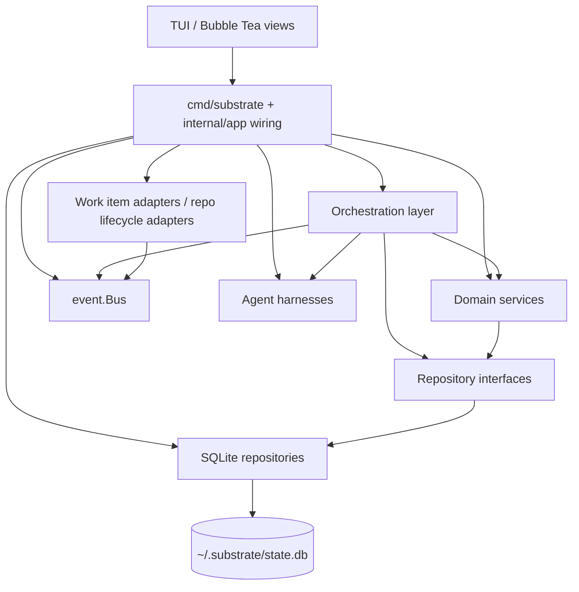

# 02 - Layered Architecture
<!-- docs:last-integrated-commit a38128010038776df783ec0bdf305b2637b5603e -->
This document describes the current layering and wiring in repository HEAD.
The important update versus older drafts is that the codebase now uses `Session`/`Task` domain names internally, while some storage tables and UI copy still use legacy `work_item` / `agent_session` terminology.

## 1. Layer Diagram



Current top-level split:

- `cmd/substrate/main.go` does the production wiring.
- `internal/app/` builds adapters and harnesses from config.
- `internal/orchestrator/` owns multi-service workflows.
- `internal/service/` owns state transitions and domain rules.
- `internal/repository/interfaces.go` defines interfaces.
- `internal/repository/transacter.go` defines `Resources` and `NoopTransacter`.
- `internal/repository/sqlite/` provides the concrete SQLite implementations.
- `internal/event/bus.go` is an in-process pub/sub bus backed by `repository.EventRepository`.

## 2. Repository Layer

`internal/repository/interfaces.go` is the abstraction boundary that services depend on.

### Interface inventory

| Interface | Purpose | Main domain type |
|---|---|---|
| `SessionRepository` | CRUD for root work items | `domain.Session` |
| `PlanRepository` | CRUD for plans + FAQ append | `domain.Plan` |
| `TaskPlanRepository` | CRUD for per-repo plan slices | `domain.TaskPlan` |
| `WorkspaceRepository` | CRUD for workspaces | `domain.Workspace` |
| `TaskRepository` | CRUD for repo-scoped runs + history projection | `domain.Task` |
| `ReviewRepository` | CRUD for review cycles and critiques | `domain.ReviewCycle`, `domain.Critique` |
| `QuestionRepository` | CRUD for questions and proposal updates | `domain.Question` |
| `EventRepository` | Persistence for system events | `domain.SystemEvent` |
| `InstanceRepository` | CRUD for running substrate processes | `domain.SubstrateInstance` |
| `GithubPullRequestRepository` | CRUD for GitHub pull requests | `domain.GithubPullRequest` |
| `GitlabMergeRequestRepository` | CRUD for GitLab merge requests | `domain.GitlabMergeRequest` |
| `SessionReviewArtifactRepository` | CRUD for session-artifact links | `domain.SessionReviewArtifact` |

Representative interface shapes:

```go
type SessionRepository interface {
	Get(ctx context.Context, id string) (domain.Session, error)
	List(ctx context.Context, filter SessionFilter) ([]domain.Session, error)
	Create(ctx context.Context, item domain.Session) error
	Update(ctx context.Context, item domain.Session) error
	Delete(ctx context.Context, id string) error
}

type TaskRepository interface {
	Get(ctx context.Context, id string) (domain.Task, error)
	ListBySubPlanID(ctx context.Context, subPlanID string) ([]domain.Task, error)
	ListByWorkspaceID(ctx context.Context, workspaceID string) ([]domain.Task, error)
	ListByOwnerInstanceID(ctx context.Context, instanceID string) ([]domain.Task, error)
	SearchHistory(ctx context.Context, filter domain.SessionHistoryFilter) ([]domain.SessionHistoryEntry, error)
	Create(ctx context.Context, s domain.Task) error
	Update(ctx context.Context, s domain.Task) error
	Delete(ctx context.Context, id string) error
}

type GithubPullRequestRepository interface {
	Upsert(ctx context.Context, pr domain.GithubPullRequest) error
	Get(ctx context.Context, id string) (domain.GithubPullRequest, error)
	GetByNumber(ctx context.Context, owner, repo string, number int) (domain.GithubPullRequest, error)
	ListByWorkspaceID(ctx context.Context, workspaceID string) ([]domain.GithubPullRequest, error)
	ListNonTerminal(ctx context.Context, workspaceID string) ([]domain.GithubPullRequest, error)
}
```

### SQLite implementations

Concrete implementations live under `internal/repository/sqlite/`:

- `SessionRepo`
- `PlanRepo`
- `SubPlanRepo`
- `WorkspaceRepo`
- `TaskRepo`
- `ReviewRepo`
- `QuestionRepo`
- `EventRepo`
- `InstanceRepo`
- `GithubPRRepo`
- `GitlabMRRepo`
- `SessionReviewArtifactRepo`

All of them accept `generic.SQLXRemote`, which lets the same repo code work with either:

- production `dbRemote{*sqlx.DB}` in `cmd/substrate/main.go`, or
- transaction-bound handles created by the transacter.

Representative constructor pattern:

```go
type EventRepo struct{ remote generic.SQLXRemote }

func NewEventRepo(remote generic.SQLXRemote) EventRepo {
	return EventRepo{remote: remote}
}
```

### Resources struct

`internal/repository/transacter.go` defines the `Resources` struct that groups all transaction-bound repositories:

```go
type Resources struct {
	Sessions               SessionRepository
	Plans                  PlanRepository
	SubPlans               TaskPlanRepository
	Workspaces             WorkspaceRepository
	Tasks                  TaskRepository
	Reviews                ReviewRepository
	Questions              QuestionRepository
	Events                 EventRepository
	Instances              InstanceRepository
	GithubPRs              GithubPullRequestRepository
	GitlabMRs              GitlabMergeRequestRepository
	SessionReviewArtifacts SessionReviewArtifactRepository
}
```

`sqlite.ResourcesFactory` (in `internal/repository/sqlite/resources.go`) constructs a fully-populated `Resources` from a transaction handle. Production wiring creates a single `sqlite.NewTransacter(db)` which uses `ResourcesFactory` internally. Tests use `repository.NoopTransacter{Res: ...}` to inject mocks directly.

## 3. Service Layer

The service layer is the state-machine and validation layer. All services use the **transacter pattern** for repository access.

### Transacter pattern

Every service holds `atomic.Transacter[repository.Resources]` (from `go-atomic`) and accesses repos through the `Resources` struct inside a `Transact` callback:

```go
type PlanService struct {
	transacter atomic.Transacter[repository.Resources]
}

func (s *PlanService) CreatePlan(ctx context.Context, plan domain.Plan) error {
	return s.transacter.Transact(ctx, func(ctx context.Context, res repository.Resources) error {
		return res.Plans.Create(ctx, plan)
	})
}
```

Rules:

- Services MUST hold `atomic.Transacter[repository.Resources]` directly. No wrapper interfaces, function types, or shims.
- All repository access goes through `Transact`, even single-repo reads.
- Inside a callback, access repos via the `res` parameter (`res.Plans`, `res.Sessions`, etc.). Do NOT close over repo fields from the service struct.
- For tests, use `repository.NoopTransacter{Res: repository.Resources{Plans: mock, SubPlans: mock}}`.

Current services:

| Service | Owns | Key responsibilities |
|---|---|---|
| `SessionService` | root `Session` lifecycle | validation, uniqueness checks, state transitions |
| `PlanService` | `Plan` + `TaskPlan` | plan/sub-plan transitions, FAQ append, lookup helpers |
| `TaskService` | repo-scoped `Task` lifecycle | pending/running/interrupted transitions, history lookups |
| `ReviewService` | `ReviewCycle` + `Critique` | cycle transitions, critique persistence and resolution |
| `QuestionService` | `Question` | answer/escalation/proposal workflows |
| `WorkspaceService` | `Workspace` | create / transition / archive / recover |
| `InstanceService` | `SubstrateInstance` | heartbeat, stale detection, cleanup |
| `EventService` | `SystemEvent` | event persistence (wraps `EventRepository`) |
| `GithubPRService` | `GithubPullRequest` | upsert, lookup by number, list non-terminal |
| `GitlabMRService` | `GitlabMergeRequest` | upsert, lookup by IID, list non-terminal |
| `SessionReviewArtifactService` | `SessionReviewArtifact` | upsert, list by work item / workspace |

All constructors follow the same signature: `NewXxxService(transacter atomic.Transacter[repository.Resources]) *XxxService`.

Design rules:

- Services MUST NOT hold bare repository interfaces as struct fields. All repository access goes through the transacter.
- Services MUST NOT import or depend on other services. Cross-service orchestration belongs in `internal/orchestrator`.
- Services return domain-oriented errors (`ErrNotFound`, `ErrInvalidTransition`, `ErrInvalidInput`).
- Services own transition tables.

## 4. Orchestration Layer

The current business-logic layer is not a single monolithic `Orchestrator` type. It is a set of focused workflow structs in `internal/orchestrator/`.

| Type | Responsibility |
|---|---|
| `Discoverer` | workspace preflight, git-work discovery, repo metadata extraction |
| `PlanningService` | planning session startup, correction loop, plan persistence |
| `ImplementationService` | worktree preparation, wave execution, harness startup, event forwarding |
| `ReviewPipeline` | review-session startup, critique parsing, review outcome transitions |
| `Foreman` | persistent question-answering session, FAQ append, escalation handling |
| `Resumption` | resume / abandon interrupted tasks |
| `SessionRegistry` | maps live agent session IDs to `adapter.AgentSession` handles for steering |
| `PlanParser` / wave helpers | orchestration support code used by planning / implementation |

Note: `InstanceManager` was deleted. Instance reconciliation is now handled by `InstanceService` directly.

Representative wiring from `cmd/substrate/main.go`:

```go
registry := orchestrator.NewSessionRegistry()

planningSvc, _ := orchestrator.NewPlanningService(
	planningCfg, discoverer, gitClient, harnesses.Planning,
	planSvc, workItemSvc, sessionSvc, eventSvc, workspaceSvc, registry, cfg,
)

reviewPipeline := orchestrator.NewReviewPipeline(
	cfg, harnesses.Review, reviewSvc, sessionSvc, planSvc, workItemSvc,
	bus, registry,
)

implSvc := orchestrator.NewImplementationService(
	cfg, harnesses.Implementation, gitClient, bus,
	planSvc, workItemSvc, sessionSvc, workspaceSvc, registry,
	reviewPipeline,
	foreman, questionSvc, reviewSvc,
```

Cross-cutting reality today:

- Services no longer receive bare repository references in orchestration constructors. Orchestration structs receive service pointers and the `SessionRegistry`.
- Worktree lifecycle, review outcomes, resumed/interrupted notifications, and TUI-published tracker/lifecycle events go through `event.Bus`.
- Adapters react to events; services do not depend on adapters.

## 5. SQLite Schema

The canonical base schema is `migrations/001_initial.sql`. Subsequent migrations extend it:

- `002_agent_sessions_canonical.sql` — rewrites `agent_sessions` to add `work_item_id`, `phase`, nullable `sub_plan_id`, `worktree_path`, and indexes
- `003_omp_session_meta.sql` — adds OMP-specific session metadata columns (`omp_session_file`, `omp_session_id`) to `agent_sessions`
- `004_sub_plan_planning_round.sql` — adds `planning_round` column to `sub_plans`
- `005_review_artifacts.sql` — adds `github_pull_requests`, `gitlab_merge_requests`, and `session_review_artifacts` tables with backfill from `system_events`
- `006_session_resume_info.sql` — migrates OMP-specific session metadata to a generic `resume_info` map column and drops the old columns
- `007_plan_supersede.sql` — plan supersede model: replaces inline UNIQUE on `plans.work_item_id` with a partial unique index on non-superseded plans, adds `superseded` to the plan status CHECK constraint, and adds `plan_id` to `agent_sessions`
- `008_drop_planning_round.sql` — drops obsolete `sub_plans.planning_round` column

### Naming note

Storage still uses legacy table names:

- `work_items` stores `domain.Session`
- `agent_sessions` stores `domain.Task`

That naming mismatch is historical; repository conversions hide it from the service layer.

### Representative schema snippet

```sql
CREATE TABLE work_items (
    id              TEXT PRIMARY KEY,
    workspace_id    TEXT NOT NULL REFERENCES workspaces(id),
    external_id     TEXT,
    source          TEXT NOT NULL,
    source_scope    TEXT,
    title           TEXT NOT NULL,
    description     TEXT,
    assignee_id     TEXT,
    state           TEXT NOT NULL CHECK (state IN (
                        'ingested','planning','plan_review','approved',
                        'implementing','reviewing','completed','failed')),
    labels          TEXT,
    source_item_ids TEXT,
    metadata        TEXT,
    created_at      TEXT NOT NULL,
    updated_at      TEXT NOT NULL
);

CREATE TABLE plans (
    id                TEXT PRIMARY KEY,
    work_item_id      TEXT NOT NULL REFERENCES work_items(id),
    orchestrator_plan TEXT NOT NULL,
    status            TEXT NOT NULL CHECK (status IN ('draft','pending_review','approved','rejected','superseded')),
    version           INTEGER NOT NULL DEFAULT 1,
    created_at        TEXT NOT NULL,
    updated_at        TEXT NOT NULL,
    faq               TEXT NOT NULL DEFAULT '[]'
);

CREATE TABLE sub_plans (
    id              TEXT PRIMARY KEY,
    plan_id         TEXT NOT NULL REFERENCES plans(id) ON DELETE CASCADE,
    repo_name       TEXT NOT NULL,
    content         TEXT NOT NULL,
    exec_order      INTEGER NOT NULL DEFAULT 0,
    status          TEXT NOT NULL CHECK (status IN ('pending','in_progress','completed','failed')),
    created_at      TEXT NOT NULL,
    updated_at      TEXT NOT NULL,
    UNIQUE(plan_id, repo_name)
);

CREATE TABLE agent_sessions (
    id                TEXT PRIMARY KEY,
    work_item_id      TEXT NOT NULL REFERENCES work_items(id) ON DELETE CASCADE,
    sub_plan_id       TEXT REFERENCES sub_plans(id) ON DELETE SET NULL,
    plan_id           TEXT REFERENCES plans(id) ON DELETE SET NULL,
    workspace_id      TEXT NOT NULL REFERENCES workspaces(id),
    phase             TEXT NOT NULL CHECK (phase IN ('planning','implementation','review')),
    repository_name   TEXT,
    harness_name      TEXT NOT NULL,
    worktree_path     TEXT,
    pid               INTEGER,
    status            TEXT NOT NULL CHECK (status IN (
                          'pending','running','waiting_for_answer','completed','failed','interrupted')),
    exit_code         INTEGER,
    started_at        TEXT,
    shutdown_at       TEXT,
    completed_at      TEXT,
    created_at        TEXT NOT NULL DEFAULT (strftime('%Y-%m-%dT%H:%M:%fZ', 'now')),
    owner_instance_id TEXT REFERENCES substrate_instances(id) ON DELETE SET NULL,
    resume_info       TEXT,

    updated_at        TEXT NOT NULL DEFAULT (strftime('%Y-%m-%dT%H:%M:%fZ', 'now'))
);

The `plans` table uses a partial unique index instead of an inline UNIQUE constraint to enforce at most one active plan per work item:

```sql
CREATE UNIQUE INDEX idx_plans_active_work_item ON plans(work_item_id) WHERE status != 'superseded';
```

CREATE TABLE questions (
    id               TEXT PRIMARY KEY,
    agent_session_id TEXT NOT NULL REFERENCES agent_sessions(id),
    content          TEXT NOT NULL,
    context          TEXT,
    answer           TEXT,
    answered_by      TEXT CHECK (answered_by IN ('foreman','human')),
    status           TEXT NOT NULL CHECK (status IN ('pending','answered','escalated')) DEFAULT 'pending',
    created_at       TEXT NOT NULL,
    answered_at      TEXT,
    proposed_answer  TEXT
);

CREATE TABLE system_events (
    id           TEXT PRIMARY KEY,
    event_type   TEXT NOT NULL,
    workspace_id TEXT REFERENCES workspaces(id),
    payload      TEXT NOT NULL,
    created_at   TEXT NOT NULL
);

CREATE TABLE github_pull_requests (
    id          TEXT PRIMARY KEY,
    owner       TEXT NOT NULL,
    repo        TEXT NOT NULL,
    number      INTEGER NOT NULL,
    state       TEXT NOT NULL DEFAULT '',
    draft       INTEGER NOT NULL DEFAULT 0,
    head_branch TEXT NOT NULL DEFAULT '',
    html_url    TEXT NOT NULL DEFAULT '',
    merged_at   TEXT,
    created_at  TEXT NOT NULL DEFAULT (strftime('%Y-%m-%dT%H:%M:%fZ', 'now')),
    updated_at  TEXT NOT NULL DEFAULT (strftime('%Y-%m-%dT%H:%M:%fZ', 'now'))
);

CREATE TABLE gitlab_merge_requests (
    id            TEXT PRIMARY KEY,
    project_path  TEXT NOT NULL,
    iid           INTEGER NOT NULL,
    state         TEXT NOT NULL DEFAULT '',
    draft         INTEGER NOT NULL DEFAULT 0,
    source_branch TEXT NOT NULL DEFAULT '',
    web_url       TEXT NOT NULL DEFAULT '',
    created_at    TEXT NOT NULL DEFAULT (strftime('%Y-%m-%dT%H:%M:%fZ', 'now')),
    updated_at    TEXT NOT NULL DEFAULT (strftime('%Y-%m-%dT%H:%M:%fZ', 'now'))
);

CREATE TABLE session_review_artifacts (
    id                   TEXT PRIMARY KEY,
    workspace_id         TEXT NOT NULL REFERENCES workspaces(id) ON DELETE CASCADE,
    work_item_id         TEXT NOT NULL REFERENCES work_items(id) ON DELETE CASCADE,
    provider             TEXT NOT NULL CHECK (provider IN ('github', 'gitlab')),
    provider_artifact_id TEXT NOT NULL,
    created_at           TEXT NOT NULL DEFAULT (strftime('%Y-%m-%dT%H:%M:%fZ', 'now')),
    updated_at           TEXT NOT NULL DEFAULT (strftime('%Y-%m-%dT%H:%M:%fZ', 'now'))
);
```

Other notable tables:

- `workspaces`
- `review_cycles`
- `critiques`
- `substrate_instances`
- `schema_migrations`

## 6. Dependency Injection and Wiring

The current app uses plain constructor wiring.

### Startup sequence

`cmd/substrate/main.go` currently does this, in order:

1. load config
2. run migrations
3. build SQLite `transacter` via `sqlite.NewTransacter(db)`
4. build domain services from the transacter
5. build `eventRepo` directly (needed for bus) and `event.NewBus(event.BusConfig{EventRepo: eventRepo})`
6. detect workspace from cwd
7. load secrets into config
8. build work item adapters and repo lifecycle adapters
9. subscribe adapters to the bus
10. build harnesses per phase
11. build `SessionRegistry`
12. build orchestration structs (passing service pointers + registry)
13. hand everything to the TUI service bundle

### Current bus wiring

Production wiring subscribes adapters like this:

```go
for _, workItemAdapter := range adapters {
	sub, _ := bus.Subscribe("work-item-adapter:" + workItemAdapter.Name())
	go func(a adapter.WorkItemAdapter, events <-chan domain.SystemEvent) {
		for evt := range events {
			_ = a.OnEvent(context.Background(), evt)
		}
	}(workItemAdapter, sub.C)
}

for _, lifecycleAdapter := range repoLifecycleAdapters {
	sub, _ := bus.Subscribe(
		"repo-lifecycle-adapter:"+lifecycleAdapter.Name(),
		string(domain.EventWorktreeCreated),
		string(domain.EventWorkItemCompleted),
	)
	go func(a adapter.RepoLifecycleAdapter, events <-chan domain.SystemEvent) {
		for evt := range events {
			_ = a.OnEvent(context.Background(), evt)
		}
	}(lifecycleAdapter, sub.C)
}
```

### Current config blocks

`internal/config/config.go` defines these top-level blocks:

```yaml
commit:
  strategy: semi-regular
  message_format: ai-generated
  message_template: ""

plan:
  max_parse_retries: 2

review:
  pass_threshold: minor_ok
  max_cycles: 3
  timeout: ""
  auto_feedback_loop: false

harness:
  default: ohmypi

adapters:
  ohmypi:
    bun_path: ""
    bridge_path: ""
    model: ""
    thinking_level: ""
  claude_code:
    bun_path: ""
    bridge_path: ""
    model: ""
    thinking: ""
    effort: ""
  codex:
    binary_path: ""
    model: ""
    reasoning_effort: ""
  opencode:
    binary_path: ""
    hostname: ""
    port: 0
    model: ""
    agent: ""
    variant: ""
  linear:
    api_key_ref: ""
    team_id: ""
    assignee_filter: ""
    poll_interval: "30s"
    state_mappings: {}
  glab:
    reviewers: []
    labels: []
  gitlab:
    token_ref: ""
    base_url: "https://gitlab.com"
    assignee: ""
    poll_interval: "60s"
    state_mappings: {}
  github:
    token_ref: ""
    base_url: "https://api.github.com"
    assignee: ""
    poll_interval: "60s"
    reviewers: []
    labels: []
    state_mappings: {}
  sentry:
    token_ref: ""
    base_url: "https://sentry.io/api/0"
    organization: ""
    projects: []

foreman:
  question_timeout: "0"

repos:
  <repo-name>:
    doc_paths: []
```

Secrets are loaded after config parse via `config.LoadSecrets`, so token refs can be hydrated from the OS keychain before adapters and harnesses are constructed.
