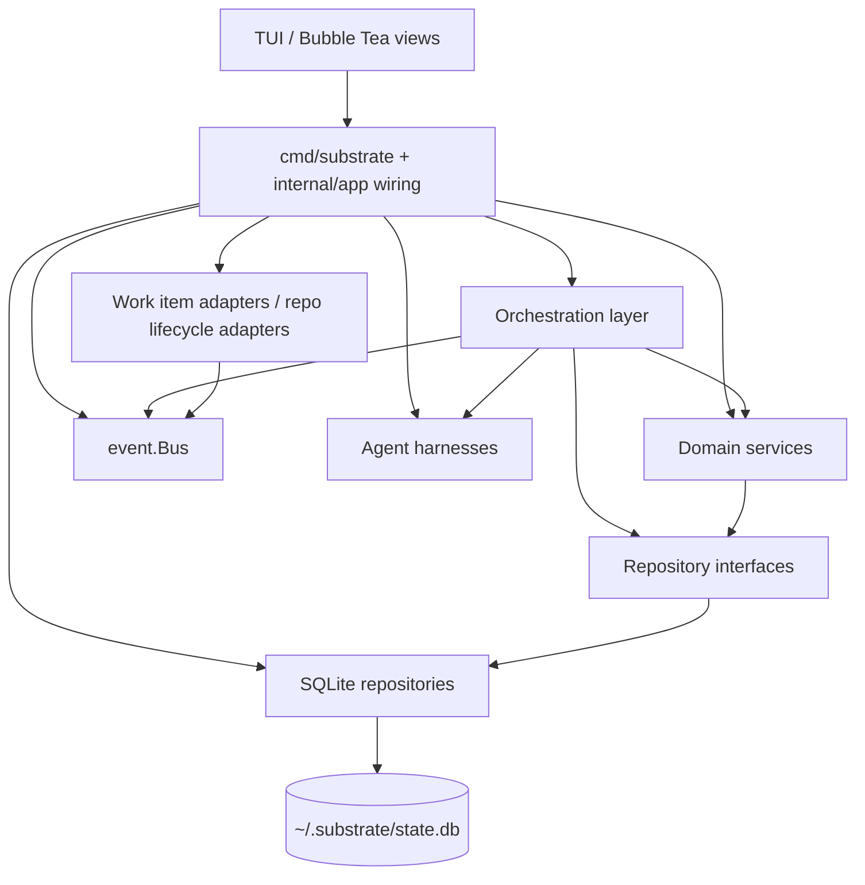

# 02 - Layered Architecture
<!-- docs:last-integrated-commit f6b8e6e5f8374bd4c2f467852266f01cc2f323a2 -->

This document describes the current layering and wiring in repository HEAD.
The important update versus older drafts is that the codebase now uses `Session`/`Task` domain names internally, while some storage tables and UI copy still use legacy `work_item` / `agent_session` terminology.

## 1. Layer Diagram



Current top-level split:

- `cmd/substrate/main.go` does the production wiring.
- `internal/app/` builds adapters and harnesses from config.
- `internal/orchestrator/` owns multi-service workflows.
- `internal/service/` owns state transitions and domain rules.
- `internal/repository/interfaces.go` defines interfaces.
- `internal/repository/sqlite/` provides the concrete SQLite implementations.
- `internal/event/bus.go` is an in-process pub/sub bus backed by `repository.EventRepository`.

## 2. Repository Layer

`internal/repository/interfaces.go` is the abstraction boundary that services depend on.

### Interface inventory

| Interface | Purpose | Main domain type |
|---|---|---|
| `SessionRepository` | CRUD for root work items | `domain.Session` |
| `PlanRepository` | CRUD for plans + FAQ append | `domain.Plan` |
| `TaskPlanRepository` | CRUD for per-repo plan slices | `domain.TaskPlan` |
| `WorkspaceRepository` | CRUD for workspaces | `domain.Workspace` |
| `TaskRepository` | CRUD for repo-scoped runs + history projection | `domain.Task` |
| `ReviewRepository` | CRUD for review cycles and critiques | `domain.ReviewCycle`, `domain.Critique` |
| `QuestionRepository` | CRUD for questions and proposal updates | `domain.Question` |
| `EventRepository` | Persistence for system events | `domain.SystemEvent` |
| `InstanceRepository` | CRUD for running substrate processes | `domain.SubstrateInstance` |

Representative interface shape:

```go
type SessionRepository interface {
	Get(ctx context.Context, id string) (domain.Session, error)
	List(ctx context.Context, filter SessionFilter) ([]domain.Session, error)
	Create(ctx context.Context, item domain.Session) error
	Update(ctx context.Context, item domain.Session) error
	Delete(ctx context.Context, id string) error
}

type TaskRepository interface {
	Get(ctx context.Context, id string) (domain.Task, error)
	ListBySubPlanID(ctx context.Context, subPlanID string) ([]domain.Task, error)
	ListByWorkspaceID(ctx context.Context, workspaceID string) ([]domain.Task, error)
	ListByOwnerInstanceID(ctx context.Context, instanceID string) ([]domain.Task, error)
	SearchHistory(ctx context.Context, filter domain.SessionHistoryFilter) ([]domain.SessionHistoryEntry, error)
	Create(ctx context.Context, s domain.Task) error
	Update(ctx context.Context, s domain.Task) error
	Delete(ctx context.Context, id string) error
}
```

### SQLite implementations

Concrete implementations live under `internal/repository/sqlite/`:

- `SessionRepo`
- `PlanRepo`
- `SubPlanRepo`
- `WorkspaceRepo`
- `TaskRepo`
- `ReviewRepo`
- `QuestionRepo`
- `EventRepo`
- `InstanceRepo`

All of them accept `generic.SQLXRemote`, which lets the same repo code work with either:

- production `dbRemote{*sqlx.DB}` in `cmd/substrate/main.go`, or
- transaction-bound handles in tests / future transactional flows.

Representative constructor pattern:

```go
type EventRepo struct{ remote generic.SQLXRemote }

func NewEventRepo(remote generic.SQLXRemote) EventRepo {
	return EventRepo{remote: remote}
}
```

### Resources registry

`internal/repository/sqlite/resources.go` still groups repo implementations into a `Resources` bundle for transaction-bound construction:

```go
type Resources struct {
	WorkItems  SessionRepo
	Plans      PlanRepo
	SubPlans   SubPlanRepo
	Workspaces WorkspaceRepo
	Sessions   TaskRepo
	Reviews    ReviewRepo
	Questions  QuestionRepo
	Events     EventRepo
	Instances  InstanceRepo
}
```

That registry exists and is exercised in tests. Production startup currently wires repositories directly rather than building a runtime service container around `Resources`.

## 3. Service Layer

The service layer is the state-machine and validation layer.

Current services:

| Service | Owns | Key responsibilities |
|---|---|---|
| `SessionService` | root `Session` lifecycle | validation, uniqueness checks, state transitions |
| `PlanService` | `Plan` + `TaskPlan` | plan/sub-plan transitions, FAQ append, lookup helpers |
| `TaskService` | repo-scoped `Task` lifecycle | pending/running/interrupted transitions, history lookups |
| `ReviewService` | `ReviewCycle` + `Critique` | cycle transitions, critique persistence and resolution |
| `QuestionService` | `Question` | answer/escalation/proposal workflows |
| `WorkspaceService` | `Workspace` | create / transition / archive / recover |
| `InstanceService` | `SubstrateInstance` | heartbeat, stale detection, cleanup |

Representative examples:

```go
type SessionService struct {
	repo repository.SessionRepository
}

type TaskService struct {
	repo repository.TaskRepository
}

type QuestionService struct {
	repo repository.QuestionRepository
}
```

Current design rules:

- Services depend on repository interfaces, not concrete SQLite repos.
- Services return domain-oriented errors (`ErrNotFound`, `ErrInvalidTransition`, `ErrInvalidInput`).
- Services own transition tables.
- There is no separate event service. Event persistence is `EventRepository`; publish/dispatch is `event.Bus`.

## 4. Orchestration Layer

The current business-logic layer is not a single monolithic `Orchestrator` type. It is a set of focused workflow structs in `internal/orchestrator/`.

| Type | Responsibility |
|---|---|
| `Discoverer` | workspace preflight, git-work discovery, repo metadata extraction |
| `PlanningService` | planning session startup, correction loop, plan persistence |
| `ImplementationService` | worktree preparation, wave execution, harness startup, event forwarding |
| `ReviewPipeline` | review-session startup, critique parsing, review outcome transitions |
| `Foreman` | persistent question-answering session, FAQ append, escalation handling |
| `Resumption` | resume / abandon interrupted tasks |
| `InstanceManager` | process registration, heartbeat, orphaned-task reconciliation |
| `PlanParser` / wave helpers | orchestration support code used by planning / implementation |

Representative wiring from `cmd/substrate/main.go`:

```go
planningSvc, _ := orchestrator.NewPlanningService(
	planningCfg, discoverer, gitClient, harnesses.Planning,
	planSvc, workItemSvc, planRepo, subPlanRepo, eventRepo, workspaceSvc, cfg,
)

implSvc := orchestrator.NewImplementationService(
	cfg, harnesses.Implementation, gitClient, bus,
	planSvc, workItemSvc, sessionSvc, subPlanRepo, sessionRepo, eventRepo, workspaceSvc,
)

reviewPipeline := orchestrator.NewReviewPipeline(
	cfg, harnesses.Review, reviewSvc, sessionSvc, planSvc, workItemSvc,
	sessionRepo, planRepo, bus,
)
```

Cross-cutting reality today:

- Planning and part of implementation still write some system events directly through `EventRepository.Create`.
- Worktree lifecycle, review outcomes, resumed/interrupted notifications, and TUI-published tracker/lifecycle events go through `event.Bus`.
- Adapters react to events; services do not depend on adapters.

## 5. SQLite Schema

The canonical schema is `migrations/001_initial.sql`.

### Naming note

Storage still uses legacy table names:

- `work_items` stores `domain.Session`
- `agent_sessions` stores `domain.Task`

That naming mismatch is historical; repository conversions hide it from the service layer.

### Representative schema snippet

```sql
CREATE TABLE work_items (
    id              TEXT PRIMARY KEY,
    workspace_id    TEXT NOT NULL REFERENCES workspaces(id),
    external_id     TEXT,
    source          TEXT NOT NULL,
    source_scope    TEXT,
    title           TEXT NOT NULL,
    description     TEXT,
    assignee_id     TEXT,
    state           TEXT NOT NULL CHECK (state IN (
                        'ingested','planning','plan_review','approved',
                        'implementing','reviewing','completed','failed')),
    labels          TEXT,
    source_item_ids TEXT,
    metadata        TEXT,
    created_at      TEXT NOT NULL,
    updated_at      TEXT NOT NULL
);

CREATE TABLE plans (
    id                TEXT PRIMARY KEY,
    work_item_id      TEXT NOT NULL UNIQUE REFERENCES work_items(id),
    orchestrator_plan TEXT NOT NULL,
    status            TEXT NOT NULL CHECK (status IN ('draft','pending_review','approved','rejected')),
    version           INTEGER NOT NULL DEFAULT 1,
    created_at        TEXT NOT NULL,
    updated_at        TEXT NOT NULL,
    faq               TEXT NOT NULL DEFAULT '[]'
);

CREATE TABLE sub_plans (
    id          TEXT PRIMARY KEY,
    plan_id     TEXT NOT NULL REFERENCES plans(id) ON DELETE CASCADE,
    repo_name   TEXT NOT NULL,
    content     TEXT NOT NULL,
    exec_order  INTEGER NOT NULL DEFAULT 0,
    status      TEXT NOT NULL CHECK (status IN ('pending','in_progress','completed','failed')),
    created_at  TEXT NOT NULL,
    updated_at  TEXT NOT NULL,
    UNIQUE(plan_id, repo_name)
);

CREATE TABLE agent_sessions (
    id                TEXT PRIMARY KEY,
    sub_plan_id       TEXT NOT NULL REFERENCES sub_plans(id),
    workspace_id      TEXT NOT NULL REFERENCES workspaces(id),
    repository_name   TEXT NOT NULL,
    harness_name      TEXT NOT NULL,
    worktree_dir      TEXT NOT NULL,
    pid               INTEGER,
    status            TEXT NOT NULL CHECK (status IN (
                          'pending','running','waiting_for_answer','completed','failed','interrupted')),
    exit_code         INTEGER,
    started_at        TEXT,
    shutdown_at       TEXT,
    completed_at      TEXT,
    created_at        TEXT NOT NULL,
    owner_instance_id TEXT REFERENCES substrate_instances(id) ON DELETE SET NULL,
    updated_at        TEXT NOT NULL
);

CREATE TABLE questions (
    id               TEXT PRIMARY KEY,
    agent_session_id TEXT NOT NULL REFERENCES agent_sessions(id),
    content          TEXT NOT NULL,
    context          TEXT,
    answer           TEXT,
    answered_by      TEXT CHECK (answered_by IN ('foreman','human')),
    status           TEXT NOT NULL CHECK (status IN ('pending','answered','escalated')) DEFAULT 'pending',
    created_at       TEXT NOT NULL,
    answered_at      TEXT,
    proposed_answer  TEXT
);

CREATE TABLE system_events (
    id           TEXT PRIMARY KEY,
    event_type   TEXT NOT NULL,
    workspace_id TEXT REFERENCES workspaces(id),
    payload      TEXT NOT NULL,
    created_at   TEXT NOT NULL
);
```

Other notable tables:

- `workspaces`
- `review_cycles`
- `critiques`
- `substrate_instances`
- `schema_migrations`

## 6. Dependency Injection and Wiring

The current app uses plain constructor wiring.

### Startup sequence

`cmd/substrate/main.go` currently does this, in order:

1. load config
2. run migrations
3. build SQLite repos directly
4. build domain services directly
5. create `event.NewBus(event.BusConfig{EventRepo: eventRepo})`
6. detect workspace from cwd
7. load secrets into config
8. build work item adapters and repo lifecycle adapters
9. subscribe adapters to the bus
10. build harnesses per phase
11. build orchestration structs
12. hand everything to the TUI service bundle

### Current bus wiring

Production wiring subscribes adapters like this:

```go
for _, workItemAdapter := range adapters {
	sub, _ := bus.Subscribe("work-item-adapter:" + workItemAdapter.Name())
	go func(a adapter.WorkItemAdapter, events <-chan domain.SystemEvent) {
		for evt := range events {
			_ = a.OnEvent(context.Background(), evt)
		}
	}(workItemAdapter, sub.C)
}

for _, lifecycleAdapter := range repoLifecycleAdapters {
	sub, _ := bus.Subscribe(
		"repo-lifecycle-adapter:"+lifecycleAdapter.Name(),
		string(domain.EventWorktreeCreated),
		string(domain.EventWorkItemCompleted),
	)
	go func(a adapter.RepoLifecycleAdapter, events <-chan domain.SystemEvent) {
		for evt := range events {
			_ = a.OnEvent(context.Background(), evt)
		}
	}(lifecycleAdapter, sub.C)
}
```

### Current config blocks

`internal/config/config.go` defines these top-level blocks:

```yaml
commit:
  strategy: semi-regular
  message_format: ai-generated
  message_template: ""

plan:
  max_parse_retries: 2

review:
  pass_threshold: minor_ok
  max_cycles: 3

harness:
  default: ohmypi
  phase:
    planning: ohmypi
    implementation: ohmypi
    review: ohmypi
    foreman: ohmypi

adapters:
  ohmypi:
    bun_path: ""
    bridge_path: ""
    thinking_level: ""
  claude_code:
    binary_path: ""
    model: ""
    permission_mode: ""
    max_turns: 0
    max_budget_usd: 0
  codex:
    binary_path: ""
    model: ""
    approval_mode: ""
    full_auto: false
    quiet: false
  linear:
    api_key_ref: ""
    team_id: ""
    assignee_filter: ""
    poll_interval: "30s"
    state_mappings: {}
  glab:
    reviewers: []
    labels: []
  gitlab:
    token_ref: ""
    base_url: "https://gitlab.com"
    assignee: ""
    poll_interval: "60s"
    state_mappings: {}
  github:
    token_ref: ""
    base_url: "https://api.github.com"
    assignee: ""
    poll_interval: "60s"
    reviewers: []
    labels: []
    state_mappings: {}
  sentry:
    token_ref: ""
    base_url: "https://sentry.io/api/0"
    organization: ""
    projects: []

foreman:
  question_timeout: "0"

repos:
  <repo-name>:
    doc_paths: []
```

Secrets are loaded after config parse via `config.LoadSecrets`, so token refs can be hydrated from the OS keychain before adapters and harnesses are constructed.
