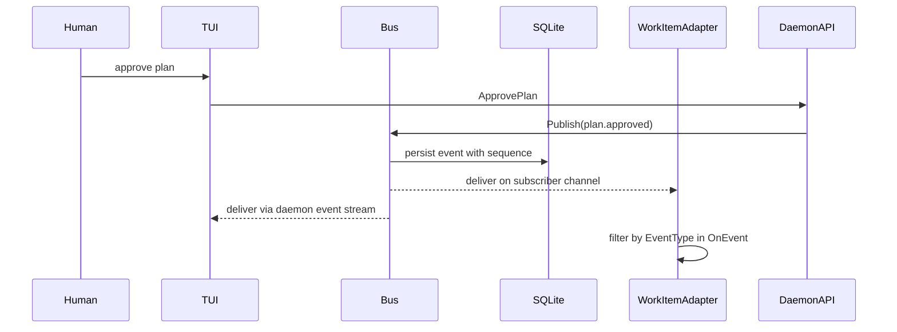
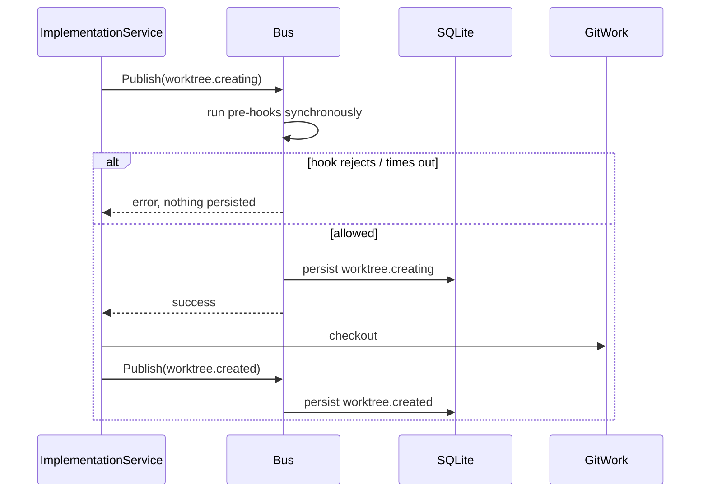

# 03 - Event System

<!-- docs:last-integrated-commit 2826f9fd2e658941eb96072a0c30df9766b92d94 -->

Substrate's event model has two parts:

1. **Persisted rows** — every significant state transition is recorded as a row in SQLite, providing an audit log and enabling UI rehydration.
2. **In-process bus** — an event bus distributes published events to subscribers in-memory, with support for synchronous gating hooks and asynchronous side-effect hooks.

Older drafts described a typed interface-based bus API. The current code uses a single persisted struct payload with JSON-in-string payloads and topic-based channel subscriptions.

---

## Persisted Event Model

Events are stored as records with a type identifier, a workspace reference, a JSON payload, and a timestamp. The payload is serialized JSON — producers marshal whatever shape they need at emission time. Persistence is the responsibility of the bus: every call to `Publish` records the event before (or after, depending on event type) fan-out.

Most producers access persistence through a transactional event service that wraps the repository.

---

## Event Catalog

Events are organized by domain area. Constants follow a `category.action` naming convention.

### Worktree lifecycle

- `worktree.creating` — gate event; pre-hook enforced before checkout
- `worktree.created` — checkout completed
- `worktree.status_changed` — worktree status changed (e.g., dirty, clean)
- `worktree.reused` — branch already existed; worktree reused without recreation
- `worktree.removed` — worktree deleted

### Work item lifecycle

- `work_item.ingested` — work item created from tracker sync
- `work_item.planning` — planning session started
- `work_item.plan_review` — plan submitted for human review
- `work_item.approved` — plan approved by human
- `work_item.implementing` — implementation session started
- `work_item.reviewing` — review session started
- `work_item.completed` — all sub-plans passed review
- `work_item.failed` — implementation or review failed
- `work_item.merged` — all linked PRs/MRs merged

### Plan and sub-plan

- `plan.generated` — orchestrator produced a draft plan
- `plan.submitted` — plan submitted for review
- `plan.status_changed` — plan status transitioned (e.g., pending→approved)
- `plan.approved` — human approved the plan
- `plan.rejected` — human rejected the plan
- `plan.revised` — plan regenerated after rejection
- `plan.superseded` — plan replaced by a new version
- `plan.failed` — plan generation failed
- `subplan.started` — sub-plan execution began
- `subplan.completed` — sub-plan execution completed
- `subplan.failed` — sub-plan execution failed
- `subplan.pr_ready` — sub-plan produced a PR/MR ready for review

### Agent session

- `agent_session.started`
- `agent_session.completed`
- `agent_session.failed`
- `agent_session.interrupted`
- `agent_session.resumed`
- `agent_session.follow_up`
- `agent_session.waiting_for_answer`
- `agent_question.raised` — operator question surfaced
- `agent_question.answered` — operator answered

### Graph continuation

- `agent_session.continuation_failed` — agent-session continuation could not complete. The continuation table is the source of truth; this event is for notification only and must not be used to infer continuation state in the UI.

### Review

- `review.started`
- `review.completed`
- `review.critiques_found`
- `review.artifact_recorded` — PR/MR link recorded by tracker adapter
- `review_cycle.status_changed` — review cycle transitioned (e.g., reimplementation triggered)
- `critique.status_changed` — individual critique status changed
- `reimplementation.started`

**Review cycle statuses:** `reviewing` → `passed` | `critiques_found` | `failed`. Once in a terminal status, the cycle is immutable — the transition table rejects any attempt to re-enter it. This prevents a crashed harness (e.g. SIGKILL between `CreateCycle` and `makeDecision`) from leaving a stale non-terminal cycle that masks outstanding critiques on prior cycles. Cycle counting for the max-cycles budget counts only terminal-status cycles; non-terminal cycles left by crashes do not consume the budget.

### PR/MR

- `pr.review_state_changed` — reviewer state transition detected by refresh loop
- `pr.ci_failed` — CI check transitioned to failure
- `pr.merged` — all linked PRs/MRs merged
- `question.status_changed` — question state transitioned (e.g., pending→answered, pending→escalated)

### Adapter

- `adapter.error` — adapter handler failed after retries
- `foreman.started` — Foreman session started
- `foreman.stopped` — Foreman session stopped

### Append-only child event payloads

`agent_session.resumed` and `agent_session.follow_up` are emitted when an append-only child session is created. Both events carry the source (superseded) session ID and the new child session ID together. The TUI decoders preserve both IDs so that pending dispatch state, superseded source updates, and graph leaf refreshes are deterministic. Decoding only the new session and discarding the edge breaks the graph in the UI.

Resume (no operator feedback) emits `agent_session.resumed`. Follow-up (operator-supplied feedback) emits `agent_session.follow_up`. The two events are not interchangeable; they are how the UI distinguishes a continuation from a feedback-driven restart.

---

## Bus Model

The bus is a singleton shared inside the logic composition layer. In daemon mode it is daemon-owned: services and orchestrators publish to it, adapters subscribe to it, and visualization clients consume the persisted/order-preserving event stream exposed by the daemon instead of holding a direct bus subscription.

### Subscriptions

Subscribers register with a list of topics. Each subscription gets a buffered channel. A topic matches an event type string. Subscribing with an existing ID replaces the prior subscriber and closes its channel. An empty topic list means "receive all events."

### Pre-hook event types

Some event types are classified as pre-hook events. For these, the bus runs registered hooks synchronously before anything else. The default set contains only `worktree.creating`, but additional types can be registered at runtime.

### Post-hooks

Hooks registered as post-hooks run asynchronously after dispatch. Errors are ignored. Post-hooks are useful for side effects that must not block the publisher.

---

## Publish Semantics

The key distinction is whether an event type is in the pre-hook set.

### Pre-hook events (gating path)

For a pre-hook event such as `worktree.creating`:

1. Run registered pre-hooks synchronously, in registration order.
2. If any pre-hook errors or times out, return error and do **not** persist.
3. Persist the event.
4. Dispatch to matching subscribers.
5. Run post-hooks asynchronously.

This is the gate used before `git-work checkout`.

### Regular events

For all other events:

1. Persist the event first.
2. Run pre-hooks synchronously.
3. If a pre-hook errors, return error **after** persistence; dispatch is aborted, but the event stays recorded.
4. Dispatch to matching subscribers.
5. Run post-hooks asynchronously.

Pre-hooks on regular events are advisory — they abort dispatch but cannot undo the persisted record.

### Timeout and panic behavior

Pre-hooks have a configurable timeout (default 30 seconds). They execute in a goroutine guarded by a timeout context. A panic in a hook is recovered and converted to an error.

---

## Drop and Retry Behavior

Dispatch is intentionally non-blocking.

When a subscriber's buffer is full:

- If no drop handler is configured, the publisher receives an error indicating retry.
- If a drop handler is configured, the handler is called asynchronously and publish continues.

This produces three observable modes: delivered normally, dropped but tolerated, or publisher told to retry. Because dispatch proceeds subscriber-by-subscriber, a retry error can occur after some subscribers have already received the event. Callers and consumers must handle events idempotently.

---

## Event Flow Snapshots

### Plan approval → tracker adapters

### Worktree creation gate

---

## Design Summary

- **Services** own domain state and are the source of truth for state-change events. They emit after database transactions commit.
- **`event.Bus`** is a shared singleton inside the logic composition layer, used by services/orchestrators (as emitters) and adapters (as subscribers). In daemon mode it does not leave the daemon process.
- **Orchestrators** own workflow-level events and emit via the shared emit helper. They do not emit state-transition events that services already emit.
- **TUI** consumes daemon event-stream batches and bridges them to its update loop. Transitional in-process mode may subscribe directly to the bus. It does not emit state-change events.
- **Topic-based** in-process bus with subscriber channels, synchronous pre-hooks for gating, and asynchronous post-hooks for side effects.
- **Best-effort fan-out** with explicit retry / drop-handler behavior.
