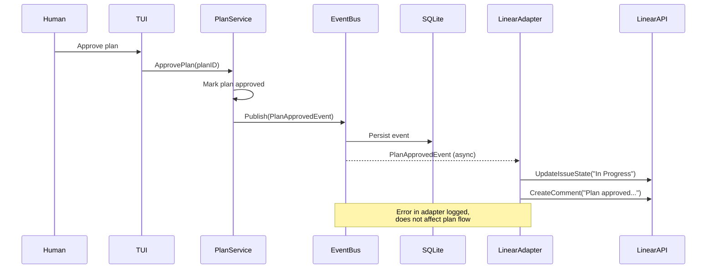
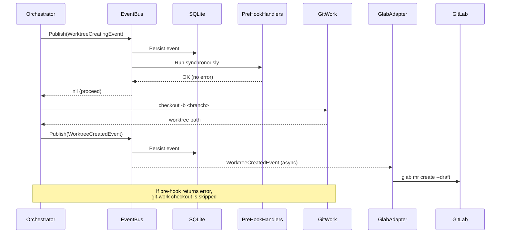

# 03 - Event System

The event system is Substrate's integration backbone. Every meaningful state transition emits an event. Adapters subscribe to events to trigger side effects in external systems (Linear, GitLab). The bus is in-process, channel-based, and persisted to SQLite for audit and replay.
See `02-layered-architecture.md` for where the event bus sits in the service layer. See `06-tui-design.md` for how the TUI subscribes to events for reactive updates.
---
## 1. System Events Catalog

Every event embeds `BaseEvent` for tracing and persistence:
```go
type EventType string

type BaseEvent struct {
    ID        string    // ULID
    Type      EventType
    Timestamp time.Time
    Workspace string    // workspace slug, empty for global events
}

type SystemEvent interface {
    Base() BaseEvent
}
```

| Event | Payload | Trigger |
|---|---|---|
| `WorkItemIngested` | `WorkItem` | Work item matches filter |
| `WorkspaceCreated` | `Workspace` | Workspace initialized |
| `PlanningStarted` | `WorkItem` | Workspace ready, planner invoked |
| `PlanGenerated` | `Plan` | Planning agent produces plans |
| `PlanSubmittedForReview` | `Plan` | Plan ready for human review |
| `PlanApproved` | `Plan` | Human accepts plan |
| `ImplementationStarted` | `WorkItem`, `Plan` | Plan approved, worktrees being created |
| `PlanRejected` | `Plan`, `Reason string` | Human rejects with feedback |
| `WorktreeCreating` | `Workspace`, `RepositoryName`, `Branch` | Pre-hook before git-work checkout |
| `WorktreeCreated` | `Workspace`, `RepositoryName`, `Branch`, `WorktreePath` | Post-hook after checkout |
| `WorktreeRemoved` | `Workspace`, `RepositoryName`, `Branch` | Worktree removed via git-work rm |
| `AgentSessionStarted` | `AgentSession` | Agent harness spawned |
| `AgentSessionCompleted` | `AgentSession`, `Result` | Agent exits 0 |
| `AgentSessionFailed` | `AgentSession`, `Error string` | Agent exits non-zero or timeout |
| `AgentSessionInterrupted` | `AgentSession` | Startup reconciliation detects dead PID for running session |
| `AgentSessionResumed` | `AgentSession` | Human chooses to resume an interrupted session |
| `AgentQuestionRaised` | `Question` | Agent cannot resolve from context |
| `AgentQuestionAnswered` | `Question` | Foreman or human answers |
| `ReviewStarted` | `ReviewCycle` | Review agent begins |
| `ReviewCompleted` | `ReviewCycle` | Review passes, no critiques |
| `CritiquesFound` | `ReviewCycle`, `[]Critique` | Review produces critiques |
| `ReimplementationStarted` | `AgentSession`, `[]Critique` | Re-impl session spawned |
| `BranchPushed` | `Workspace`, `RepositoryName`, `Branch`, `Remote` | Branch pushed to remote |
| `DocumentationStale` | `DocumentationSource`, `Reason` | Impl diverged from docs |
| `WorkItemCompleted` | `WorkItem` | All repos pass review |
| `WorkItemFailed` | `WorkItem`, `Error string` | Unrecoverable error in any phase |

### Event Type Constants and Representative Structs

```go
const (
    EventWorkItemIngested       EventType = "work_item.ingested"
    EventWorkspaceCreated       EventType = "workspace.created"
    EventPlanningStarted         EventType = "work_item.planning_started"
    EventPlanGenerated          EventType = "plan.generated"
    EventPlanSubmittedForReview  EventType = "plan.submitted_for_review"
    EventPlanApproved           EventType = "plan.approved"
    EventImplementationStarted   EventType = "work_item.implementation_started"
    EventPlanRejected           EventType = "plan.rejected"
    EventWorktreeCreating       EventType = "worktree.creating"
    EventWorktreeCreated        EventType = "worktree.created"
    EventWorktreeRemoved        EventType = "worktree.removed"
    EventAgentSessionStarted    EventType = "agent_session.started"
    EventAgentSessionCompleted  EventType = "agent_session.completed"
    EventAgentSessionFailed     EventType = "agent_session.failed"
    EventAgentSessionInterrupted EventType = "agent_session.interrupted"
    EventAgentSessionResumed     EventType = "agent_session.resumed"
    EventAgentQuestionRaised    EventType = "agent_question.raised"
    EventAgentQuestionAnswered  EventType = "agent_question.answered"
    EventReviewStarted          EventType = "review.started"
    EventReviewCompleted        EventType = "review.completed"
    EventCritiquesFound         EventType = "review.critiques_found"
    EventReimplementationStarted EventType = "reimplementation.started"
    EventBranchPushed           EventType = "branch.pushed"
    EventDocumentationStale     EventType = "documentation.stale"
    EventWorkItemCompleted      EventType = "work_item.completed"
    EventWorkItemFailed          EventType = "work_item.failed"
)

// Representative struct. All events follow this pattern: embed BaseEvent,
// carry payload fields from the catalog table, implement Base().

type PlanApprovedEvent struct {
    BaseEvent
    Plan Plan
}

func (e PlanApprovedEvent) Base() BaseEvent { return e.BaseEvent }
```

## 2. Event Bus

```go
type EventHandler func(ctx context.Context, event SystemEvent) error

type Subscription interface { Unsubscribe() }

type EventBus interface {
    // Pre-hook events: synchronous, error aborts. All others: async fan-out.
    Publish(ctx context.Context, event SystemEvent) error
    Subscribe(handler EventHandler) Subscription
    SubscribeType(eventType EventType, handler EventHandler) Subscription
    Close() error
}
```

### Implementation

The bus is in-process, no external broker. Each subscriber gets a buffered channel (cap 64). SQLite persistence is the first step in `Publish`, so events survive crashes. Pre-hook events run handlers synchronously; post-hook events fan out to channels asynchronously.

```go
type subscriber struct {
    id      string
    types   map[EventType]bool // nil = all types
    ch      chan SystemEvent
    handler EventHandler
    cancel  context.CancelFunc
}

func (s *subscriber) matches(e SystemEvent) bool {
    return s.types == nil || s.types[e.Base().Type]
}
func (s *subscriber) Unsubscribe() { s.cancel() }
type channelEventBus struct {
    mu           sync.RWMutex
    subscribers  map[string]*subscriber
    repo         EventRepository
    preHookTypes map[EventType]bool
    wg           sync.WaitGroup
}

func NewEventBus(repo EventRepository) EventBus {
    return &channelEventBus{subscribers: make(map[string]*subscriber), repo: repo,
        preHookTypes: map[EventType]bool{EventWorktreeCreating: true}}
}

func (b *channelEventBus) Publish(ctx context.Context, event SystemEvent) error {
    if err := b.repo.Save(ctx, event); err != nil {
        return fmt.Errorf("persisting event: %w", err)
    }
    b.mu.RLock()
    defer b.mu.RUnlock()
    if b.preHookTypes[event.Base().Type] {
        for _, sub := range b.subscribers {
            if sub.matches(event) {
                if err := sub.handler(ctx, event); err != nil {
                    return fmt.Errorf("pre-hook %s rejected: %w", sub.id, err)
                }
            }
        }
        return nil
    }

    for _, sub := range b.subscribers {
        if sub.matches(event) {
            select {
            case sub.ch <- event:
            default:
                slog.Warn("event dropped", "subscriber", sub.id, "event", event.Base().Type)
            }
        }
    }
    return nil
}
func (b *channelEventBus) subscribe(types map[EventType]bool, handler EventHandler) Subscription {
    ctx, cancel := context.WithCancel(context.Background())
    sub := &subscriber{
        id: ulid.Make().String(), types: types,
        ch: make(chan SystemEvent, 64), handler: handler, cancel: cancel,
    }
    b.mu.Lock()
    b.subscribers[sub.id] = sub
    b.mu.Unlock()
    b.wg.Add(1)
    go func() {
        defer b.wg.Done()
        for {
            select {
            case <-ctx.Done(): return
            case evt := <-sub.ch:
                hCtx, hCancel := context.WithTimeout(ctx, 30*time.Second)
                if err := handler(hCtx, evt); err != nil {
                    slog.Error("handler failed", "sub", sub.id, "err", err)
                }
                hCancel()
            }
        }
    }()
    return sub
}
func (b *channelEventBus) SubscribeType(t EventType, h EventHandler) Subscription {
    return b.subscribe(map[EventType]bool{t: true}, h)
}
func (b *channelEventBus) Subscribe(h EventHandler) Subscription { return b.subscribe(nil, h) }
func (b *channelEventBus) Close() error {
    b.mu.Lock()
    for _, sub := range b.subscribers { sub.cancel() }
    b.mu.Unlock()
    b.wg.Wait()
    return nil
}
```

### SQLite Persistence

Events stored in `system_events` for audit and replay (see `02-layered-architecture.md`). JSON-serialized via type registry for replay deserialization.

```go
type EventRepository interface {
    Save(ctx context.Context, event SystemEvent) error
    List(ctx context.Context, filter EventFilter) ([]PersistedEvent, error)
    ListSince(ctx context.Context, after string) ([]PersistedEvent, error)
}
```

```sql
CREATE TABLE system_events (
    id TEXT PRIMARY KEY, type TEXT NOT NULL, workspace TEXT,
    payload TEXT NOT NULL, created_at TEXT NOT NULL
);
CREATE INDEX idx_events_type ON system_events(type);
CREATE INDEX idx_events_workspace ON system_events(workspace);
```
---
## 3. Hook Mechanism

Adapters register event interest at startup via `EventBus.SubscribeType`. The orchestration layer publishes events; the bus routes them to registered handlers.

**Pre-hooks** (e.g., `WorktreeCreating`): synchronous, block caller, error aborts operation, uses caller's context deadline. **Post-hooks** (all others): asynchronous, 30s timeout per handler, errors logged only. Panics recovered via `defer recover()`.

```go
func (a *LinearAdapter) RegisterHooks(bus EventBus) {
    bus.SubscribeType(EventPlanApproved, a.OnEvent)
    bus.SubscribeType(EventWorkItemCompleted, a.OnEvent)
}
func (a *GlabAdapter) RegisterHooks(bus EventBus) {
    bus.SubscribeType(EventWorktreeCreated, a.OnEvent)
    bus.SubscribeType(EventBranchPushed, a.OnEvent)
}
```
---
## 4. Work Item Adapter Interface

```go
type WorkItemState string

const (
    WorkItemStateTodo       WorkItemState = "todo"
    WorkItemStateInProgress WorkItemState = "in_progress"
    WorkItemStateInReview   WorkItemState = "in_review"
    WorkItemStateDone       WorkItemState = "done"
)

type WorkItemFilter struct {
    ProjectIDs []string
    States     []WorkItemState
    Labels     []string
    AssigneeID string
}

type WorkItemAdapter interface {
    Name() string
    Capabilities() AdapterCapabilities

    // Interactive: browse + select for new session creation
    ListSelectable(ctx context.Context, opts ListOpts) (*ListResult, error)
    Resolve(ctx context.Context, selection Selection) (WorkItem, error)

    // Reactive: auto-assignment watching
    Watch(ctx context.Context, filter WorkItemFilter) (<-chan WorkItemEvent, error)

    // External tracker mutations
    Fetch(ctx context.Context, externalID string) (WorkItem, error)
    UpdateState(ctx context.Context, externalID string, state WorkItemState) error
    AddComment(ctx context.Context, externalID string, body string) error

    // System event hooks
    OnEvent(ctx context.Context, event SystemEvent) error
}
```

The adapter methods serve distinct roles:

- `Capabilities()` tells the TUI which session creation flow to present. Adapters with `CanBrowse: true` get the interactive search-and-select flow; those without (Manual) get a freeform input form.
- `ListSelectable` + `Resolve` is the interactive selection path: the TUI calls `ListSelectable` to populate a searchable list, then `Resolve` to aggregate selections into a `WorkItem`.
- `Watch` is the reactive auto-assignment path, independent of interactive selection.
- Adapters that lack browsing return `ErrNotSupported` from `ListSelectable`.
- `OnEvent` dispatches via type switch. `UpdateState` maps `WorkItemState` to Linear's state IDs (configured per-project in TOML). `AddComment` creates an `IssueComment` via GraphQL mutation.

See `01-domain-model.md` for the full type definitions of `AdapterCapabilities`, `ListOpts`, `ListResult`, `Selection`, and `SelectableItem`.

```go
func (a *LinearAdapter) Capabilities() AdapterCapabilities {
    return AdapterCapabilities{
        CanWatch:     true,
        CanBrowse:    true,
        CanMutate:    true,
        BrowseScopes: []SelectionScope{ScopeIssues, ScopeProjects, ScopeInitiatives},
    }
}

func (a *LinearAdapter) OnEvent(ctx context.Context, event SystemEvent) error {
    switch e := event.(type) {
    case PlanApprovedEvent:
        if err := a.UpdateState(ctx, e.Plan.WorkItemID, WorkItemStateInProgress); err != nil {
            return err
        }
        return a.AddComment(ctx, e.Plan.WorkItemID,
            fmt.Sprintf("Plan approved. Starting across %d repos.", len(e.Plan.SubPlans)))
    case WorkItemCompletedEvent:
        return a.UpdateState(ctx, e.WorkItem.ExternalID, WorkItemStateDone)
    default:
        return nil
    }
}
```

---

## 5. Repo Lifecycle Adapter Interface

```go
type RepoLifecycleAdapter interface {
    Name() string
    OnEvent(ctx context.Context, event SystemEvent) error
}
```

Deliberately narrow. Repo lifecycle actions are event reactions, not imperative calls.

### Glab Adapter Event Handling

```go
func (a *GlabAdapter) OnEvent(ctx context.Context, event SystemEvent) error {
    switch e := event.(type) {
    case WorktreeCreatedEvent:
        return a.createDraftMR(ctx, e.RepositoryName, e.Branch)
    case BranchPushedEvent:
        return a.updateMRDescription(ctx, e.RepositoryName, e.Branch)
    default:
        return nil
    }
}
```

`createDraftMR` shells out to `glab mr create --draft --source-branch <branch> --target-branch main`. Inherits the user's existing `glab` authentication.

---

## 6. Event Flow Diagrams

### 6a. Plan Approval to Work Item State Change


### 6b. Worktree Creation to Merge Request Creation


## Design Decisions

**In-process, not external broker.** Single-user developer machine. Low event volume. Channel bus is zero-ops and trivially testable. `EventBus` interface allows NATS re-impl later.

**Persist events.** (1) Audit trail for debugging. (2) Crash recovery via replay from last checkpoint (see `01-domain-model.md`).

**Single `OnEvent` dispatch.** Adapters register for specific types via `SubscribeType`. Adding event types never changes adapter interfaces.

**Buffer size 64.** Conservative. Dropped-event warnings signal slow handlers. Preferable to unbounded memory growth.
