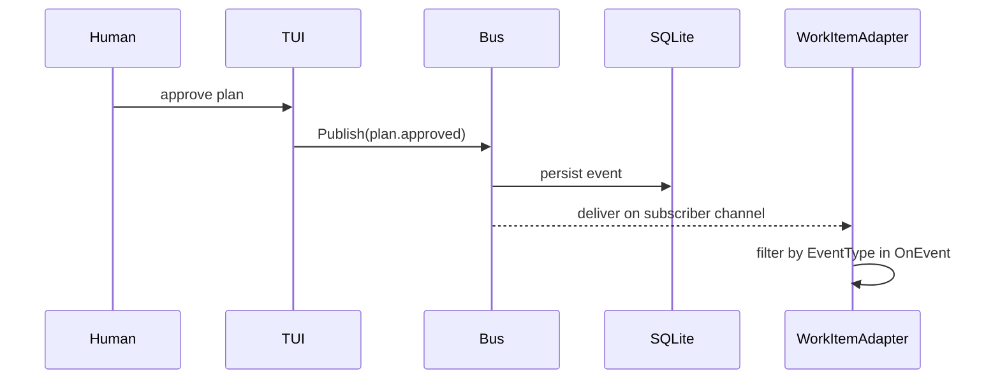
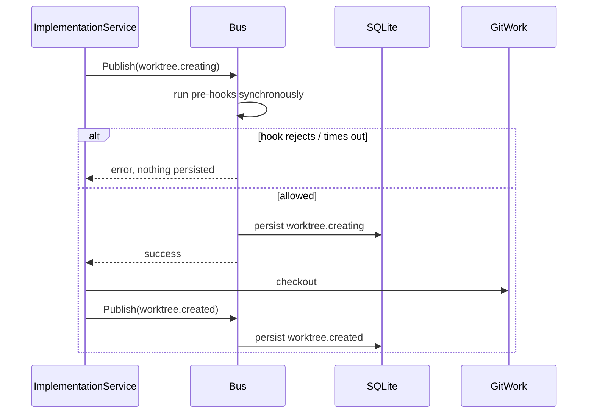

# 03 - Event System
<!-- docs:last-integrated-commit 5f40bd72111dbaec6c4ea02625679580f6d96c0a -->
Substrate's event model has two parts:

1. persisted `domain.SystemEvent` rows in SQLite
2. an in-process `event.Bus` that can persist, gate, and fan out selected events

Older drafts described a typed interface-based bus API. The current code uses a single persisted struct payload with JSON-in-string payloads and topic-based channel subscriptions.

---

## 1. Persisted Event Model

`domain.SystemEvent` is the persisted event record.

```go
type SystemEvent struct {
	ID          string
	EventType   string
	WorkspaceID string
	Payload     string
	CreatedAt   time.Time
}
```

`Payload` is stored as a raw JSON string. Event producers marshal whatever payload shape they need and write the serialized string into `Payload`.

Persistence boundary:

```go
type EventRepository interface {
	Create(ctx context.Context, e domain.SystemEvent) error
	ListByType(ctx context.Context, eventType string, limit int) ([]domain.SystemEvent, error)
	ListByWorkspaceID(ctx context.Context, workspaceID string, limit int) ([]domain.SystemEvent, error)
}
```

Most producers access persistence through `service.EventService`, which wraps the repository in a transaction:

```go
type EventService struct { transacter atomic.Transacter[repository.Resources] }

func (s *EventService) Create(ctx context.Context, e domain.SystemEvent) error
func (s *EventService) ListByType(ctx context.Context, eventType string, limit int) ([]domain.SystemEvent, error)
func (s *EventService) ListByWorkspaceID(ctx context.Context, workspaceID string, limit int) ([]domain.SystemEvent, error)
```

SQLite storage is a thin mapping layer:

```sql
CREATE TABLE system_events (
    id           TEXT PRIMARY KEY,
    event_type   TEXT NOT NULL,
    workspace_id TEXT REFERENCES workspaces(id),
    payload      TEXT NOT NULL,
    created_at   TEXT NOT NULL
);
CREATE INDEX idx_events_type ON system_events(event_type);
CREATE INDEX idx_events_workspace ON system_events(workspace_id);
CREATE INDEX idx_events_created ON system_events(created_at);
```

### Core event-type constants

`internal/domain/event.go` declares the current catalog of substrate-level event constants:

```go
const (
	EventWorktreeCreating EventType = "worktree.creating"
	EventWorktreeCreated  EventType = "worktree.created"
	EventWorktreeReused   EventType = "worktree.reused"  // branch already exists, worktree not recreated

	EventWorkItemIngested     EventType = "work_item.ingested"
	EventWorkItemPlanning     EventType = "work_item.planning"
	EventWorkItemPlanReview   EventType = "work_item.plan_review"
	EventWorkItemApproved     EventType = "work_item.approved"
	EventWorkItemImplementing EventType = "work_item.implementing"
	EventWorkItemReviewing    EventType = "work_item.reviewing"
	EventWorkItemCompleted    EventType = "work_item.completed"
	EventWorkItemFailed       EventType = "work_item.failed"
	EventWorkItemMerged       EventType = "work_item.merged"

	EventWorkspaceCreated        EventType = "workspace.created"
	EventPlanGenerated          EventType = "plan.generated"
	EventPlanSubmitted          EventType = "plan.submitted"
	EventPlanApproved           EventType = "plan.approved"
	EventPlanRejected            EventType = "plan.rejected"
	EventPlanRevised             EventType = "plan.revised"
	EventPlanFailed             EventType = "plan.failed"

	// Sub-plan state events (supersede subplan.status_changed)
	EventSubPlanStarted   EventType = "subplan.started"
	EventSubPlanCompleted EventType = "subplan.completed"
	EventSubPlanFailed    EventType = "subplan.failed"
	EventSubPlanPRReady   EventType = "subplan.pr_ready"

	// Deprecated: use EventSubPlanStarted/Completed/Failed instead
	EventSubPlanStatusChanged EventType = "subplan.status_changed"

	EventWorktreeRemoved        EventType = "worktree.removed"
	EventAgentSessionStarted          EventType = "agent_session.started"
	EventAgentSessionCompleted        EventType = "agent_session.completed"
	EventAgentSessionFailed           EventType = "agent_session.failed"
	EventAgentSessionInterrupted      EventType = "agent_session.interrupted"
	EventAgentSessionResumed          EventType = "agent_session.resumed"
	EventAgentSessionFollowUp         EventType = "agent_session.follow_up"
	EventAgentSessionWaitingForAnswer EventType = "agent_session.waiting_for_answer"
	EventAgentQuestionRaised          EventType = "agent_question.raised"
	EventAgentQuestionAnswered        EventType = "agent_question.answered"
	EventReviewStarted                EventType = "review.started"
	EventReviewCompleted              EventType = "review.completed"
	EventCritiquesFound              EventType = "review.critiques_found"
	EventReimplementationStarted      EventType = "reimplementation.started"

	// Review artifact events
	EventReviewArtifactRecorded  EventType = "review.artifact_recorded"

	// PR/MR lifecycle events emitted by the GitHub/GitLab refresh loops
	EventPRReviewStateChanged    EventType = "pr.review_state_changed"
	EventPRCIFailed              EventType = "pr.ci_failed"
	EventPRMerged                EventType = "pr.merged"

	// Adapter error events
	EventAdapterError EventType = "adapter.error"
)
```

Important nuance: the bus and repository are not limited to those constants. `ImplementationService.forwardEvents` also republishes raw harness event names such as `done`, `error`, `question`, or `foreman_proposed` as `SystemEvent.EventType` strings.

---

## 2. Where Events Come From Today

Events originate from two layers:

- **Services** own domain state and emit events on every transition. They are the source of truth for state-change events.
- **Orchestrators** own workflow-level events (plan generation, review outcomes, session resume). They emit via `service.Emit()` which wraps `event.Bus.Publish(...)` asynchronously.
- **TUI** subscribes to the bus and reacts to events. It does not emit state-change events.
- **Adapters** subscribe to the bus for side effects (tracker updates, repo lifecycle hooks).

All events flow through `event.Bus.Publish(...)` via the shared `service.Emit()` helper, which handles async emission with a 5-second timeout and nil-bus safety.

### Service-layer emitters (state transitions)

Services emit via `service.Emit(bus, evt)` after database transactions commit:

| Service | Methods | Event types |
|---|---|---|
| `SessionService` | `Transition()` | `work_item.planning`, `work_item.plan_review`, `work_item.approved`, `work_item.implementing`, `work_item.reviewing`, `work_item.completed`, `work_item.failed`, `work_item.merged`, `work_item.archived` |
| `TaskService` | `Create`, `Complete`, `Fail`, `Interrupt` | `agent_session.started`, `agent_session.completed`, `agent_session.failed`, `agent_session.interrupted` |
| `PlanService` | `SubmitForReview`, `ApprovePlan`, `RejectPlan`, `ApplyReviewedPlanOutput`, `TransitionSubPlan` | `plan.submitted`, `plan.approved`, `plan.rejected`, `plan.revised`, `subplan.started`, `subplan.completed`, `subplan.failed` |
| `AgentSessionService` | `Transition()`, `FollowUpRestart()` | `agent_session.follow_up`, `agent_session.waiting_for_answer` |

### Orchestrator-layer emitters (workflow events)

Orchestrators emit higher-level workflow events via `service.Emit()`:

| Orchestrator | Event types | Notes |
|---|---|
| `PlanningService` | `plan.generated`, `plan.failed` | Plan generation is an orchestrator action |
| `ImplementationService` | `work_item.completed` (rich payload), `worktree.created`, `worktree.reused`, `subplan.pr_ready` | `agent_session.*` events removed — services emit these |
| `ReviewPipeline` | `review.started`, `review.critiques_found`, `review.completed`, `reimplementation.started` | |
| `Resumption` | `agent_session.resumed` | |

### Adapter and TUI emitters

| Emitter | Event types | Notes |
|---|---|
| GitHub/GitLab adapters (`PersistReviewArtifact`) | `review.artifact_recorded` | Direct persistence via `EventService.Create` |
| GitHub `refreshPRs` / GitLab `refreshSingleMR` | `pr.merged` | `pr.merged` emitted on post-merge transition; review state and CI check rows are maintained in the DB by the refresh loop but do not emit bus events |
| Adapter dispatch loops | `adapter.error` | Published through bus on handler failure |

### Unused event constants

The following declared constants are not currently emitted in the assigned code paths:

- `workspace.created`
- `pr.review_state_changed`
- `pr.ci_failed`

`pr.review_state_changed` and `pr.ci_failed` are declared but not emitted through the bus. The 120-second refresh loop maintains review and check rows in the database, but does not publish events when those rows change. The TUI reads review and check state from the database tables directly.

Also reserved but not currently emitted in the active runtime path: `agent_question.raised` and `agent_question.answered`. These event types are defined and handled in the TUI, but the current question routing in `QuestionService.EscalateWithProposal` does not publish them through the bus — the TUI receives question updates via targeted load commands from orchestrator completion messages instead.

---

## 3. `event.Bus` Model

The actual bus implementation is `internal/event/bus.go`.

### Public surface

```go
type PreHook func(ctx context.Context, event domain.SystemEvent) error
type PostHook func(ctx context.Context, event domain.SystemEvent) error

type HookConfig struct {
	Name    string
	Timeout time.Duration
}

type DropHandler func(subscriberID string, event domain.SystemEvent)

type Subscriber struct {
	ID     string
	Topics map[string]bool
	C      chan domain.SystemEvent
}

type Bus struct { ... }

func NewBus(cfg BusConfig, opts ...BusOption) *Bus
func (b *Bus) Subscribe(id string, topics ...string) (*Subscriber, error)
func (b *Bus) Unsubscribe(id string)
func (b *Bus) RegisterPreHook(config HookConfig, hook PreHook)
func (b *Bus) RegisterPostHook(config HookConfig, hook PostHook)
func (b *Bus) RegisterPreHookType(eventType string)
func (b *Bus) IsPreHookEvent(eventType string) bool
func (b *Bus) Publish(ctx context.Context, event domain.SystemEvent) error
func (b *Bus) Close() error
func (b *Bus) SubscriberCount() int
```

### Subscription semantics

`Subscribe` is topic-based and returns a buffered channel subscriber.

Current behavior:

- subscriber buffer size is `500`
- `topics == empty` means “receive all events”
- subscribing with an existing subscriber ID replaces the old subscriber and closes its channel
- `Subscribe` returns `ErrBusClosed` if the bus has already been closed
- `Unsubscribe` closes the channel and removes the subscriber
- `Close` closes all subscriber channels and prevents future subscriptions

### Pre-hook event types

The bus tracks a set of event types that should behave as pre-hook events.

Current default set:

```go
var defaultPreHookTypes = map[string]bool{
	string(domain.EventWorktreeCreating): true,
}
```

`RegisterPreHookType` can extend that set at runtime.

---

## 4. Publish Semantics

The key distinction is whether an event type is in the pre-hook set.

### Pre-hook events

For a pre-hook event such as `worktree.creating`:

1. run registered pre-hooks synchronously, in registration order
2. if any pre-hook errors or times out, return error and do **not** persist the event
3. persist the event through `EventRepository.Create`
4. dispatch to matching subscribers
5. run post-hooks asynchronously

This is the gating path used before `git-work checkout`.

### Regular events

For all other events:

1. persist the event first
2. run pre-hooks synchronously
3. if a pre-hook errors, return error **after** persistence; dispatch is aborted, but the event stays recorded
4. dispatch to matching subscribers
5. run post-hooks asynchronously

That means pre-hooks on regular events are advisory / abort-dispatch hooks, not fact-reversal hooks.

### Timeout and panic behavior

Pre-hooks:

- default timeout is `30s` when `HookConfig.Timeout == 0`
- execute in registration order
- run inside a goroutine guarded by `context.WithTimeout`
- timeout returns an error to the publisher
- panic is recovered and converted into an error

Post-hooks:

- default timeout is `30s` when `HookConfig.Timeout == 0`
- run after dispatch, asynchronously
- errors are ignored
- panic is recovered and logged with `slog.Error`

Registering a nil hook is programmer error and panics immediately.

---

## 5. Drop / Retry Behavior

Dispatch is intentionally non-blocking.

When a subscriber's buffer is full:

- if no drop handler is configured, `dispatch` returns `ErrRetryLater`
- if a drop handler is configured through `WithDropHandler`, the handler is invoked asynchronously and publish continues

This creates three observable modes:

1. delivered normally
2. dropped but tolerated via `onDrop`
3. publisher told to retry later via `ErrRetryLater`

Because dispatch happens subscriber-by-subscriber, `ErrRetryLater` can happen after some subscribers already received the event. Callers and consumers need idempotent handling.

---

## 6. Current Registration and Routing Semantics

### Work item adapters

Production wiring subscribes each work item adapter to a targeted set of events:

```go
sub, _ := bus.Subscribe(
	"work-item-adapter:" + workItemAdapter.Name(),
	string(domain.EventPlanApproved),
	string(domain.EventWorkItemCompleted),
	string(domain.EventPRMerged),
)
```

Each adapter's `OnEvent` implementation receives matching events. Currently, adapters care about `plan.approved`, `work_item.completed`, and `pr.merged`.

### Repo lifecycle adapters

Production wiring subscribes lifecycle adapters to:

- `worktree.created`
- `worktree.reused`
- `work_item.completed`
- `pr.merged`
- `plan.approved`

```go
sub, _ := bus.Subscribe(
	"repo-lifecycle-adapter:" + lifecycleAdapter.Name(),
	string(domain.EventWorktreeCreated),
	string(domain.EventWorktreeReused),
	string(domain.EventWorkItemCompleted),
	string(domain.EventPRMerged),
	string(domain.EventPlanApproved),
)
```

Lifecycle adapters also receive a drop handler via `WithDropHandler`, so bus dispatch is non-blocking even when the adapter's goroutine falls behind.

### Provider routing on top of topic routing

`internal/app/wire.go` adds another layer for lifecycle adapters:

- GitHub and GitLab lifecycle adapters are wrapped in `routedRepoLifecycleAdapter`
- the wrapper parses `event.Payload`
- it inspects `review` and `external_id` / `external_ids`
- it only forwards the event to the adapter if the payload matches that adapter's provider

So routing is:

1. coarse topic filtering in the bus
2. provider-specific payload filtering in `routedRepoLifecycleAdapter`

### Pre-hooks and post-hooks in production wiring

The `Bus` supports `RegisterPreHook` and `RegisterPostHook`, but the current production `main.go` wiring does not register any explicit hook functions. Current runtime behavior relies mainly on:

- topic subscriptions
- the built-in pre-hook type classification for `worktree.creating`
- persistence through the configured `EventRepo`

---

## 7. Representative Payloads

### `worktree.creating`

Published before checkout:

```json
{
  "workspace_id": "ws-123",
  "repository": "repo-a",
  "branch": "sub-abc-fix-bug",
  "work_item_title": "Fix bug",
  "sub_plan": "...markdown...",
  "review": { ... }
}
```

### `worktree.created`

Published after checkout:

```json
{
  "workspace_id": "ws-123",
  "repository": "repo-a",
  "branch": "sub-abc-fix-bug",
  "worktree_path": "/path/to/repo-a/sub-abc-fix-bug",
  "work_item_title": "Fix bug",
  "sub_plan": "...markdown...",
  "tracker_refs": [ ... ],
  "review": { ... }
}
```

### `worktree.reused`

Published by `ensureWorktree` when the target branch already exists and no new worktree is created:

```json
{
  "workspace_id": "ws-123",
  "repository": "repo-a",
  "branch": "sub-abc-fix-bug",
  "worktree_path": "/path/to/repo-a/sub-abc-fix-bug",
  "work_item_title": "Fix bug",
  "sub_plan": "...markdown...",
  "tracker_refs": [ ... ],
  "review": { ... }
}
```

This event uses the same `WorktreeCreatedPayload` struct as `worktree.created`. The updated `SubPlan` content reflects any changes from differential re-planning. It is published through the bus but lifecycle adapters do not currently subscribe to this topic.

### `plan.approved`

Published by `PlanService.ApprovePlan()` when a human approves a plan:

```json
{
  "plan_id": "plan-1",
  "work_item_id": "wi-1",
  "external_id": "gh:issue:acme/rocket#42",
  "comment_body": "Overall plan text",
  "external_ids": ["gh:issue:acme/rocket#42"]
}
```

### `work_item.completed`

Published by `ImplementationService.emitWorkItemCompleted()` after all sub-plans pass review. The richer payload (including branch, review, sub-plan content) stays in the orchestrator since services don't have access to those fields:

```json
{
  "work_item_id": "wi-1",
  "external_id": "gh:issue:acme/rocket#42",
  "branch": "sub-branch",
  "review": { ... },
  "external_ids": ["gh:issue:acme/rocket#42"]
}
```

### `agent_session.resumed`

Published by `Resumption`:

```json
{
  "old_session_id": "sess-old",
  "new_session_id": "sess-new",
  "sub_plan_id": "sp-1"
}
```

### `review.artifact_recorded`

Published by `adapter.PersistReviewArtifact` (called from GitHub and GitLab adapters) when a PR/MR is created or updated. Persisted via `EventService.Create`, not through the bus:

```json
{
  "work_item_id": "wi-1",
  "artifact": {
    "provider": "github",
    "kind": "PR",
    "repo_name": "acme/rocket",
    "ref": "#7",
    "url": "https://github.com/acme/rocket/pull/7",
    "state": "draft",
    "branch": "sub-branch",
    "worktree_path": "/path/to/worktree",
    "draft": true,
    "updated_at": "2026-01-15T10:00:00Z"
  }
}
```

The payload shape is `domain.ReviewArtifactEventPayload` containing a `WorkItemID` and a `ReviewArtifact` struct.

### `pr.review_state_changed`

Emitted by the GitHub `refreshPRs` and GitLab `refreshSingleMR` loops when a stored reviewer's state differs from the freshly fetched value. Persisted via `EventService.Create`. Subscribers (notably the TUI) use this to invalidate cached artifact data without waiting for the next UI tick:

```json
{"pr_id":"...","reviewer":"alice","old_state":"commented","new_state":"approved"}
```

### `pr.ci_failed`

Emitted when any check transitions to `conclusion = failure`:

```json
{"pr_id":"...","check_name":"test","conclusion":"failure"}
```

Reserved for future automation (e.g. optional auto-follow-up agent session). Currently informational.

### `pr.merged`

Emitted **once per work item** when the refresh loop observes that every PR/MR linked to a work item has reached `merged` state and the work item itself is still `SessionCompleted`. The handler transitions the work item to `SessionMerged` and may trigger configured post-merge hooks (see `04-adapters.md`). The refresh loop suppresses re-emission by checking the current work item state:

```json
{"work_item_id":"...","workspace_id":"..."}
```

### `adapter.error`

Published by the TUI settings service adapter dispatch loops when an adapter handler fails after exhausting 3 retries. Published through the bus:

```json
{"adapter":"github-tracker","event_type":"work_item.completed","error":"POST https://api.github.com/...: 502 Bad Gateway"}
```

The payload is a flat JSON object with `adapter` (adapter name), `event_type` (the event that failed), and `error` (the last error message).
---

## 8. Event Flow Snapshots

### Plan approval -> tracker adapters



### Worktree creation gate



---

## Design Summary

The event system architecture:

- **Services** own domain state and are the source of truth for state-change events. They emit via `service.Emit()` after DB transactions commit.
- **`event.Bus`** is a shared singleton in the application composition layer, used by services (as emitters), the TUI (as subscriber), and adapters (as subscribers).
- **Orchestrators** own workflow-level events and emit via `service.Emit()`. They do not emit state-transition events that services already emit.
- **TUI** subscribes to the bus and bridges events to its update loop via `DomainEventMsg`. It does not emit state-change events.
- **Topic-based** in-process bus with subscriber channels, synchronous pre-hooks for gating, and asynchronous post-hooks for side effects.
- **Best-effort fan-out** with explicit `ErrRetryLater` / drop-handler behavior.
- All events persist via `event.Bus.Publish()`, which calls `EventRepository.Create` internally. Direct `EventService.Create` calls are reserved for adapter-side artifact persistence.

Key architectural rules:

1. Services own state and emit events on every transition.
2. Orchestrators coordinate services but do not hold the bus for service-layer events.
3. Orchestrators never subscribe to the bus — they only publish.
4. TUI subscribes to the bus and bridges events to its update loop.
5. Adapters subscribe to the bus for side effects.
6. `PollTickMsg` is eliminated for work item and task state.

Payloads use `map[string]any` with consistent lowercase keys (`work_item_id`, `session_id`, `workspace_id`) marshaled with `encoding/json`. Shared helpers in `internal/event/payload.go` ensure consistency.
