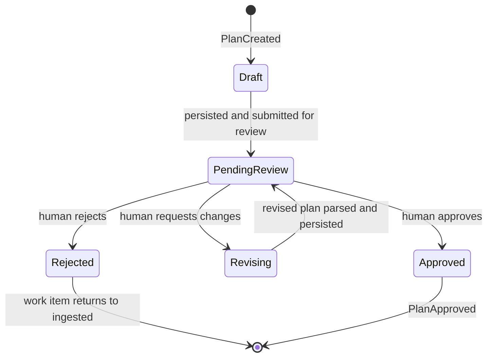
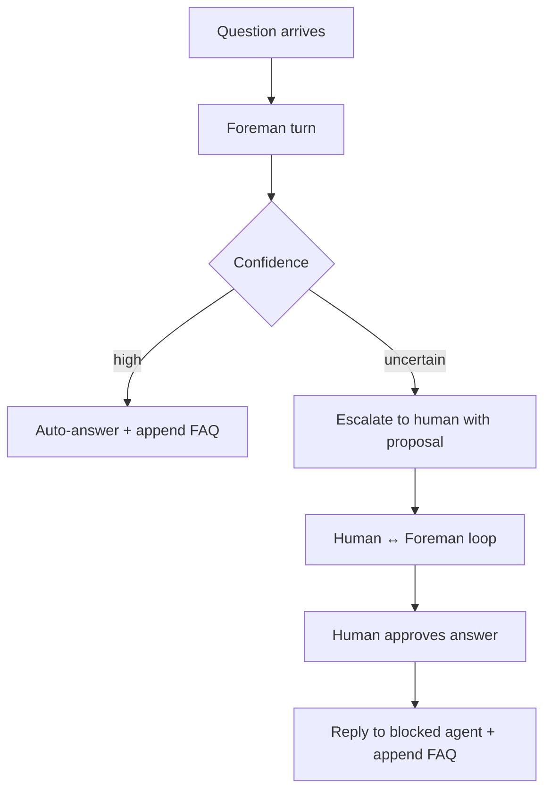

# 05 - Orchestration
<!-- docs:last-integrated-commit a38128010038776df783ec0bdf305b2637b5603e -->
Owns the runtime workflow: planning, plan review, execution waves, Foreman handling, review/reimplementation, completion, and recovery.

For domain/state definitions see `01-domain-model.md`. For event semantics see `03-event-system.md`. For provider, repo host, and harness behavior see `04-adapters.md`. For rollout status and test gates see `07-implementation-plan.md`.

---

## 1. Planning Pipeline

Triggered when a work item enters the planning flow.

**Runtime flow:**

`WorkItemReady -> PullMainWorktrees -> PreflightCheck -> DiscoverRepos -> BuildPlanningContext -> StartPlanningSession -> ParseDraft -> ValidatePlan -> PersistPlan -> PlanGenerated`

### 1a. Refresh workspace inputs

Before planning:
- pull `main/` worktrees with `git pull --ff-only`
- re-scan the workspace for git-work repos
- surface plain git clones as health warnings rather than silently treating them as managed repos
- read workspace-level guidance (`AGENTS.md`) before the planning session starts

The `Discoverer` enforces a 5-minute pull cooldown on `PullMainWorktrees` — calls within the cooldown window are skipped, preventing redundant network I/O when multiple sessions start in rapid succession. The cooldown timestamp is stamped optimistically before the lock is released so concurrent callers that arrive while a pull is in-flight also skip.

Planning operates on `main/` worktrees only. Feature worktrees from other active items are excluded from planning context.

### 1b. Build planning context

The planning context contains:
- work item snapshot
- workspace guidance
- discovered repo pointers
- plan draft path for the planning session

The planning harness explores the workspace and writes its plan to the draft path. The draft file, not the final chat response, is the source of truth for plan parsing.

The planning session ID and draft path are exposed to the TUI so the overview can render a live transcript while the planning harness is running.

### 1c. Parse and validate the draft

The draft must begin with a fenced `substrate-plan` YAML block that defines `execution_groups`, followed by a non-empty orchestration section and one implementation-ready sub-plan section per declared repo.

Validation rules:
1. every repo in `execution_groups` must exist in the discovered workspace repo set
2. every declared repo must have a matching sub-plan section
3. no sub-plan may exist for a repo absent from `execution_groups`
4. the `## Orchestration` section must be present and non-empty
5. every sub-plan must include `### Goal`, `### Scope`, `### Changes`, `### Validation`, and `### Risks`
6. `### Scope`, `### Validation`, and `### Risks` each need at least one list item; `### Changes` needs at least three concrete steps

If validation fails or the draft is missing, Substrate sends a correction message to the same planning session and retries up to `plan.max_parse_retries`.

### 1d. Persist plan

On success:
- persist the orchestration plan and sub-plans atomically via `PlanService.CreatePlanAtomic`
- when `replacePlanID` is set (re-planning after rejection or follow-up), the old plan row is marked `superseded` within the same transaction before inserting the new one, and `Plan.Version` is incremented as a generation counter. The partial unique index on non-superseded plans enforces at most one active plan per work item
- assign execution order from the `execution_groups` index
- transition the plan from `draft` to `pending_review`
- transition the work item to `plan_review`
- emit `PlanGenerated`
- retain the session draft directory as audit data

For draft format and implementation-phase validation gates, see `07-implementation-plan.md`.

### 1e. Planning session lifecycle

Planning runs are durable child sessions, not synthetic UI state.

When planning starts:
1. create an `agent_sessions` row with `phase = planning` and `work_item_id` pointing to the root session
2. transition the row to `running` before launching the harness
3. stream session events under that session identity
4. mark the row `completed` on successful plan generation
5. mark the row `failed` on unrecoverable planning failure

For plan revisions (`PlanWithFeedback`), each revision creates a **new** planning child session rather than reusing the prior one. Historical planning sessions remain visible in the task sidebar and session history.

Planning sessions share the same `Task` model and status machine as implementation and review sessions. The discriminator is `Task.Phase = planning`. Planning sessions have no `SubPlanID` since they operate at the cross-repo level.

### 1f. Native resume for planning revisions

`PlanWithFeedback` supports native harness resume: when the prior planning session used a harness that exposes resume data, the orchestrator locates the stored session identifier and resume metadata and passes them to the new planning harness session. This preserves full conversation context across planning revisions.

### 1g. Recovery for interrupted planning sessions

When a planning session is interrupted (process exit, crash), the user can restart planning via `RestartPlanningCmd`: it rolls the work item back from `planning` to `ingested` (via `RollbackPlanningInterrupt`), fails any interrupted sessions so the overview clears the action card, and re-runs `Plan()` from scratch. If a rejected plan row exists from a prior hard rejection, `Plan()` passes its ID as `replacePlanID` to `CreatePlanAtomic` so the UNIQUE constraint is satisfied.

---

## 2. Plan Review Loop

The plan review loop is the human control point between planning and implementation.



### Review actions

- **Approve** — mark the plan approved and emit `PlanApproved`
- **Request changes** — start a new planning session with the current full plan document plus human feedback; replace the existing orchestration/sub-plan contents in place and increment version on success
- **Edit in review** — update the full reconstructed plan document in place; re-parse, re-validate, and persist both orchestrator and sub-plan sections before implementation can proceed
- **Reject** — return the work item to the ingested state and retain the workspace/session audit trail

The TUI interaction model for this loop belongs to `06-tui-design.md`; the runtime effect belongs here.

### 2b. Follow-up re-planning

A completed work item can re-enter planning when the operator provides follow-up feedback.

`PlanningService.FollowUpPlan(ctx, workItemID, feedback)` drives this flow:

1. validate that the work item is in the `completed` state
2. fetch the current approved plan and sub-plans
3. build a `RepoResultSummary` per repo — status plus the last 50 lines of the session log
4. render the `followUpPromptTemplate` with: user feedback, repo result summaries, and the current plan
5. transition the work item `completed → planning`
6. call `planRun()` — the standard planning pipeline (§1) runs normally
7. return to plan review (§2) for human approval before re-implementation

**Plan versioning.** Each plan carries a `Version int` generation counter. It starts at 1 and increments each time `CreatePlanAtomic` supersedes the prior active plan. Historical plan rows are retained with `PlanSuperseded` status. The orchestrator always queries for the active (non-superseded) plan.

**Sub-plan reconciliation.** `ApplyReviewedPlanOutput` runs inside a database transaction. It resets `completed → pending` when sub-plan content changes (signaling re-execution), and leaves unchanged sub-plans untouched (status preserved). Plan supersession via `CreatePlanAtomic` marks the old plan as superseded and inserts the new one in the same transaction.

---

## 3. Implementation Runtime

Triggered by `PlanApproved`.

### 3a. Build execution waves

`BuildWaves` filters out sub-plans in the `completed` status before grouping by `SubPlan.Order`. Only `pending` sub-plans — whether new or reset from a prior round — enter execution.

- equal order => same wave => run in parallel
- later order => later wave => start only after the previous wave reaches terminal status

This lets the planner express explicit cross-repo dependency order while preserving safe parallelism. First-time implementation is unaffected since all sub-plans start as pending.

### 3b. Per-sub-plan lifecycle

Before wave execution begins, `Implement()` resets any `failed` sub-plans to `pending`, enabling retry without manual intervention.

For each sub-plan in a ready wave:
1. derive a shared branch name from the work item external ID and title slug
2. create or reuse the feature worktree
3. emit `WorktreeCreating` before checkout and `WorktreeCreated` after checkout
4. start an implementation harness session in that worktree
5. stream session events into orchestration state and the TUI
6. on success, enter the per-repo review loop inline (see §5) — the sub-plan only reaches `completed` status after review passes
7. on failure, emit `AgentSessionFailed` and pause/escalate per orchestration policy
8. on review escalation, mark the sub-plan `failed` (not `escalated`) so the work item can reach the correct terminal state

### 3c. Session deletion and pipeline cancellation

When a session or work item is deleted from the TUI (`DeleteSessionMsg`):
1. cancel the orchestrator pipeline context for that work item — this cascades through `executeWave` → `executeSubPlan` → `Wait` → harness abort on every running agent session
2. stop the Foreman if it is running for the work item's plan
3. abort any remaining running sessions via `SessionRegistry.AbortAndDeregister` — this covers resumed and follow-up sessions that use fire-and-forget goroutines without a stored cancel handle
4. delete the session and work item from the database

`AbortAndDeregister` is idempotent — sessions already torn down by the context cancel are a no-op.

### 3d. Graceful quit

On quit (`QuitConfirmedMsg`), `teardownAllPipelines` executes the shared teardown path:
1. cancel every active pipeline context via stored cancel handles
2. stop the Foreman
3. abort all running/waiting sessions tracked by the `SessionRegistry`
4. delete the instance heartbeat row and exit

When agent sessions are running, the quit path shows a confirmation dialog first. `ctrl+c` while the confirmation is open acts as "yes".

### 3e. Retry failed work items

`RetryFailedCmd` transitions a failed work item back to `implementing` (via `RetryFailedWorkItem`), registers a pipeline cancellation handle, and re-runs `Implement()`. `Implement()` resets `failed` sub-plans to `pending` before building waves (see §3a, §3b).

### 3f. Idempotency expectations

Implementation must tolerate retries and resume:
- worktree creation checks for an existing worktree first
- repo-host lifecycle automation must detect and reuse existing MR/PR state
- tracker updates should be safe when the target state already matches
- plan revisions update the same plan record rather than creating divergent copies

Concrete provider and repo-host guards live in `04-adapters.md`.

### 3g. Harness routing at runtime

The orchestrator chooses a harness per phase through harness routing.

Current operational rule:
- oh-my-pi is the default verified interactive harness
- Claude Code and Codex may be selected or used as fallbacks
- correction-loop and Foreman-sensitive phases must not assume non-OMP parity unless that parity has been proven

Harness capabilities, maturity, and routing policy live in `04-adapters.md`; rollout status lives in `07-implementation-plan.md`.

### 3h. Worktree reuse

When `ensureWorktree` finds an existing branch, it emits `EventWorktreeReused` instead of creating a new worktree. This triggers adapter updates for MR/PR descriptions with the updated sub-plan content — glab updates via `glab mr update --description`, GitHub updates via the API PATCH endpoint. Both use the same `WorktreeCreatedPayload` struct (includes the updated `SubPlan` content).

Worktree reuse supports two scenarios:
- **Level 1 re-planning** — changed sub-plans from follow-up re-planning (§2b) reuse existing worktrees
- **Level 2 follow-up** — resumed sessions on completed repos (§7f) continue in existing worktrees

---

## 4. Foreman Handling

The Foreman handles unresolved questions during implementation.

### 4a. Model

The Foreman is a persistent harness session that holds:
- the approved plan
- accumulated FAQ / answered questions
- prior Foreman conversation context

The Foreman session is stopped when implementation completes and restarted when follow-up feedback is provided. It counts as a live session in the TUI status bar. The Foreman receives the full composed plan document (orchestrator section + all sub-plans) as its system prompt context.

Questions are serialized through that single session so later answers can rely on earlier resolved context.

### 4b. Two-tier resolution



Runtime policy:
- if the Foreman returns a high-confidence answer, Substrate auto-answers
- if the Foreman is uncertain, the proposed answer is persisted for TUI pre-fill via `EscalateWithProposal`, and the human reviews and may iterate with the Foreman before approving
- every answered question is appended to the plan FAQ so later sessions and reviews inherit the clarified decision

### 4c. Answer timeout

`waitForAnswer` enforces a configurable timeout (default 60s, overridable via `config.Foreman.QuestionTimeout`). If no `foreman_proposed` event arrives within the timeout, the answer is treated as uncertain and escalated to the human.

### 4d. Recovery

If the Foreman session dies while answering a question:
- re-queue the in-flight question at the front of the priority queue
- restart the Foreman with the current plan + FAQ as context
- deliver the re-queued question first
- escalate directly to the human if repeated immediate restarts imply the question no longer fits in the usable context window

The question UI belongs to `06-tui-design.md`; the runtime restart behavior belongs here.

---

## 5. Review and Re-Implementation

### 5a. Core principle

The orchestrator owns the full per-repo lifecycle: **implement → review → reimpl → re-review → ... → pass/escalate/fail**. The TUI observes state via events and only intervenes when human input is required (escalation, override-accept). The work item stays in `implementing` for the entire lifecycle; automated review runs within that state.

### 5b. Review session

Substrate starts a review harness session in the same repository worktree, with read-only review-oriented behavior. The review agent explores the worktree relative to `main`, evaluates the result against:
- the repo sub-plan
- cross-repo orchestration notes
- accumulated FAQ decisions

The orchestrator does not provide a precomputed diff as the canonical truth; the review session forms its own picture from the worktree. Review sessions run in `SessionModeAgent` with a review-only role instruction. If the review output is unparseable, it is treated as no critiques rather than triggering a correction loop — the bridge cannot do a correction loop in agent mode.

### 5c. Structured output and correction loop

Review output must be either:
- exactly `NO_CRITIQUES`, or
- one or more structured critique blocks

If the output is unparseable, Substrate sends a correction message to the same review session and retries up to `plan.max_parse_retries`.

### 5d. Per-repo review loop

`reviewLoop` on `ImplementationService` drives the per-repo review cycle:

```
executeSubPlan completes implementation session
    │
    ├─ Failed → mark failed, return
    │
    └─ Completed → enter review loop:
         │
         ReviewPipeline.ReviewSession(ctx, session)
         │
         ├─ Passed → sub-plan passed
         │
         ├─ Escalated (max cycles reached) → mark escalated, return
         │
         ├─ NeedsReimpl + AutoFeedbackLoop=true:
         │       build critique feedback, re-run implementation session
         │       (same worktree, same sub-plan, fresh Task row),
         │       loop back to ReviewSession()
         │
         └─ NeedsReimpl + AutoFeedbackLoop=false → mark escalated for human decision
```

On error, the sub-plan is marked failed.

Within a wave, each repo runs its full implement+review cycle independently in the errgroup. The wave completes when all repos in it reach a terminal state (passed, escalated, or failed).

### 5e. Decision logic

- pass immediately if critiques are absent or below the configured `PassThreshold`
- start re-implementation if any critique meets or exceeds the configured blocking severity
- escalate to human intervention when the review cycle count exceeds `MaxCycles`

### 5f. Re-implementation

Re-implementation creates a fresh Task row. The implementation session runs in the same worktree and receives:
- the original sub-plan
- the cross-repo orchestration context
- the review critique set as feedback

When the previous session exposes resume data, the new session resumes from it via `ResumeFromSessionID` and `ResumeInfo`, preserving full conversation context. The critique feedback is sent as a follow-up message rather than being baked into the system prompt, so the model retains its full conversation history. When no resume data is available, falls back to a fresh session with critiques appended to the system prompt.

Review sessions register with the `SessionRegistry` for steering (§8) and deregister on completion or timeout.

### 5g. Review configuration

```go
type ReviewConfig struct {
    PassThreshold    PassThreshold `yaml:"pass_threshold"`     // default: minor_ok
    MaxCycles        *int          `yaml:"max_cycles"`         // default: 3
    Timeout          *string       `yaml:"timeout"`            // default: "1h"
    AutoFeedbackLoop *bool         `yaml:"auto_feedback_loop"` // default: true
}
```

- **PassThreshold** — critiques at or below this severity pass without re-implementation
- **MaxCycles** — maximum number of review-reimplementation cycles before escalation
- **Timeout** — parsed via `ReviewTimeout()` helper; governs the per-review-session time limit
- **AutoFeedbackLoop** — when true, the orchestrator automatically re-implements on critique and loops; when false, any critique requiring re-implementation is escalated for human decision

Threshold values and rollout gates live in `07-implementation-plan.md`.

### 5h. Compact-before-critique

When a harness session from the prior implementation exposes resume data and the harness supports compaction (`SupportsCompact()`), the orchestrator compacts the conversation context before sending critique feedback. This frees context window space so the model can process the critique without hitting token limits. If the harness does not support compaction, a fresh session is started with critiques appended to the system prompt.
---

## 6. Completion

After all waves complete, the orchestrator evaluates outcomes across sub-plans:

- **All repos passed review** → `CompleteWorkItem` (transition to `completed`), emit `WorkItemCompleted`. Before completion, the orchestrator commits any residual uncommitted changes in the worktree and pushes to the remote branch, ensuring the worktree state is fully captured even if the agent did not commit everything.
- **Any repo hard-failed** → `FailWorkItem` (transition to `failed`)

**Semantic shift:** `reviewing` means "human attention needed due to escalation," not "automated review is running." Automated review runs entirely within the `implementing` state (see §5). Any code that checks for the `reviewing` state to determine whether review is in progress should check per-repo events instead.

On successful completion:
1. allow subscribed adapters to perform tracker and repo-host side effects
2. render the completion summary in the TUI
3. retain the workspace and worktrees for reference until the operator prunes them

This document owns the fact that completion emits the event and ends the runtime workflow. `03-event-system.md` owns event semantics. `04-adapters.md` owns what specific providers and repo hosts do in response.
---

## 7. Resume and Recovery

Substrate must recover from crashes, process exits, and interrupted sessions without corrupting work.

### 7a. Startup reconciliation

On startup (`App.Init` and workspace reload):
- resolve the current workspace from `.substrate-workspace`
- reconcile moved workspace paths against persisted workspace identity
- load live instances and reconcile orphaned tasks via `ReconcileOrphanedTasksCmd`
- inspect instance heartbeats and session ownership — tasks owned by absent or stale instances (>15s heartbeat) are interrupted
- surface interrupted sessions to the TUI for operator action

Instance reconciliation uses `InstanceService` (not the deleted `InstanceManager`). `InstanceService` provides `Get`, `ListByWorkspaceID`, `IsAlive`, `FindStaleInstances`, `CleanupStaleInstances`, and `Delete`.

### 7b. Resume

When resuming an interrupted session:
- keep the old session as audit history
- assign ownership to the current instance
- start a new session in the same worktree
- pass the original sub-plan plus the latest tail of the interrupted session log as resume context
- instruct the harness to inspect existing partial changes before continuing
- emit `AgentSessionResumed`

### 7c. Abandon

When abandoning an interrupted session:
- mark the session failed
- leave recovery choices to the operator (manual fix, reset, or worktree removal)

### 7d. Superseded interrupted sessions

When resuming an interrupted session, the new replacement session first reaches a durable `running` state. Only then is the old interrupted session failed — this ensures there is no window where the sub-plan has no active session. The fail step clears the interrupted action from the overview.

### 7e. Graceful shutdown

On clean shutdown (via `teardownAllPipelines`):
- cancel all active pipeline contexts
- abort all running/waiting sessions via `SessionRegistry.AbortAndDeregister`
- stop the Foreman
- delete the current instance heartbeat row via `InstanceService.Delete`

### 7f. Session logs

Session logs are per-agent-session durable output streams used for:
- live observation and tailing across instances
- review/output extraction for individual runs
- resume context by carrying the latest interrupted-session log tail into the replacement run
- audit history behind the work-item-centric session browser and search, which aggregate child sessions and surface the latest contributing session plus interruption/question counts
- rotated storage for long-running sessions

Schema, lock-table ownership, and session-log persistence details are specified in `02-layered-architecture.md` and `07-implementation-plan.md`.

### 7g. Level 2 follow-up on completed sessions

`Resumption.FollowUpSession(ctx, completedTask, feedback, instanceID)` drives follow-up on a completed single-repo session:

1. validate the task is in `completed` state
2. create a new Task row (the completed task is preserved as audit trail)
3. build a follow-up system prompt from the sub-plan, the last lines of the session log, and the operator's feedback
4. start a harness session with `ResumeFromSessionID` and `ResumeInfo` set (native harness resume), preserving full conversation context
5. register in `SessionRegistry` for steering (§8)

The TUI activates follow-up via the `p` key on completed repos in the implementing view. See `06-tui-design.md` for the interaction model.

### 7h. Follow-up on failed sessions

`Resumption.FollowUpFailedSession()` follows the same pattern as §7g but targets failed tasks. It creates a new Task row (the failed task is preserved as audit trail), optionally resumes the harness session, and sends the operator's feedback as a follow-up message. The work item transitions back to `implementing` and the sub-plan resets to `pending`.

### 7i. Failure recovery

Failed work items can be retried from the TUI. `RetryFailedCmd` transitions `failed → implementing` (via `RetryFailedWorkItem`), registers a pipeline cancellation handle, and re-runs `Implement()`. `Implement()` resets `failed` sub-plans to `pending` before building waves (see §3a, §3b, §3e).

---

## 8. Steering

Real-time interaction with running agent sessions.

`SessionRegistry` (`internal/orchestrator/session_registry.go`) is a concurrent-safe map of session IDs to running `adapter.AgentSession` handles. It is used by the orchestrator, review pipeline, and TUI to interact with live sessions.

API:
- `Register(sessionID, session)` — add a running session
- `Deregister(sessionID)` — remove a session (called when the session goroutine's `Wait()` returns)
- `SendMessage(ctx, sessionID, msg)` — send a follow-up message to a running session
- `Steer(ctx, sessionID, msg)` — interrupt the agent's active streaming turn with a steering prompt
- `IsRunning(sessionID)` — check whether a session is registered
- `AbortAndDeregister(ctx, sessionID)` — abort and remove in one call; idempotent (no-op if not registered)

Returns `ErrSessionNotRunning` when the target session is not in the registry.

- Supported by the ohmypi and claude-agent harnesses; other harnesses return `ErrSteerNotSupported`. See `04-adapters.md` for harness capability details.
- The TUI `p` key activates steering input for running sessions; the message is delivered via the session registry. See `06-tui-design.md` for the input model.
- All orchestrator sessions (implementation, review, resumed, follow-up) register with the `SessionRegistry` on start and deregister on completion or abort.

---

## Runtime Responsibility Summary

| Topic | Owned here | Refer to |
|---|---|---|
| Planning flow | yes | `04-adapters.md`, `07-implementation-plan.md` |
| Plan review runtime | yes | `06-tui-design.md` |
| Follow-up re-planning | yes | `06-tui-design.md` |
| Execution waves and retries | yes | `04-adapters.md` |
| Session deletion and pipeline cancellation | yes | `06-tui-design.md` |
| Foreman handling | yes | `04-adapters.md`, `06-tui-design.md` |
| Review/reimplementation loop | yes | `07-implementation-plan.md` |
| Steering (SessionRegistry) | yes | `04-adapters.md`, `06-tui-design.md` |
| Follow-up on completed/failed sessions | yes | `06-tui-design.md` |
| Failure recovery | yes | `06-tui-design.md` |
| Graceful quit/teardown | yes | `06-tui-design.md` |
| Event catalog/handler semantics | no | `03-event-system.md` |
| Provider/harness internals | no | `04-adapters.md` |
| Schema/DI/persistence | no | `02-layered-architecture.md` |
