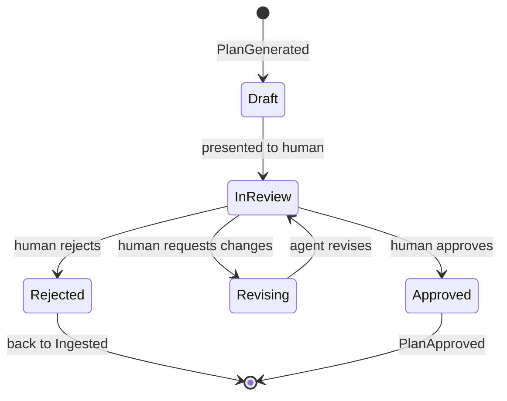
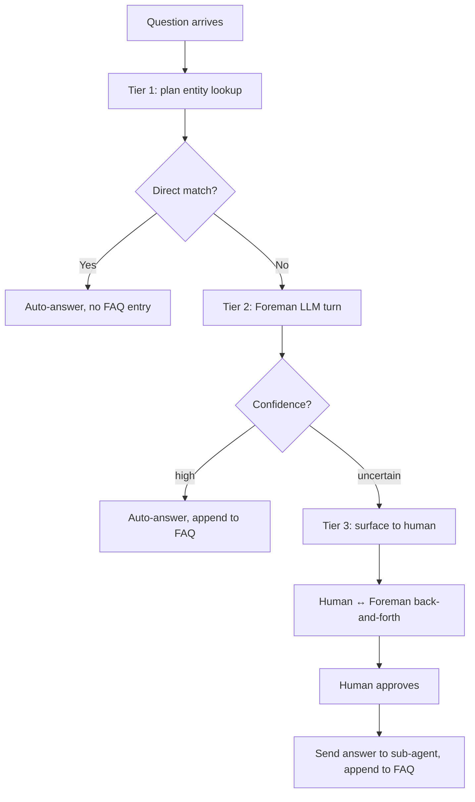
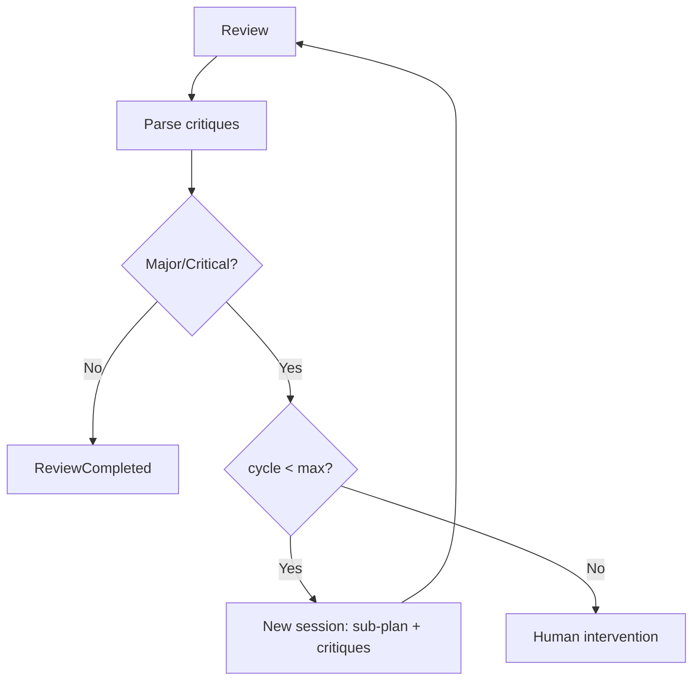

# 05 - Orchestration

Covers the full lifecycle: planning, approval, implementation, oversight, review, completion. For domain models see `01-domain-model.md`, events see `03-event-system.md`, workspace setup see `01-domain-model.md`.

---

## 1. Planning Pipeline

Triggered when a work item enters the `Planning` state.

**Flow:** `WorkItemReady → PreflightCheck → DiscoverRepos → BuildContext → RunPlanningAgent → ReadPlanDraft → ParseOutput → ValidateRepoNames → PersistDraft → PlanGenerated`

**a. Pre-flight workspace check.** Scan all direct child directories of the workspace root. For each:
- **git-work initialized** (`.bare/` present) → will be discovered in step b; no action
- **plain git clone** (`.git/` present, no `.bare/`) → surface as a workspace health warning; requires explicit acknowledgement before it is dismissed
- **other directories** → ignored

Uninitialized repos are not prevented from proceeding — the user may have intentionally unmanaged directories in the workspace. They will not appear in the planning agent's repo roster. If a repo that should be in scope is uninitialized, the resulting plan will be incomplete.

**b. Discover repos.** Scan the workspace directory for git-work managed repos — any subdirectory containing a `.bare/` folder. For each discovered repo:
- Record `Name` (directory name), `Path`, `MainDir` (absolute path to `main/` worktree)
- Detect language and framework from manifest file existence (`go.mod` → Go, `package.json` → TypeScript/JS, `Cargo.toml` → Rust, `pyproject.toml`/`setup.py` → Python); detect framework from key dependencies in the manifest if useful
- Check for `AGENTS.md` in `MainDir`; record its path if present
- Collect configured doc paths from `DocumentationSource` config entries scoped to this repo

Read the workspace-root `AGENTS.md` content (if present) as `WorkspaceAgentsMd`. This is the only file content read before the planning agent starts.

```go
type RepoPointer struct {
    Name         string   // directory name
    MainDir      string   // absolute path to main/ worktree
    Language     string   // "go", "typescript", "rust", "python", "unknown"
    Framework    string   // "gin", "next", "axum", etc.; empty if not detected
    AgentsMdPath string   // absolute path to AGENTS.md if present; else empty
    DocPaths     []string // configured documentation paths for this repo
}
```

**c. Build context bundle.**

```go
type PlanningContext struct {
    WorkItem          WorkItemSnapshot // title, description, labels, priority
    WorkspaceAgentsMd string           // content of workspace-root AGENTS.md; empty if absent
    Repos             []RepoPointer    // all discovered repos
    SessionDraftPath  string           // absolute path to plan-draft.md for this session
}
```

**d. Run planning agent.** Substrate generates a session ULID, creates `.substrate/sessions/<session-id>/` in the workspace root, and starts an agent harness session (see `04-adapters.md`) with cwd = workspace root and full filesystem access to all repos' `main/` worktrees. The session ID and draft path are recorded in `SessionOpts.SessionID` and `SessionOpts.DraftPath` respectively. The agent explores the workspace, determines which repos need changes, and writes its plan progressively to `SessionOpts.DraftPath`. All repos — including documentation repos — may receive sub-plans.

**Context stability rule**: The agent's filesystem access covers `main/` worktrees only. Feature worktrees from other active work items are not visible during planning.

### Planning Prompt Template

Rendered via Go `text/template`:

```
{{if .WorkspaceAgentsMd}}
## Workspace Guidance
{{.WorkspaceAgentsMd}}
{{end}}
## Work Item
Title: {{.WorkItem.Title}}
ID: {{.WorkItem.ExternalID}}
Description:
{{.WorkItem.Description}}

## Repos
{{range .Repos}}
- {{.Name}} ({{.Language}}{{if .Framework}}/{{.Framework}}{{end}}) — {{.MainDir}}
{{- if .AgentsMdPath}}  guidance: {{.AgentsMdPath}}{{end}}
{{- if .DocPaths}}  docs: {{range .DocPaths}}{{.}} {{end}}{{end}}
{{end}}

## Instructions
If `{{.SessionDraftPath}}` already exists, read it first to orient yourself before exploring.
Explore the workspace before finalising your plan. After each significant decision or
exploration finding, update `{{.SessionDraftPath}}`. Substrate reads this file as your
plan output — your final message is not used. The last complete version in the file
when the session ends is what gets executed.

Begin the file with a fenced code block tagged `substrate-plan` containing YAML:

```substrate-plan
execution_groups:
  - [<repo-name>, ...]   # group 1: no dependencies, run first (parallel within group)
  - [<repo-name>, ...]   # group 2: run after group 1 completes (parallel within group)
  # add further groups as needed; list only repos that require changes
```

Then write:

## Orchestration
<cross-repo coordination, shared contracts, data flow, rationale for execution order>

## SubPlan: <repo-name>
<files to change, approach, tests, edge cases>

One `## SubPlan` section per repo listed in `execution_groups`. Omit repos requiring no changes.

## Validation
Before marking complete: run all relevant formatters, compilation checks, and unit tests.
All must pass. Refer to AGENTS.md in this repo for tooling specifics.
```

**e. Read plan draft.** Read the file at `SessionOpts.DraftPath` (`.substrate/sessions/<session-id>/plan-draft.md` within the workspace root). If the file does not exist, enter the correction loop immediately (see step g) with message: *"Your plan was not written to {{.SessionDraftPath}}. Write your complete plan to this file now."* Find the fenced code block with info string `substrate-plan`. If absent → correction loop. Parse YAML. Extract `execution_groups: [][]string`. Flatten to `declared_repos []string` (ordered, deduped).

**f. Validate.** Three rules, all must pass:
1. Every name in `declared_repos` matches a `DiscoveredRepo.Name` (case-insensitive). Collect unknowns.
2. For every name in `declared_repos`, find a SubPlan section: search for any markdown heading (any level) whose text contains that name (case-insensitive). Collect names with no matching section.
3. Any heading whose text matches the pattern `SubPlan.*<name>` for a name NOT in `declared_repos` is an undeclared repo. Collect those too.

```go
type RawPlanOutput struct {
    ExecutionGroups [][]string // from substrate-plan YAML; group index = exec_order
    Orchestration   string     // Orchestration section prose
    SubPlans        []RawSubPlan
}

type RawSubPlan struct {
    RepoName string // name from execution_groups, matched to section heading
    Body     string // full section content
}

type ParseErrors struct {
    MissingBlock        bool
    UnknownRepos        []string // in YAML but not in workspace
    MissingSubPlans     []string // in YAML but no matching section found
    UndeclaredSubPlans  []string // section found but not in YAML
}

func (e ParseErrors) HasErrors() bool
```

**g. Automatic correction loop.** On `ParseErrors.HasErrors()` or missing plan draft, send a correction message to the planning agent (same session — conversation continues, full history preserved):

```
Your plan had structural errors that prevent execution:
{{.Errors}}

Valid repos in this workspace: {{.DiscoveredRepos}}

Re-read {{.SessionDraftPath}} to see your current plan, then address the errors above.
Rewrite {{.SessionDraftPath}} with your complete revised plan. The substrate-plan YAML
block must appear first, before any prose.
```

Retry up to `plan.max_parse_retries` (default `2`). On exhaustion: emit `PlanFailed { WorkItemID, Errors }`, surface to human with full error details, work item returns to `Ingested`.

**h. Persist.** Build `Plan` + `SubPlan` domain objects. Assign `SubPlan.Order` from the group index (repos in `execution_groups[0]` → `Order=0`, `execution_groups[1]` → `Order=1`, etc.). Sub-plans in the same group share the same `Order` value and will run in parallel. Save via go-atomic transaction. Emit `PlanGenerated { PlanID, Version }`. The session directory `.substrate/sessions/<session-id>/` is retained as an audit trail.

---

## 2. Plan Review Loop



**TUI presentation:** Scrollable markdown view with section navigation (Orchestration, each SubPlan). Action bar: `[a]pprove  [c]hange  [r]eject`.

**Approve:** Status → Approved. Emit `PlanApproved { PlanID, WorkItemID }`. Triggers implementation.

**Request Changes:** Inline text input for feedback. A **new** planning session is started — the original session is not resumed; it may be long-lived and compacted. The new session receives the current plan text (read from DB) and the human's feedback embedded in its prompt:
```
The human has requested changes to this plan:
{{.Feedback}}

The current plan is below. Apply the requested changes and write your revised plan to
`{{.NewSessionDraftPath}}`. Use the same substrate-plan format.

--- CURRENT PLAN ---
{{.CurrentPlan}}
---
```
Output parsed, version incremented, old version retained. Emit `PlanRevised`. TUI refreshes.

**Reject:** Emit `PlanRejected { PlanID, Reason }`. Work item → `Ingested`. Workspace retained.

---

## 3. Implementation Orchestrator

Triggered by `PlanApproved`.

### Execution Wave Scheduling

The orchestrator reads sub-plans ordered by `SubPlan.Order`. Sub-plans with equal `Order` form a wave and run in parallel. Waves execute sequentially — wave N+1 starts only after all sub-plans in wave N reach `completed` (or `failed`).

```go
// BuildWaves groups sub-plans by Order into sequential execution waves.
// Sub-plans within a wave run concurrently.
func BuildWaves(subPlans []SubPlan) [][]SubPlan {
    groups := map[int][]SubPlan{}
    for _, sp := range subPlans {
        groups[sp.Order] = append(groups[sp.Order], sp)
    }
    orders := sortedKeys(groups) // ascending
    waves := make([][]SubPlan, len(orders))
    for i, o := range orders {
        waves[i] = groups[o]
    }
    return waves
}
```

```
execution_groups:          →  Wave 0: [backend-api, shared-lib]  parallel
  - [backend-api, shared-lib]  Wave 1: [frontend-app]             after Wave 0
  - [frontend-app]
```

### Per Sub-Plan Execution

**i. Create worktree.** Branch: `sub/<workItemID>/<short-slug>` where the slug is derived from the work item title (lowercased, spaces→dashes, stripped to `[a-z0-9-]`, consecutive dashes collapsed, leading/trailing dashes trimmed, max 30 chars). The same branch name is used in every repo touched by this work item. git-work converts `/`→`-` for the directory name, so the worktree directory becomes e.g. `sub-LIN-FOO-123-fix-auth-flow`. Before creating, check if worktree already exists via `git-work list` (idempotency guard — see section 7). Emit `WorktreeCreating` (pre-hook, can abort), then `WorktreeCreated` (post-hook, e.g. glab creates draft MR).

```go
cmd := exec.CommandContext(ctx, "git-work", "checkout", "-b", branch)
cmd.Dir = repoDir
```

**ii. Start agent session.** Prompt = sub-plan + orchestration section + documentation. Session config:

```go
type AgentSessionConfig struct {
    WorkDir   string         // worktree path
    Prompt    string         // assembled prompt
    SubPlanID uuid.UUID
    EventCh   chan AgentEvent // events → orchestrator
    MessageCh chan string     // orchestrator → session
}
```

Each session runs in its own goroutine. Events multiplexed to foreman + orchestrator.

**iii. Monitor.** The orchestrator loops: get ready nodes, launch them in parallel, `wg.Wait()`, check for failures. On failure: mark node + transitive dependents as blocked, pause pipeline, surface to human (options: retry, skip, abort).

**iv. On completion:** Emit `AgentSessionCompleted`, trigger review cycle (section 5).

**v. Validation command.** After the session exits, check for `validation_command` in the workspace config (`substrate.toml`) for this repo. If configured, run it in the feature worktree. On non-zero exit: feed `stdout`+`stderr` back to a new agent session as a critique, using the same retry loop as review critiques (section 5). On success or if not configured: proceed to review.

### Commit Strategy

The agent session receives commit instructions as part of its system context, derived from the `[commit]` block in `substrate.toml`:

```toml
[commit]
strategy = "semi-regular"       # "granular" | "semi-regular" | "single"
message_format = "ai-generated" # "ai-generated" | "conventional" | "custom"
message_template = ""           # used when message_format = "custom"
```

Strategy modes:

- `granular`: commit after each logical change (function, file, config entry)
- `semi-regular` (default): commit when a complete unit of work is done — e.g. after implementing a full feature component or adding all files for one sub-task; not after every file, not one big commit at the end
- `single`: one commit at the end of the session

Commit messages are AI-generated by default (the model picks a message from diff context). If `message_format = "conventional"`, the agent is instructed to follow Conventional Commits format. If `message_format = "custom"`, `message_template` is passed as the format string.

---

## 4. Foreman Agent

A persistent oh-my-pi harness session running for the duration of implementation. Started on `PlanApproved`, terminated when all sub-plans reach a terminal state. Reduces human interrupts by answering sub-agent questions from accumulated cross-repo context.

```go
type Foreman struct {
    session    HarnessSession   // persistent oh-my-pi session (mode=foreman)
    plan       *Plan
    questionCh chan pendingQuestion
    events     EventBus
}

type pendingQuestion struct {
    question AgentQuestion
    answerCh chan<- string // write here to unblock the sub-agent's tool call
}

func (f *Foreman) Run(ctx context.Context) error // drains questionCh until ctx done
func (f *Foreman) Ask(q AgentQuestion) <-chan string // enqueues; returns answer channel
```

Questions are **serialized**: one at a time through the single persistent session. A sub-agent calling `ask_foreman` blocks on the tool call until the answer arrives on `answerCh`. The second question waits in `questionCh` — it is already blocked on a tool call, so extra wait is inconsequential. The persistent session accumulates full conversation history across all questions: later questions can be answered from earlier Q&A context without any external lookup.

### Three-Tier Resolution



**Tier 1 — Plan text lookup (synchronous, no LLM)**

At plan approval time, build an in-memory entity index from the plan: endpoint paths, interface names, shared contracts, config keys, type definitions — anything explicitly specified in the orchestration or sub-plan sections. On question arrival, extract entities from the question and look them up. A direct match with surrounding context → auto-answer with cited quote. No session turn consumed, no FAQ entry (the answer already exists in the plan).

**Tier 2 — Foreman LLM (persistent session)**

For questions tier 1 misses: send the question as a user message to the persistent Foreman session. The session holds full context: plan + docs + all prior Q&A in conversation history. The Foreman LLM emits a `foreman_proposed` event with its answer.

The Foreman system prompt instructs explicit confidence signalling:
```
If you can answer with high confidence from the plan and prior Q&A, answer directly.
If uncertain, state what you do not know and propose your best answer with caveats.
Do not fabricate facts about the codebase.
```

High-confidence response → auto-answer, append to FAQ.
Uncertain response → escalate to tier 3.

**Tier 3 — Human, with Foreman context**

Surface to the TUI `waiting_question` panel. The human sees the question, the Foreman's proposed answer pre-filled, and the Foreman's stated uncertainty. The human may respond directly or iterate: each human message is forwarded to the Foreman session via `SendMessage()`, producing a refined `foreman_proposed`. This loop continues until the human presses `[A]pprove`. Only on approval is the answer written to `answerCh` and forwarded to the blocked sub-agent. Append to FAQ.

### FAQ

A `faq` section is appended to the live plan document (stored as a DB field, rendered in the TUI plan view, passed to review agents as context). Each entry represents a decision made during implementation that was not already in the plan.

```go
type FAQEntry struct {
    ID             string    `json:"id"          db:"id"`
    PlanID         string    `json:"plan_id"      db:"plan_id"`
    AgentSessionID string    `json:"session_id"   db:"agent_session_id"`
    RepoName       string    `json:"repo_name"    db:"repo_name"`
    Question       string    `json:"question"     db:"question"`
    Answer         string    `json:"answer"       db:"answer"`
    AnsweredBy     string    `json:"answered_by"  db:"answered_by"` // "foreman" | "human"
    CreatedAt      time.Time `json:"created_at"  db:"created_at"`
}
```

Only tier 2 and tier 3 answers produce FAQ entries. Tier 1 answers are omitted — the information is already present in the plan.

### Recovery

**Context overflow** is the expected termination path for long implementation runs. Model promotion to a larger context window and auto-compaction are both disabled (see `04-adapters.md`). When the Foreman session reaches full context it terminates cleanly.

Restart protocol:
1. Orchestrator detects termination via `Wait()` returning (error or clean exit after context full).
2. Load the **current plan from DB** — which includes all FAQ entries appended — and use it as the initial system prompt for the new session. This is not a special replay step: the FAQ is already part of the plan document, so the current plan state provides complete prior-decision context without injecting synthetic conversation turns.
3. Send the next question from `questionCh` as the first user message.
4. No questions are lost — sub-agents remain blocked on their tool calls throughout.

**Actual crash** (unexpected process exit, network failure): handled identically — same restart path, same FAQ-in-plan restoration.

**Unrecoverable edge case**: a single question whose combined context (plan + FAQ + question text) saturates the full context window. Not realistically expected for any question in a typical implementation run. If it occurs, the session terminates immediately after receiving the question. The orchestrator detects the pattern (3+ immediate restarts on the same question without producing a `foreman_proposed` event), marks the question unanswerable via Foreman, and surfaces it directly to the human as a tier 3 escalation.
---

## 5. Review Pipeline

Triggered by `AgentSessionCompleted` for each sub-plan.

**a. Compute diff.** `git diff main...<branch>` in repo's `.bare/` dir. Empty diff → emit `ReviewCompleted` with note, skip.

**b. Start review agent session.** Prompt:

````
## Task
Review changes against the plan. Identify correctness, completeness, style issues.

## Sub-Plan
{{.SubPlan.Content}}

## Cross-Repo Plan (Orchestration)
{{.Plan.Orchestration}}

## Documentation Context
{{range .Documentation}}### {{.Source}}: {{.Title}}
{{.Content}}
{{end}}

## Diff
```diff
{{.Diff}}
```

## Output Format
If no issues: "NO_CRITIQUES"
Otherwise, repeat:

CRITIQUE
File: <path>
Severity: critical | major | minor | nit
Description: <what is wrong and what to do>
END_CRITIQUE
````

**c. Parse critiques** via regex on `CRITIQUE`/`END_CRITIQUE` markers into domain objects:

```go
type Critique struct {
    ID          uuid.UUID
    ReviewID    uuid.UUID
    File        string
    Severity    CritiqueSeverity // Critical, Major, Minor, Nit
    Description string
}
```

**d. Decision logic.**

| Condition | Action |
|---|---|
| No critiques | `ReviewCompleted` |
| Only Minor/Nit | `ReviewCompleted` (critiques logged) |
| Any Major/Critical | `CritiquesFound` → re-implementation |

Configurable: `review.pass_threshold` = `nit_only` | `minor_ok` (default) | `no_critiques`.

### Re-Implementation Loop



New session runs in **same worktree** (builds on previous commits). Prompt: original sub-plan + critique list. Max cycles configurable (default 3). Exceeded → pause, notify human with full critique history.

### Documentation Staleness Check

After final review passes, call `CheckStale` on all `DocumentationSource` implementations with the changed files list. Emit `DocumentationStale` for any flagged docs. Advisory only — does not block completion. Collected and shown in the completion summary.

---

## 6. Completion

Triggered when **all** sub-plans pass review.

**a.** Verify all sub-plans in `Completed` status (defensive check).

**b.** Emit `WorkItemCompleted`:

```go
type WorkItemCompleted struct {
    WorkItemID uuid.UUID
    PlanID     uuid.UUID
    Repos      []RepoResult
    StaleDocs  []DocumentationStale
    Duration   time.Duration
}

type RepoResult struct {
    RepoName       string
    Branch         string
    CommitCount    int
    ReviewCycles   int
    CritiquesFixed int
}
```

**c.** Adapter hooks fire (see `03-event-system.md`): Linear moves to Done, glab marks MRs ready.

**d.** TUI completion summary: work item ID, per-repo stats (branch, commits, review cycles, MR link), stale doc warnings, elapsed time.

**e.** Workspace retained. Worktrees persist for manual inspection. Cleanup is manual or via retention policy. DB record updated to `Completed`.

---

## 7. Resume & Recovery

Substrate must handle crashes, user quits, and restarts gracefully. This section defines the reconciliation, resume, and shutdown protocols.

### Startup Reconciliation

On TUI launch or `substrate` CLI invocation:

1. **Find workspace.** Walk from cwd upward looking for `.substrate-workspace` file. If not found, prompt user or error.
2. **Load workspace.** Read workspace ID (ULID) from `.substrate-workspace`. Look up workspace in `~/.substrate/state.db` by ID.
3. **Path reconciliation.** If the workspace path stored in DB differs from the current filesystem path (i.e. the user moved the folder), update the DB record. The workspace ID is the stable identity, not the path.
4. **Scan running sessions.** Query `agent_sessions` where `status = 'running'` and `workspace_id` matches:
   - For each: check PID liveness via `kill -0 pid`
   - **PID alive:** Another substrate instance may be running against this workspace. Emit a warning, do not modify the session.
   - **PID dead:** Process crashed or was killed. Transition session to `interrupted`. Emit `AgentSessionInterrupted { SessionID, SubPlanID, WorktreeDir }`.
5. **Surface state.** Dashboard shows all work items for this workspace. Interrupted sessions appear with `[R]esume` / `[A]bandon` actions.

```go
func (s *OrchestrationService) Reconcile(ctx context.Context, wsID string) error {
    sessions, _ := s.agents.ListByStatus(ctx, wsID, StatusRunning)
    for _, sess := range sessions {
        alive := isProcessAlive(sess.PID)
        if alive {
            log.Warn("session %s PID %d still alive, skipping", sess.ID, sess.PID)
            continue
        }
        sess.Status = StatusInterrupted
        sess.InterruptedAt = time.Now()
        s.agents.Update(ctx, sess)
        s.events.Publish(AgentSessionInterrupted{SessionID: sess.ID, SubPlanID: sess.SubPlanID})
    }
    return nil
}

func isProcessAlive(pid int) bool {
    return syscall.Kill(pid, 0) == nil
}
```

### Resume Protocol

When a human selects `[R]esume` on an interrupted session:

1. The old session stays in DB as `interrupted` (audit trail).
2. Substrate starts a **new** agent harness session in the **same worktree** — the partial work is already on disk.
3. The new session receives: original sub-plan + orchestration context + resume preamble:

```
You are continuing work on this sub-plan. The worktree may contain partial
changes from a previous session that was interrupted. Before proceeding:
1) Run `git status` and `git diff` to understand current state.
2) Review any uncommitted changes.
3) Continue implementing remaining items from the sub-plan.
```

4. The new session links to the same `SubPlan` (via `sub_plan_id` FK). The sub-plan now has two sessions: the interrupted one and the resumed one.
5. Emit `AgentSessionResumed { OldSessionID, NewSessionID, SubPlanID }`.
6. On completion, the normal review pipeline (section 5) applies.

### Abandon Protocol

When a human selects `[A]bandon` on an interrupted session:

1. Session status → `failed`.
2. Human can then:
   - Reset worktree: `git checkout .` in the worktree directory
   - Manually fix and commit the partial changes
   - Remove the worktree entirely: `git-work remove <branch>`
3. The sub-plan can be re-executed from scratch if the human chooses to retry from the TUI.

### Idempotency Guards

All side-effecting operations must be idempotent to support resume without corruption:

| Operation | Guard |
|---|---|
| Worktree creation | Before `git-work checkout -b <branch>`, run `git-work list` and check if the worktree already exists. Skip creation if present. |
| MR creation | glab adapter calls `glab mr list --source-branch <branch>` before creating. If MR exists, skip. |
| Linear state updates | Setting the same status is inherently a no-op. |
| Plan persistence | Upsert by plan ID + version. Re-persisting the same version is safe. |

### Graceful Shutdown

On SIGINT, SIGTERM, or TUI quit:

1. **Mark sessions.** All `running` sessions for the current workspace → `interrupted` in DB. Record `shutdown_at` timestamp.
2. **Signal subprocesses.** Send SIGTERM to all tracked agent subprocess PIDs.
3. **Wait.** Up to 10 seconds for subprocesses to exit.
4. **Force kill.** Any surviving subprocesses receive SIGKILL.
5. **Clean exit.**

The `shutdown_at` timestamp distinguishes a clean shutdown (timestamp present) from a crash (no timestamp, detected on next startup by finding `running` sessions with dead PIDs).

```go
func (s *OrchestrationService) Shutdown(ctx context.Context) {
    s.mu.Lock()
    defer s.mu.Unlock()

    for _, sess := range s.activeSessions {
        sess.Status = StatusInterrupted
        sess.ShutdownAt = ptr(time.Now())
        s.agents.Update(ctx, sess)
        syscall.Kill(sess.PID, syscall.SIGTERM)
    }

    deadline := time.After(10 * time.Second)
    for _, sess := range s.activeSessions {
        select {
        case <-sess.Done:
        case <-deadline:
            syscall.Kill(sess.PID, syscall.SIGKILL)
        }
    }
}
```

### PID Tracking

The `agent_sessions` table includes a `pid INTEGER` column (nullable). Populated when the subprocess starts, cleared on clean completion. Used exclusively by the startup reconciliation protocol to detect crashed sessions.

---

## Orchestration Service Interface

Top-level service owning the full flow:

```go
type OrchestrationService struct {
    workItems  WorkItemService
    workspaces WorkspaceService
    planning   PlanningService
    agents     AgentHarnessService
    reviews    ReviewService
    foreman    *Foreman
    docSources []DocumentationSource
    events     EventBus
    config     *OrchestratorConfig
}

func (s *OrchestrationService) Run(ctx context.Context, workItemID uuid.UUID) error
func (s *OrchestrationService) Plan(ctx context.Context, workItemID uuid.UUID) (*Plan, error)
func (s *OrchestrationService) ApprovePlan(ctx context.Context, planID uuid.UUID) error
func (s *OrchestrationService) RejectPlan(ctx context.Context, planID uuid.UUID, reason string) error
func (s *OrchestrationService) RequestPlanChanges(ctx context.Context, planID uuid.UUID, feedback string) (*Plan, error)
func (s *OrchestrationService) Implement(ctx context.Context, planID uuid.UUID) error
func (s *OrchestrationService) ReviewSubPlan(ctx context.Context, subPlanID uuid.UUID) (*ReviewResult, error)
```

`Run` composes phases with event-driven transitions. TUI calls individual methods (`ApprovePlan`, etc.) directly. `Run` is for non-interactive/test execution.
