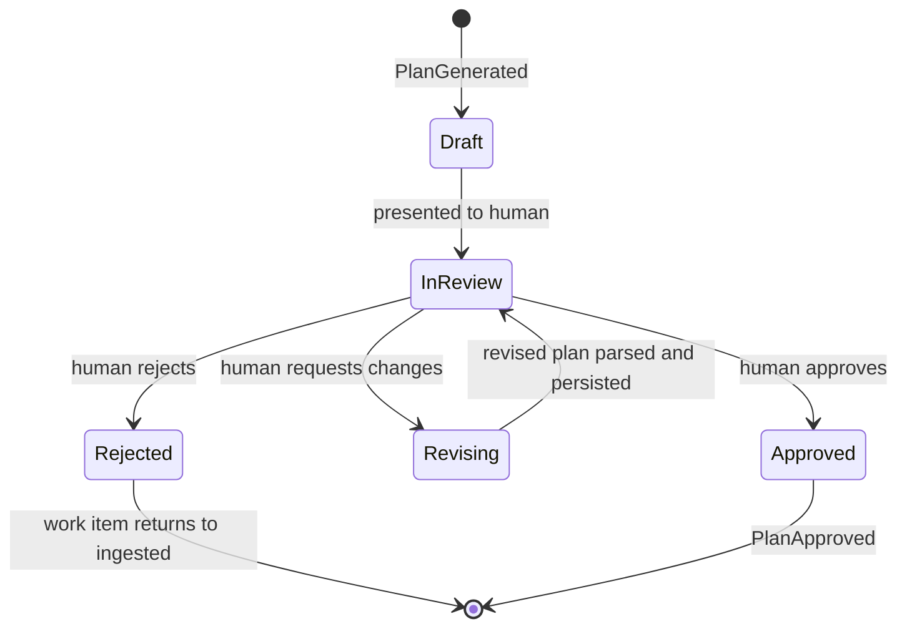
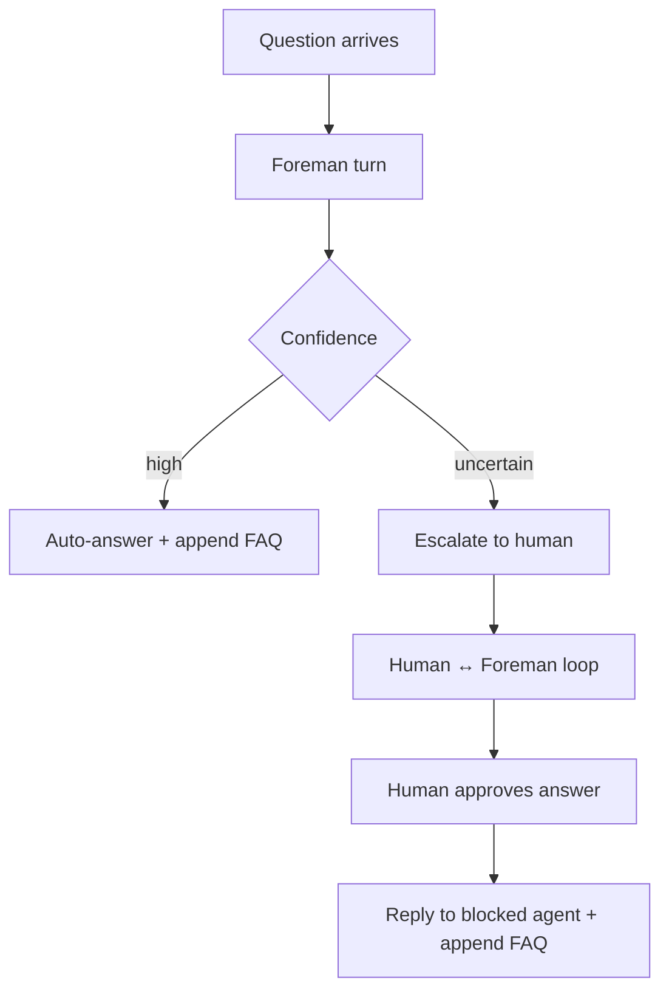

# 05 - Orchestration
<!-- docs:last-integrated-commit f6b8e6e5f8374bd4c2f467852266f01cc2f323a2 -->

Owns the runtime workflow: planning, plan review, execution waves, Foreman handling, review/reimplementation, completion, and recovery.

For domain/state definitions see `01-domain-model.md`. For event semantics see `03-event-system.md`. For provider, repo host, and harness behavior see `04-adapters.md`. For rollout status and test gates see `07-implementation-plan.md`.

---

## 1. Planning Pipeline

Triggered when a work item enters the planning flow.

**Runtime flow:**

`WorkItemReady -> PullMainWorktrees -> PreflightCheck -> DiscoverRepos -> BuildPlanningContext -> StartPlanningSession -> ParseDraft -> ValidatePlan -> PersistPlan -> PlanGenerated`

### 1a. Refresh workspace inputs

Before planning:
- pull `main/` worktrees with `git pull --ff-only`
- re-scan the workspace for git-work repos
- surface plain git clones as health warnings rather than silently treating them as managed repos
- read workspace-level guidance (`AGENTS.md`) before the planning session starts

Planning operates on `main/` worktrees only. Feature worktrees from other active items are excluded from planning context.

### 1b. Build planning context

The planning context contains:
- work item snapshot
- workspace guidance
- discovered repo pointers
- plan draft path for the planning session

The planning harness explores the workspace and writes its plan to the draft path. The draft file, not the final chat response, is the source of truth for plan parsing.

### 1c. Parse and validate the draft

The draft must begin with a fenced `substrate-plan` YAML block that defines `execution_groups`, followed by a non-empty orchestration section and one implementation-ready sub-plan section per declared repo.

Validation rules:
1. every repo in `execution_groups` must exist in the discovered workspace repo set
2. every declared repo must have a matching sub-plan section
3. no sub-plan may exist for a repo absent from `execution_groups`
4. the `## Orchestration` section must be present and non-empty
5. every sub-plan must include `### Goal`, `### Scope`, `### Changes`, `### Validation`, and `### Risks`
6. `### Scope`, `### Validation`, and `### Risks` each need at least one list item; `### Changes` needs at least three concrete steps

If validation fails or the draft is missing, Substrate sends a correction message to the same planning session and retries up to `plan.max_parse_retries`.

### 1d. Persist plan

On success:
- persist the orchestration plan and sub-plans atomically
- assign execution order from the `execution_groups` index
- emit `PlanGenerated`
- retain the session draft directory as audit data

For draft format and implementation-phase validation gates, see `07-implementation-plan.md`.

---

## 2. Plan Review Loop

The plan review loop is the human control point between planning and implementation.

### Review actions

- **Approve** — mark the plan approved and emit `PlanApproved`
- **Request changes** — start a new planning session with the current full plan document plus human feedback; replace the existing orchestration/sub-plan contents in place and increment version on success
- **Edit in review** — update the full reconstructed plan document in place; re-parse, re-validate, and persist both orchestrator and sub-plan sections before implementation can proceed
- **Reject** — return the work item to the ingested state and retain the workspace/session audit trail

The TUI interaction model for this loop belongs to `06-tui-design.md`; the runtime effect belongs here.

---

## 3. Implementation Runtime

Triggered by `PlanApproved`.

### 3a. Build execution waves

Sub-plans are grouped by `SubPlan.Order`.
- equal order => same wave => run in parallel
- later order => later wave => start only after the previous wave reaches terminal status

This lets the planner express explicit cross-repo dependency order while preserving safe parallelism.

### 3b. Per-sub-plan lifecycle

For each sub-plan in a ready wave:
1. derive a shared branch name from the work item external ID and title slug
2. create or reuse the feature worktree
3. emit `WorktreeCreating` before checkout and `WorktreeCreated` after checkout
4. start an implementation harness session in that worktree
5. stream session events into orchestration state and the TUI
6. on success, emit `AgentSessionCompleted`
7. on failure, emit `AgentSessionFailed` and pause/escalate per orchestration policy

### 3c. Idempotency expectations

Implementation must tolerate retries and resume:
- worktree creation checks for an existing worktree first
- repo-host lifecycle automation must detect and reuse existing MR/PR state
- tracker updates should be safe when the target state already matches
- plan revisions update the same plan record rather than creating divergent copies

Concrete provider and repo-host guards live in `04-adapters.md`.

### 3d. Harness routing at runtime

The orchestrator chooses a harness per phase through harness routing.

Current operational rule:
- oh-my-pi is the default verified interactive harness
- Claude Code and Codex may be selected or used as fallbacks
- correction-loop and Foreman-sensitive phases must not assume non-OMP parity unless that parity has been proven

Harness capabilities, maturity, and routing policy live in `04-adapters.md`; rollout status lives in `07-implementation-plan.md`.

---

## 4. Foreman Handling

The Foreman handles unresolved questions during implementation.

### 4a. Model

The Foreman is a persistent harness session that holds:
- the approved plan
- accumulated FAQ / answered questions
- prior Foreman conversation context

Questions are serialized through that single session so later answers can rely on earlier resolved context.

### 4b. Two-tier resolution

Runtime policy:
- if the Foreman returns a high-confidence answer, Substrate auto-answers
- if the Foreman is uncertain, the human reviews and may iterate with the Foreman before approving
- every answered question is appended to the plan FAQ so later sessions and reviews inherit the clarified decision

### 4c. Recovery

If the Foreman session dies while answering a question:
- re-queue the in-flight question at the front of the queue
- restart the Foreman with the current plan + FAQ as context
- deliver the re-queued question first
- escalate directly to the human if repeated immediate restarts imply the question no longer fits in the usable context window

The question UI belongs to `06-tui-design.md`; the runtime restart behavior belongs here.

---

## 5. Review and Re-Implementation

Triggered by `AgentSessionCompleted` for a sub-plan.

### 5a. Review session

Substrate starts a review harness session in the same repository worktree, with read-only review-oriented behavior. The review agent explores the worktree relative to `main`, evaluates the result against:
- the repo sub-plan
- cross-repo orchestration notes
- accumulated FAQ decisions

The orchestrator does not provide a precomputed diff as the canonical truth; the review session forms its own picture from the worktree.

### 5b. Structured output and correction loop

Review output must be either:
- exactly `NO_CRITIQUES`, or
- one or more structured critique blocks

If the output is unparseable, Substrate sends a correction message to the same review session and retries up to `plan.max_parse_retries`.

### 5c. Decision logic

- pass immediately if critiques are absent or below the configured failure threshold
- start re-implementation if any critique meets or exceeds the configured blocking severity
- escalate to human intervention when the review cycle count exceeds `review.max_cycles`

### 5d. Re-implementation

Re-implementation runs in the same worktree and receives:
- the original sub-plan
- the cross-repo orchestration context
- the review critique set

The runtime loop is:

`Implement -> Review -> (Pass | Re-implement | Escalate)`

Threshold values and rollout gates live in `07-implementation-plan.md`.

---

## 6. Completion

Triggered when all sub-plans have passed review.

Completion runtime steps:
1. verify every sub-plan is in a terminal successful state
2. emit `WorkItemCompleted`
3. allow subscribed adapters to perform tracker and repo-host side effects
4. render the completion summary in the TUI
5. retain the workspace and worktrees for reference until the operator prunes them

This document owns the fact that completion emits the event and ends the runtime workflow. `03-event-system.md` owns event semantics. `04-adapters.md` owns what specific providers and repo hosts do in response.

---

## 7. Resume and Recovery

Substrate must recover from crashes, process exits, and interrupted sessions without corrupting work.

### 7a. Startup reconciliation

On startup:
- resolve the current workspace from `.substrate-workspace`
- reconcile moved workspace paths against persisted workspace identity
- inspect instance heartbeats and session ownership
- mark abandoned running sessions as `interrupted`
- surface interrupted sessions to the TUI for operator action

### 7b. Resume

When resuming an interrupted session:
- keep the old session as audit history
- assign ownership to the current instance
- start a new session in the same worktree
- pass the original sub-plan plus the latest tail of the interrupted session log as resume context
- instruct the harness to inspect existing partial changes before continuing
- emit `AgentSessionResumed`

### 7c. Abandon

When abandoning an interrupted session:
- mark the session failed
- leave recovery choices to the operator (manual fix, reset, or worktree removal)

### 7d. Graceful shutdown

On clean shutdown:
- mark live sessions interrupted
- record shutdown timestamps
- terminate harness subprocesses with timeout + kill fallback
- remove the current instance heartbeat row

### 7e. Session logs

Session logs are per-agent-session durable output streams used for:
- live observation and tailing across instances
- review/output extraction for individual runs
- resume context by carrying the latest interrupted-session log tail into the replacement run
- audit history behind the work-item-centric session browser and search, which aggregate child sessions and surface the latest contributing session plus interruption/question counts
- rotated storage for long-running sessions

Schema, lock-table ownership, and session-log persistence details are specified in `02-layered-architecture.md` and `07-implementation-plan.md`.

---

## Runtime Responsibility Summary

| Topic | Owned here | Refer to |
|---|---|---|
| Planning flow | yes | `04-adapters.md`, `07-implementation-plan.md` |
| Plan review runtime | yes | `06-tui-design.md` |
| Execution waves and retries | yes | `04-adapters.md` |
| Foreman handling | yes | `04-adapters.md`, `06-tui-design.md` |
| Review/reimplementation loop | yes | `07-implementation-plan.md` |
| Event catalog/handler semantics | no | `03-event-system.md` |
| Provider/harness internals | no | `04-adapters.md` |
| Schema/DI/persistence | no | `02-layered-architecture.md` |