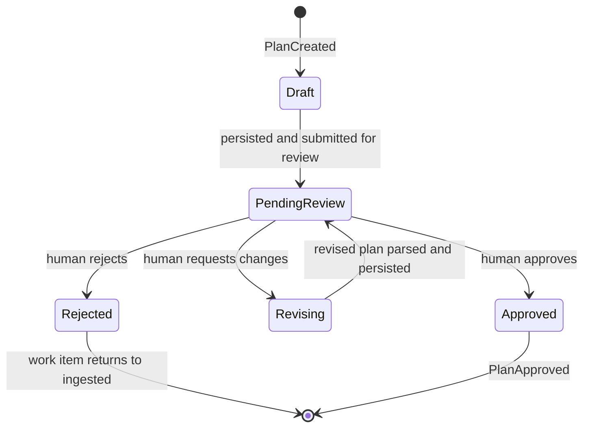

# 05 - Orchestration

<!-- docs:last-integrated-commit 10e50295fb75f72c67233e191ae34fb8fc091f1e -->

Orchestration owns the runtime workflow: planning, plan review, execution waves, Foreman handling, review and reimplementation, completion, and recovery.

For domain and state definitions see `01-domain-model.md`. For event semantics see `03-event-system.md`. For adapter behavior see `04-adapters.md`.

---

## 1. Planning Pipeline

Triggered when a work item enters the planning flow.

**1a. Refresh workspace inputs.** Before planning, pull latest state from managed worktrees and rescan the workspace for active repositories. Plain git clones outside the managed workspace surface as health warnings. Planning reads workspace guidance and operates only on `main/` branches; other active feature worktrees are excluded.

**1b. Build planning context.** The planning harness receives a work item snapshot, workspace guidance, and discovered repository pointers. The harness explores the workspace and writes a plan draft — this draft, not the chat response, is the source of truth for parsing.

**1c. Parse and validate.** The draft must begin with a fenced `substrate-plan` YAML block declaring execution groups, followed by a non-empty orchestration section and one implementation-ready sub-plan per declared repository. Validation rules: every repo in execution groups must exist; every declared repo must have a matching sub-plan; the Orchestration section must be present and non-empty; each sub-plan must include Goal, Scope, Changes, Validation, and Risks (Scope/Validation/Risks need at least one list item; Changes needs at least three steps). On validation failure, Substrate sends a correction and retries. After exhausting retries, the session fails for operator review.

**1d. Persist.** On success, the orchestration plan and sub-plans persist atomically. When replacing an existing plan, the old plan marks superseded within the same transaction and the version counter increments — guaranteeing at most one active plan per work item. Execution order derives from the execution groups index. The plan transitions draft → pending_review and the work item transitions to plan_review.

**1e. Planning session lifecycle.** Planning runs are durable child sessions. A session row is created with planning phase, transitions to running before the harness launches, streams events under that identity, and marks completed on success or failed on unrecoverable error. Each plan revision creates a new planning child session rather than reusing the prior one; historical sessions remain visible in the task sidebar.

**1f. Native resume.** When the prior planning session produced resume data, the orchestrator passes the stored session identifier and resume metadata to the new harness, preserving full conversation context across revisions.

**1g. Recovery.** On restart after interruption: the work item rolls back to ingested, interrupted sessions mark failed to clear the overview, and the standard planning pipeline runs from scratch. If a rejected plan row exists, the new plan run replaces it to satisfy the unique-plan constraint.

---

## 2. Plan Review Loop

The plan review loop is the human control point between planning and implementation.

**Review actions:**
- **Approve** — mark the plan approved, emit PlanApproved
- **Request changes** — start a new planning session with the current plan plus human feedback; replace orchestration and sub-plan contents in place, increment version
- **Edit in review** — update the full plan document in place; re-parse, re-validate, and persist before implementation proceeds
- **Reject** — return the work item to ingested, retain audit trail

**Follow-up re-planning.** A completed work item can re-enter planning when the operator provides follow-up feedback: validate completed state, fetch the approved plan and sub-plans, build a result summary per repository (status plus session log tail), render the follow-up prompt with feedback and summaries, transition completed → planning, run the standard planning pipeline, return to plan review for human approval before re-implementation.

Each plan carries a version counter starting at 1, incrementing on each supersession. Historical plan rows are retained with superseded status; the orchestrator always queries for the active (non-superseded) plan.

---

## 3. Implementation Runtime

Triggered by plan approval.

**3a. Build execution waves.** Sub-plans group by execution order; completed sub-plans are excluded. Sub-plans with equal order run in parallel (same wave); later orders form later waves that start only after the previous wave reaches a terminal status.

**3b. Per-sub-plan lifecycle.** Before wave execution, any failed sub-plans reset to pending, enabling retry without manual intervention. For each ready sub-plan: derive a shared branch name from the work item, create or reuse the feature worktree, emit worktree creating/created events, start an implementation harness session, stream events to orchestration state and the UI. On success, enter the per-repo review loop — the sub-plan reaches completed only after review passes. On failure, emit AgentSessionFailed and pause/escalate per policy. On review escalation, mark the sub-plan failed (not escalated) so the work item reaches the correct terminal state.

**3c. Session deletion.** When a session or work item is deleted: cancel the pipeline context (cascading through wave execution, sub-plan execution, and harness abort), stop the Foreman if running, abort remaining running sessions via the registry (covers resumed and follow-up sessions using fire-and-forget goroutines), delete the session and work item from the database. Abort is idempotent.

**3d. Graceful quit.** On quit: cancel all active pipeline contexts, stop the Foreman, abort all running and waiting sessions, delete the instance heartbeat and exit. When sessions are running, a confirmation dialog appears first; Ctrl+C while open acts as yes.

**3e. Retry failed work items.** Retrying transitions failed → implementing, registers a cancellation handle, re-runs implementation with failed sub-plans reset to pending.

**3f. Idempotency.** Worktree creation checks for existing worktrees first. Repo-host automation detects and reuses existing MR/PR state. Tracker updates are safe when target state already matches. Plan revisions update the same record rather than creating divergent copies.

**3g. Harness routing.** Oh-my-pi is the default verified interactive harness. Claude Code and Codex may be selected or used as fallbacks. Correction-loop and Foreman-sensitive phases must not assume parity with non-OMP harnesses unless proven.

**3h. Worktree reuse.** When an existing worktree is found, emit WorktreeReused and trigger adapter updates for MR/PR descriptions with updated sub-plan content. Supports two scenarios: changed sub-plans from follow-up re-planning, and resumed sessions on completed repositories.

---

## 4. Foreman Handling

The Foreman handles unresolved questions during implementation. It is a persistent harness session holding the approved plan, accumulated FAQ, and prior conversation context. It stops when implementation completes and restarts on follow-up feedback. It counts as a live session in the UI status bar and receives the full composed plan document as its system prompt context. Questions serialize through that single session so later answers rely on earlier resolved context.

**Two-tier resolution:**
- High confidence → auto-answer and append to FAQ
- Uncertain → persist proposed answer for UI pre-fill; human reviews and may iterate with the Foreman before approving; approved answer replies to the blocked agent and appends to FAQ

**Answer timeout.** A configurable timeout governs answer delivery. If no answer arrives within the window, the answer treats as uncertain and escalates directly to the human.

**Recovery.** If the Foreman dies while answering: re-queue the in-flight question at priority front, restart the Foreman with current plan and FAQ, deliver the re-queued question first. If repeated immediate restarts imply the question no longer fits in the usable context window, escalate directly to the human.

---

## 5. Review and Re-Implementation

The orchestrator owns the full per-repo lifecycle: implement → review → reimplement → re-review → ... → pass/escalate/fail. The UI observes state via events and only intervenes on escalation or override. The work item stays in implementing throughout; automated review runs within that state.

**Review session.** A review harness session starts in the same repository worktree with read-only review-oriented behavior. It explores the worktree relative to main and evaluates against the repo sub-plan, cross-repo orchestration notes, and accumulated FAQ. The orchestrator does not provide a precomputed diff as canonical truth. Unparseable review output treats as no critiques rather than triggering a correction loop.

**Structured output.** Review output must be exactly `NO_CRITIQUES` or one or more structured critique blocks. Unparseable output triggers a correction message to the same session, retrying up to the configured maximum.

**Per-repo review loop.** After implementation completes: failed session → mark sub-plan failed. Completed session → enter review loop: review passes → sub-plan done; review escalates (max cycles reached) → mark escalated; review needs reimplementation + auto-feedback enabled → build critique feedback, re-run implementation in same worktree with fresh task row, loop back to review; review needs reimplementation + auto-feedback disabled → mark escalated for human decision. On error, sub-plan marks failed. Within a wave, each repo runs its full cycle independently; the wave completes when all repos reach a terminal state.

**Decision logic.** Pass immediately if critiques absent or below pass threshold. Start re-implementation if any critique meets or exceeds blocking severity. Escalate to human when cycle count exceeds maximum.

**Re-implementation.** Creates a fresh task row. The session receives the original sub-plan, cross-repo context, and critique feedback as a follow-up message so the model retains full history. When prior session exposes resume data, the new session resumes from it. When no resume data exists, starts fresh with critiques appended to system prompt.

**Review configuration:**
- **Pass threshold** — critiques at or below this severity pass without re-implementation
- **Maximum cycles** — review-reimplementation cycles before escalation
- **Timeout** — per-review-session time limit
- **Auto-feedback loop** — when enabled, orchestrator auto-reimplements on critique and loops; when disabled, any reimplementation-needed critique escalates for human decision

**Compact-before-critique.** When prior implementation harness exposes resume data and supports compaction, the orchestrator compacts context before sending critique, freeing window space. When unsupported, a fresh session starts with critiques appended to system prompt.

---

## 6. Completion

After all waves complete, evaluate outcomes: all repos passed review → transition work item to completed, emit completion event, commit residual uncommitted changes and push to remote branch; any repo hard-failed → transition work item to failed.

The `reviewing` state means human attention needed due to escalation, not that automated review is running. Any code checking reviewing state should check per-repo events instead. On successful completion, subscribed adapters perform tracker and repo-host side effects. Worktrees are retained for reference until the operator prunes them.

---

## 7. Resume and Recovery

**Startup reconciliation.** On startup and workspace reload: resolve current workspace from marker file, reconcile moved paths against persisted identity, reconcile orphaned tasks, inspect instance heartbeats and interrupt tasks owned by absent or stale instances, surface interrupted sessions to the UI.

**Resume.** Keep old session as audit history, assign ownership to current instance, start new session in same worktree, pass original sub-plan plus session log tail as resume context, instruct harness to inspect partial changes, emit session resumed event.

**Abandon.** Mark session failed; leave recovery choices to operator (manual fix, reset, or worktree removal).

**Superseded sessions.** When resuming, the replacement session first reaches durable running state. Only then does the old interrupted session mark failed — no window exists where the sub-plan has no active session.

**Graceful shutdown.** Cancel all active pipeline contexts, abort all running and waiting sessions via registry, stop the Foreman, delete the instance heartbeat row.

**Session logs.** Per-agent-session durable output streams for: live observation and tailing across instances; review and output extraction; resume context (log tail into replacement run); audit history behind work-item-centric session browser; rotated storage for long-running sessions.

**Follow-up on completed sessions.** Validate completed state, create new task row (completed task preserved as audit), build follow-up prompt from sub-plan, session log tail, and operator feedback, start harness session with native resume, register for steering.

**Follow-up on failed sessions.** Same pattern but targets failed tasks. Creates new task row, optionally resumes harness, sends feedback as follow-up message, transitions work item back to implementing with sub-plan reset to pending.

---

## 8. Steering

Real-time interaction with running agent sessions.

The session registry is a concurrent-safe map of session identifiers to running agent session handles, used by orchestrator, review pipeline, and UI.

Operations: register (add session), deregister (remove when wait returns), send message (follow-up to running session), steer (interrupt streaming turn with steering prompt), is running (check registration), abort and deregister (abort and remove in one call, idempotent). Returns error when target session is not registered.

Steering is supported by ohmypi and claude-agent harnesses; others return not-supported error. All orchestrator sessions — implementation, review, resumed, and follow-up — register on start and deregister on completion or abort.
