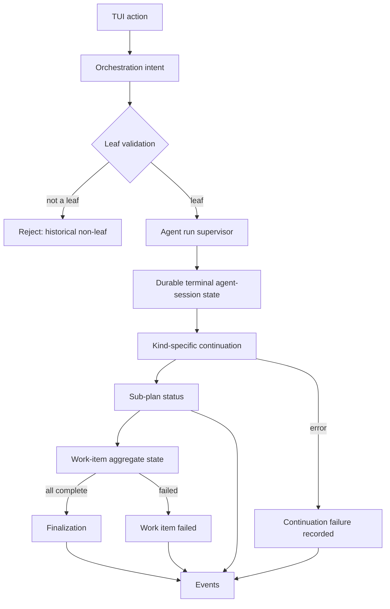

# 12 - Agent-Session Graph Continuation

<!-- docs:last-integrated-commit 5cbffc696e10a65fb98b6957c93e3c5f68e837d8 -->

Graph-driven model for resuming, retrying, following up on, and continuing agent sessions. This document is the single home for the contracts that govern how a user-initiated TUI action becomes a durable state change in the agent-session graph. It does not cover plan approval, review critique parsing, or Foreman question routing — those live in §3 Plan Review Loop and §4 Foreman Handling of the orchestration document and in the foreman lifecycle document.

---

## 1. Why a graph model

Before the graph model, resume, retry, and follow-up each carried their own ad-hoc row mutation, kind-blind continuation wrappers, and duplicate "is this a current leaf?" checks across the overview, TUI commands, and the implementation orchestrator. The bugs were not isolated missing checks — they came from duplicated state machines and continuations that the caller could forget or only log on failure.

The graph model collapses that surface into one progression:

```text
TUI action
  -> orchestration intent
    -> graph leaf validation
      -> agent run supervisor
        -> durable terminal agent-session state
          -> kind-specific continuation
            -> sub-plan status
              -> work-item aggregate state / finalization
                -> events
```

Every replaceable agent session is an append-only child of its predecessor. Continuation work is durable state on its own row, not a side effect that a caller can forget. TUI commands dispatch an intent and observe events; they never block on harness or review completion.

---

## 2. Graph terms

| Term | Meaning |
|---|---|
| **Attempt** | One agent session node in the graph. |
| **Leaf** | Current terminal node for a `(work item, sub-plan, kind, repository)` branch — a session that has no graph child. The set of leaves is the source of truth for "what is the current state?". |
| **Superseded leaf** | A failed, interrupted, or completed node that triggered a retry, resume, or follow-up. New work points `ParentAgentSessionID` to this node. |
| **Continuation** | Work that must happen after an agent session exits cleanly: review, reimplementation, sub-plan transition, work-item aggregate state, finalization. Continuation is durable state, not a side effect. |
| **Work-item entry point** | One orchestrator call that computes the leaf set once and routes each leaf to its kind-specific entry point. Bulk resume, bulk retry, and follow-up replan all use this entry point. |

Manual sessions (`phase = manual`) are excluded from the graph and are not eligible for automated resume or retry.

---

## 3. Invariants

The graph model is held together by these rules. Violations are product bugs.

1. **Leaves only for user actions.** User-triggered resume, retry, and follow-up may only target graph leaves. Historical non-leaf failed or interrupted sessions cannot drive current action cards, labels, or new child creation. Explicit historical read-only actions are the only exception.
2. **Append-only children.** Every replacement agent session has `ParentAgentSessionID = sourceLeaf.ID`. The superseded source row is never mutated to look like a leaf again.
3. **Failed-review parentage.** Review sessions created while retrying a failed review have `ParentAgentSessionID = failedReview.ID`, not the reviewed implementation ID. The edge `failed review -> replacement review` is preserved.
4. **Continuation before completion.** A completed implementation session is not product-complete until its continuation has produced a durable terminal result. A "completed" agent session with no `completed`/`failed`/`skipped` continuation is a system-level failure state, not a valid terminal state.
5. **TUI dispatches, never blocks.** User-triggered TUI commands return a dispatch acknowledgement immediately. Durable state changes arrive through the event bus. No command path waits on harness or review completion.
6. **Service vs orchestrator split.** Services enforce primitive per-entity transitions and own the persisted row. Orchestrators enforce cross-entity graph progression.
7. **Single candidate selector.** Resume and retry eligibility live in one domain or orchestrator helper. The overview, TUI commands, and the implementation orchestrator all consume the same helper rather than reconstructing leaf rules independently.

---

## 4. Graph progression flow



The TUI emits an intent (source session, trigger, optional feedback). The orchestrator reloads the source from the database, validates it is still a current leaf for the requested trigger, and then hands the harness off to the agent run supervisor. The supervisor starts the harness, owns the single consumer of the harness event channel, and translates the terminal harness result into durable `complete`/`fail`/`interrupt` plus a `pending` continuation row. From that point the continuation is durably tracked and can be recovered across crashes.

Foreman sessions are not part of this flow. Foreman has its own restart and recovery contract — see §3 Foreman Handling in the orchestration document and the foreman lifecycle document.

---

## 5. Resume and retry kind routing

The kind-blind resume façade is gone. Each kind has exactly one entry point. The work-item entry point computes the leaf set once and dispatches each leaf to its kind-specific route.

| Source kind | Source status | Route | Result |
|---|---|---|---|
| Planning | interrupted | planning service resume | new planning child session, leaf preserved |
| Implementation | interrupted | implementation graph resume | new implementation child from leaf, continuation runs after clean completion |
| Implementation | failed | implementation graph retry / follow-up | new implementation child, continuation runs after clean completion |
| Review | interrupted or failed | review graph retry | replacement review child parented to the failed review leaf, continuation runs |
| Review | completed | implementation graph follow-up (when feedback is code change) | new implementation child whose parent is the completed review leaf; continuation runs |
| Foreman | interrupted or failed | foreman restart | foreman session restarted against the current approved plan |
| Manual | any | no automated resume or retry | operator drives the row directly |

A leaf is eligible for graph routing only when its `kind` and `status` match one of the rows above. Historical non-leaf failed or interrupted sessions are rejected at the entry point with a `not a leaf` error and never produce a sibling child.

---

## 6. Continuation lifecycle

A continuation is the durable record of the work that must happen after an agent session reaches a terminal harness state. It is not the same as the agent session itself: the agent session is the harness run, the continuation is the orchestrator work that follows it (review, sub-plan transition, aggregate work-item state, finalization).

```mermaid
stateDiagram-v2
    [*] --> Pending: created in same transaction as agent-session completion
    Pending --> Running: orchestrator starts review / sub-plan / aggregate work
    Pending --> Skipped: explicit skip with reason
    Pending --> Superseded: new graph child created before continuation runs
    Running --> Completed: durable sub-plan / work-item / finalization writes finished
    Running --> Failed: continuation errored; LastError captured
    Running --> Skipped: continuation decided not to run, with reason
    Running --> Superseded: new graph child created
    Failed --> Running: operator-triggered recovery
    Failed --> Superseded: new graph child created
    Completed --> [*]
    Skipped --> [*]
    Superseded --> [*]
```



`Completed`, `Skipped`, and `Superseded` are terminal. `Failed` is not terminal — it surfaces the durable failure to the UI and is reachable from recovery.

Lifecycle rules:

- A `pending` continuation is created in the same transaction as the agent session's terminal transition. The agent-session row and the continuation row commit together so a crash between the two is not observable.
- The transition to `running` happens before review, sub-plan, work-item, or finalization work begins. The reverse — terminal aggregate state without a `running` continuation — is not allowed.
- The transition to `completed` happens only after the durable sub-plan, aggregate work-item, and (if applicable) finalization writes have committed. Failures of any of those writes return errors to the continuation caller and cause a `failed` transition with the error chain preserved in `LastError`.
- `Superseded` is the safe state for a continuation that was preempted by a new graph child (for example, a new follow-up session created before the prior continuation finished).
- Recovery scans `pending` and stale `running` continuations on startup, resumes them, and leaves `failed` continuations intact for operator inspection. A failed continuation does not auto-replay; the operator triggers the retry.

UI visibility: a completed implementation session whose continuation is `pending`, `running`, or `failed` is rendered as a distinct "agent completed; continuation pending/running/failed" state. It is not the same as a failed agent session.

---

## 7. Event contract

The event bus carries the durable state transitions described in §3 of the event-system document. Two additions matter for the graph model:

**`agent_session.continuation_failed`** is published whenever a continuation cannot finish. The payload includes the failed agent session ID, the continuation kind, and the error chain. This event is for notification only — the continuation table is the source of truth, and the UI must not infer continuation state from event timing.

**Append-only child event payloads** carry the source (superseded) session ID and the new child session ID together. Resumed sessions publish `agent_session.resumed`; follow-up children (created with operator feedback) publish `agent_session.follow_up`. UI event decoders preserve both IDs so that pending dispatch state, superseded source updates, and graph leaf refreshes are deterministic.

Avoid UI-only completion messages for graph lifecycle state. The persisted row plus the event are authoritative; the in-process message is at most a dispatch acknowledgement.

---

## 8. TUI dispatch contract

Long-running TUI commands follow one pattern:

- The command returns a dispatch acknowledgement immediately. The dispatch message carries the intent, the source session ID, and a transient dispatch ID.
- The actual graph entry point runs in a background goroutine. Async errors are sent back to the Bubble Tea program as `ErrMsg` so dispatch failures are observable instead of log-only.
- The TUI never blocks on harness or review completion. State arrives through the event bus.
- Candidate selection (which leaves are eligible for a given bulk action) is delegated to the orchestrator entry point. The TUI does not recompute eligibility.

This applies to: focused retry, focused follow-up (completed and failed), focused resumed-session continuation, bulk work-item resume and retry, and planning restart. The unified work-item entry point is the only path that touches multiple leaves.

---

## 9. Follow-up split

The TUI exposes two distinct follow-up actions for completed work items, with explicit labels:

- **"Revise plan"** — re-enters planning. Routes through the planning follow-up path; the next plan cycle diffs sub-plans and re-implements only the changed repositories.
- **"Request code changes"** — creates an append-only implementation child from a completed implementation or review graph leaf, then runs the standard review loop. The dispatch payload carries the completed leaf session ID, never the work-item ID.

A single ambiguous "follow up" label is not allowed; the two routes have different effects and must be labeled accordingly.

---

## 10. Service-layer contracts

Two layers cooperate to keep the graph model honest.

**Service primitives** own durable per-entity transitions:

- Append-only child creation for `resume`, `retry`, and `follow-up` is a service primitive that reloads the source row inside the transaction, validates graph-leaf status, preserves `kind`, sets `ParentAgentSessionID`, creates the running child row, and emits both source and new session IDs. Sibling retries on a non-leaf source are rejected transactionally.
- Continuation lifecycle (`pending` → `running` → `completed`/`failed`/`skipped`/`superseded`) is a service primitive that validates transitions and preserves the error chain in `LastError`. Startup recovery queries this primitive for `pending` and stale `running` continuations per workspace.
- Manual session row reuse goes through a manual-only primitive. Graph-managed implementation and review follow-up never reuses a manual primitive.

**Agent run supervisor** owns harness lifecycle:

- One consumer of each harness event channel — text, progress, question, and terminal events are forwarded exactly once.
- The supervisor starts the harness, persists `ResumeInfo`, waits for terminal completion (with the harness-specific `Wait` contract respected), translates the terminal result into durable `complete`/`fail`/`interrupt`, and runs the registered completion callback. Review sessions use a separate event-terminal mode that consumes the `done`/`error` events from the same channel.
- The supervisor holds the registration, wait, and resume-info persistence in one place. The implementation and review pipelines delegate to it rather than re-implementing the wait loop and durable transition sequence.

---

## 11. Acceptance criteria

The graph model is correct when all of the following hold:

- A clean ACP exit from any implementation resume, retry, or follow-up always either runs review and advances the sub-plan and work item, or records a durable failure explaining why continuation did not run.
- Retrying a failed review creates the graph edge `failed review -> replacement review`. The replacement review is parented to the failed review leaf, not to the reviewed implementation.
- Bulk resume and focused retry use the same eligibility rules. The TUI does not compute candidates independently.
- No user-triggered TUI command blocks on harness or review completion. State arrives through the event bus.
- Historical failed or interrupted non-leaf sessions never drive current action cards or labels and cannot create new retry or resume children.
- There is no path where an implementation agent session is `completed` while its sub-plan remains stale solely because a caller forgot to call continuation, or because a continuation failure was only logged. The continuation table and its terminal transitions are the source of truth.

---

## 12. Referenced documents

- Agent-session graph model (leaves, parent links, legacy fallback): see §1 of the domain model
- Resume and recovery semantics at the user level: see §7 of the orchestration document
- Event catalog and append-only child event payloads: see §3 of the event-system document
- TUI leaf-based status derivation and async dispatch pattern: see §1 and §5 of the TUI design document
- Foreman lifecycle ownership boundary: see the foreman lifecycle document; foreman-specific routing rules see §5 of this document